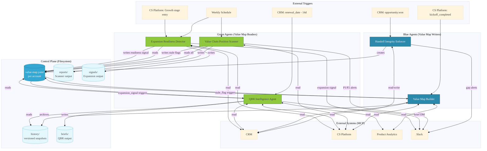

# Value Map System — Full Architecture Specification

**Status:** [PROPOSED]  
**Stage:** TDD+ DESIGN  
**Version:** 0.1  
**Date:** 2026-05-18  

---

## 1. System Purpose

The Value Map System is a set of five coordinated Agent SDK cookbooks that instrument, maintain, and act on the Customer Success Value Chain at the account level. Together they answer three operational questions that no existing CS toolchain addresses at runtime:

1. **Where is this account on the seven-stage value chain, and how fast are they moving?**
2. **What value has been promised, delivered, realized, and left unrealized — and where is the leakage?**
3. **When is the account ready for a commercial conversation, a QBR, or an intervention?**

The system is intentionally non-monolithic. Each cookbook is independently triggerable, has a single responsibility, and communicates with other cookbooks only through a shared filesystem artifact — the Value Map document — not through direct API calls or shared memory.

---

## 2. Central Artifact: The Value Map Document

### 2.1 Role

The Value Map document is the **canonical per-account state artifact** for the entire system. It is a YAML file stored at a deterministic filesystem path:

```
managed-agent-cookbooks/value-map-system/value-maps/{account-id}/value-map.yaml
```

Every cookbook either creates, updates, or reads this file. No cookbook calls another cookbook's APIs directly. The Value Map is the only shared state.

This design satisfies the **Control-Plane Discipline** constraint: governance state lives in the filesystem, not in platform-provided mechanisms (Claude memory, Cowork context, MCP vendor state). If every platform feature were disabled, the Value Maps would still exist on disk and remain readable.

### 2.2 Four Quadrants

The Value Map encodes four information categories derived from the Customer Value Map concept:

| Quadrant | Who Creates | Who Maintains | Commercial Trigger |
|----------|-------------|---------------|-------------------|
| **Promised Outcomes** | Handoff Integrity Enforcer (from Sales) | Value Map Builder (quarterly) | Expansion unlocked when achieved |
| **Delivered Capabilities** | Value Map Builder (onboarding + adoption) | Value Map Builder + product analytics | Gaps = expansion opportunities |
| **Realized Value** | Value Map Builder (QBR cycles, ROI data) | Value Map Builder | Evidence base for expansion |
| **Unrealized Potential** | Value Map Builder (benchmarks + gap analysis) | Revenue team signals | "Customers like you achieve X; you're at Y" |

### 2.3 Value Chain Position Vector

In addition to the four quadrants, the Value Map stores a **position vector** — a structured encoding of where the account currently sits on the seven-stage value chain:

```
Stages: 1-Product Capabilities → 2-Deliverable Outcomes → 3-Desired Outcomes
      → 4-Business Goals → 5-Expected Value → 6-Delivered Value → 7-Business Impact
```

The position vector is not a single integer. Each stage has an independent confidence and completeness score. An account can be "confirmed" at stage 5 but "stalled" at stage 6 — which is a qualitatively different situation than being "not yet assessed" at stage 6. The scanner interprets these distinctions.

### 2.4 Version History

Every write to `value-map.yaml` copies the previous version to:

```
value-maps/{account-id}/history/value-map-{ISO-timestamp}.yaml
```

This provides an audit trail and enables trend analysis (how has position changed over time) without requiring database infrastructure.

### 2.5 Schema Location

```
managed-agent-cookbooks/value-map-system/schema/value-map.schema.yaml
```

All agents that write to the Value Map validate their output against this schema before writing. Schema is defined in JSON Schema format embedded in YAML.

---

## 3. Blue / Green Agent Classification

Agents are classified by their relationship to the Value Map:

**Blue agents** — maintain the Value Map. They write to it. They require write access to the filesystem.

| Agent | Write Operation |
|-------|----------------|
| Handoff Integrity Enforcer | Creates `value-map.yaml` from CRM handoff data |
| Value Map Builder | Updates all four quadrants; updates position vector |

**Green agents** — consume the Value Map for commercial or strategic action. They read from it. They do not write to it (their outputs are separate report/brief files).

| Agent | Read Operation | Output Type |
|-------|----------------|-------------|
| Value Chain Position Scanner | Reads all account Value Maps | Portfolio report + intervention queue |
| QBR Intelligence Agent | Reads single account Value Map | QBR intelligence brief |
| Expansion Readiness Detector | Reads single account Value Map | Expansion readiness signal |

**Cross-trigger events** — green agents can *signal* blue agents, but never call them directly:

- Scanner writes a trigger flag to `value-map.yaml` when a position has gone stale → Value Map Builder reads the flag on its next run
- Expansion Readiness Detector writes an expansion signal to `value-map.yaml` → QBR Intelligence Agent reads it when triggered pre-renewal

---

## 4. Five Cookbooks — Detailed Specification

### 4.1 Handoff Integrity Enforcer

**Responsibility:** The moment a deal is marked Won in CRM, this agent fires and creates the account's initial Value Map. It enforces that Stages 3–5 of the value chain are properly documented before CS receives the account. If data is missing, it blocks the handoff and surfaces gaps to the closing rep.

**Trigger model:**
- Primary: CRM webhook — `opportunity.status = "won"`
- Secondary: Manual invocation with `account_id` argument (for legacy accounts being onboarded into the system)

**Inputs (from CRM):**
- Opportunity record: deal terms, ARR, products purchased
- Desired outcomes documented during sales (Stage 3 coverage)
- Business goals captured during discovery (Stage 4 coverage)
- Expected value commitments made at close (Stage 5 coverage)
- Champion / executive sponsor contacts
- Handoff call notes (if attached)

**Completeness gate:** The agent scores Stage 3–5 coverage on a 0–100 scale per stage. If any stage scores below 60, the handoff is flagged as incomplete and the closing rep receives a structured gap list via Slack/email before the account is handed to CS.

**Output:**
- Creates `value-maps/{account-id}/value-map.yaml` with:
  - Promised Outcomes quadrant populated from deal data
  - Stages 1–5 position vector set (with completeness scores)
  - Stages 6–7 set to `not_yet_assessed`
  - `handoff_integrity_score` field (0–100)
  - `handoff_gaps` list (empty if clean)

**Subagents:**

| Subagent | Role |
|----------|------|
| `won-opportunity-reader` | Pulls full opportunity record from CRM; normalizes to internal schema |
| `handoff-completeness-assessor` | Scores Stage 3–5 coverage; generates structured gap list |
| `value-chain-intake-recorder` | Writes the initial `value-map.yaml`; validates against schema |

**MCP servers required:** `crm` (read), `slack` (notify on gap), filesystem write

---

### 4.2 Value Map Builder

**Responsibility:** Maintains the four quadrants of the Value Map over the account lifecycle. Runs at kickoff (to capture initial state post-handoff) and quarterly (to update as the account progresses). Is also callable by the Scanner when a stale-position flag is detected.

**Trigger model:**
- `kickoff_completed` event from CS platform (account attribute flip)
- Quarterly calendar (accounts where `last_value_map_build` > 90 days ago)
- Scanner-initiated: `scanner_stale_flag: true` in existing `value-map.yaml`

**Inputs:**
- Existing `value-map.yaml` (if present — kickoff run may follow handoff)
- CS platform: lifecycle stage, health score, touchpoint history, adoption milestones
- Product analytics: feature adoption %, usage trends, key workflow completion rates
- CRM: ARR, renewal date, expansion history
- CS platform / notes: QBR outputs, success plan milestones

**Value chain transition logic:** The agent evaluates each stage transition using documented evidence, not inference. Stage advancement requires:
- Stage 3→4: Desired outcomes mapped to at least one business goal with named executive sponsor
- Stage 4→5: Expected value articulated in customer's business metrics (not vendor metrics)
- Stage 5→6: At least one desired outcome confirmed achieved with supporting data
- Stage 6→7: Value achievement documented in customer's business reporting or exec communication
- No stage advances without evidence; the agent records the evidence source per stage

**Leakage diagnosis:** After updating the position vector, the agent runs a leakage scan against the five leakage patterns:
1. Capability-Outcome Gap — features used but outcomes not achieved
2. Outcome-Goal Misalignment — outcomes achieved but business goals not addressed
3. Expectation-Reality Disconnect — expected value exceeds achievable results given adoption
4. Value-Perception Disconnect — value delivered but not recognized by customer
5. Impact Communication Failure — impact achieved but not documented / communicated

**Output:**
- Updates all four quadrants in `value-map.yaml`
- Updates position vector with evidence citations
- Appends leakage diagnostics section
- Archives previous version to `history/`

**Subagents:**

| Subagent | Role |
|----------|------|
| `data-aggregator` | Pulls CS platform, product analytics, CRM data; normalizes to internal schema |
| `value-map-synthesizer` | Updates four quadrants; advances position vector with evidence gating |
| `leakage-diagnoser` | Runs five-pattern leakage scan; writes diagnostics to Value Map |

**MCP servers required:** `crm` (read), `cs-platform` (read), `product-analytics` (read), filesystem read+write

---

### 4.3 Value Chain Position Scanner

**Responsibility:** Weekly portfolio sweep across all accounts with Value Maps. Evaluates each account's current position against the expected position for their lifecycle stage (the lifecycle × value chain matrix). Produces a ranked intervention list for the CS team.

**Trigger model:**
- Weekly scheduled (Monday 06:00 in CS team's timezone)
- Manual invocation for ad-hoc portfolio review

**Position-stage matrix (the evaluation baseline):**

| Lifecycle Stage | Expected Value Chain Position | Alert Threshold |
|-----------------|------------------------------|-----------------|
| Onboarding | Stages 3–5 confirmed | < Stage 4 at day 60 |
| Adoption | Stages 5–6 confirmed | < Stage 5 at day 90 |
| Nurture | Stage 6 active | Stalled > 45 days |
| Growth | Stages 6–7 active | Position regression |
| Retention | Stage 7 sustained | Any regression |
| Advocacy | Stage 7+ | Value erosion signal |

**Intervention classification:**

| Priority | Condition | Recommended Action |
|----------|-----------|-------------------|
| P1 — At Risk | Position below threshold AND health score declining | Immediate CSM escalation |
| P2 — Stalled | Position at threshold but no advancement in 45+ days | Scheduled CSM outreach |
| P3 — Lagging | Position below threshold but health stable | Next QBR focus item |
| P4 — Monitor | Position at or above threshold | Standard cadence |

**Stale flag:** When an account's `last_value_map_build` timestamp is > 90 days old, the scanner writes `scanner_stale_flag: true` to the Value Map. The Value Map Builder will pick this up on its next trigger cycle. The VCS env var `VCS_STALE_THRESHOLD_DAYS` must be set to `'90'` to match this threshold.

**Output:**
- `value-chain-position-scanner/reports/{YYYY-MM-DD}/portfolio-status.yaml` — machine-readable full portfolio state
- `value-chain-position-scanner/reports/{YYYY-MM-DD}/intervention-queue.md` — human-readable ranked intervention list for CS leadership
- Slack notification to CS team channel with P1 and P2 items

**Subagents:**

| Subagent | Role |
|----------|------|
| `portfolio-reader` | Reads all `value-map.yaml` files; normalizes to portfolio data structure |
| `position-evaluator` | Applies lifecycle × value chain matrix; classifies each account by priority |
| `intervention-ranker` | Ranks P1–P4 accounts; generates intervention queue; writes stale flags |

**MCP servers required:** `cs-platform` (lifecycle stage read), `slack` (notify P1/P2), filesystem read+write (stale flags + report output)

---

### 4.4 QBR Intelligence Agent

**Responsibility:** 14 days before an account's renewal date, synthesizes everything in the Value Map plus interaction history into a QBR intelligence brief. Gives the CSM everything they need to run a value-anchored renewal conversation. Also callable when the Expansion Readiness Detector has fired an expansion signal.

**Trigger model:**
- CRM: `renewal_date` within 14 days (daily CRM sweep)
- Expansion Readiness Detector: `expansion_readiness_signal: true` in Value Map (pre-expansion QBR)
- Manual: invoked by CSM for an ad-hoc account review

**Inputs:**
- `value-maps/{account-id}/value-map.yaml` (full four quadrants + position vector + leakage diagnostics)
- `value-maps/{account-id}/history/` (trend data — position over time)
- CS platform: touchpoint history, last 4 QBR notes, success plan status
- CRM: ARR, contract terms, expansion history, renewal value
- Product analytics: usage trend last 90 days

**Brief structure:**

1. **Value Chain Narrative** — where the account started (Promised Outcomes) vs. where they are now (Realized Value), told in business terms
2. **Evidence Package** — concrete proof points for every claim in the narrative, sourced from product analytics and CS data
3. **Unrealized Potential Analysis** — what the account hasn't yet achieved, benchmarked against similar customers
4. **Leakage Remediation Status** — which leakage patterns were identified, what was done, what remains
5. **Expansion Angles** — 2–3 specific, evidence-based expansion opportunities with supporting rationale
6. **Risk Signals** — any position regression or stall patterns that need addressing in the QBR
7. **Suggested Agenda** — structured QBR agenda with talking points per section

**Output:**
- `qbr-intelligence-agent/briefs/{account-id}/{YYYY-MM-DD}/qbr-brief.md` — human-readable brief for CSM
- `qbr-intelligence-agent/briefs/{account-id}/{YYYY-MM-DD}/evidence-package.yaml` — structured evidence, suitable for slide generation
- Slack DM to account CSM with brief link

**Subagents:**

| Subagent | Role |
|----------|------|
| `evidence-collector` | Pulls interaction history, usage trends, success plan data; normalizes to evidence schema |
| `value-narrative-generator` | Writes the value chain narrative in business language; constructs the full brief |
| `expansion-angle-identifier` | Identifies 2–3 expansion opportunities from unrealized potential + leakage data |

**MCP servers required:** `crm` (read), `cs-platform` (read), `product-analytics` (read), `slack` (DM), filesystem read+write

---

### 4.5 Expansion Readiness Detector

**Responsibility:** Monitors each account's Value Map for the conditions that indicate genuine expansion readiness — not just a good health score, but actual progression through value chain stages that justifies a commercial conversation. Fires a signal when readiness is confirmed.

**Trigger model:**
- Weekly (runs after the Position Scanner, reads same Value Maps)
- Lifecycle event: account transitions to `Growth` stage in CS platform
- Manual: invoked by CSM or revenue team for account-specific assessment

**Readiness model — four dimensions:**

ERD evaluates four readiness dimensions using qualitative classification (not quantified weights):

1. **Value Chain Stage Position** (primary gate — Stage 4 or below = too early; evaluation stops if gate fails)
2. **Realized Value Density** (count of `realized_value` entries in the Value Map)
3. **Leakage Posture** (P3 = caution; P1/P2 = hard block via `signals.hard_block_active`)
4. **Executive Engagement** (confirmed `cs_platform_touchpoint` entries in stages 5–7 within the trailing window)

Readiness threshold for signal: all four dimensions must pass their classification threshold. No numeric aggregate score — dimension-level classification gates the overall signal.

**NEVER rules specific to this agent:**
- NEVER fire an expansion signal when active leakage in the Delivered Value quadrant exists (a customer who doesn't believe they've received value is not ready for an expansion conversation)
- NEVER score stakeholder engagement from inferred relationship data — only confirmed touchpoints in CS platform count
- NEVER produce an expansion brief without a specific, named expansion angle (no generic "there may be opportunities" outputs)

**Output (when readiness ≥ 70):**
- Writes `expansion_readiness_signal: true` and `expansion_readiness_score: {n}` to `value-map.yaml`
- Creates `{value_map_base_path}/expansion-briefs/{account_id}/expansion-brief-{build_date}.md`
- Slack notification to CSM + revenue team with readiness score and top expansion angle
- QBR Intelligence Agent is auto-triggered via Value Map flag (CSM receives QBR brief within 2 hours)

**Subagents:**

| Subagent | Role |
|----------|------|
| `readiness-scorer` | Scores all three dimensions from Value Map + CS platform data; produces readiness score with dimension breakdown |
| `expansion-brief-generator` | Writes expansion brief with specific angle, evidence, commercial case, and suggested next step |

**MCP servers required:** `cs-platform` (stakeholder/engagement read), `crm` (commercial alignment read), `slack` (notify), filesystem read+write

---

## 5. Cross-Cookbook Data Flow

The diagram below shows the complete system. Arrows represent data flow, not API calls. All inter-cookbook communication is mediated by the Value Map document.



### Flow narrative

The system lifecycle for a single account follows this sequence:

**1. Deal closes** → CRM fires `opportunity.won` → **Handoff Integrity Enforcer** reads the opportunity, scores Stage 3–5 coverage, creates `value-map.yaml`. If gaps exist, it alerts the closing rep before handoff proceeds.

**2. Kickoff completes** → CS platform fires `kickoff_completed` → **Value Map Builder** reads CRM + CS platform + product analytics, populates all four quadrants, advances the position vector with evidence gating, runs leakage diagnosis.

**3. Every week** → **Value Chain Position Scanner** reads all Value Maps, evaluates each against the lifecycle × value chain matrix, produces the intervention queue, writes stale flags where needed. Stale flags trigger the Value Map Builder on its next run. **Expansion Readiness Detector** runs the same day, scoring readiness across three dimensions, writing signals when threshold is crossed.

**4. Expansion signal fires** → `expansion_readiness_signal: true` in Value Map → **QBR Intelligence Agent** synthesizes value chain narrative + evidence package + expansion angles → brief delivered to CSM via Slack.

**5. 14 days before renewal** → CRM date sweep → **QBR Intelligence Agent** runs again for renewal-specific brief, incorporating any expansion signals already present.

---

## 6. MCP Server Dependency Map

| MCP Server | Required By | Operations |
|------------|-------------|------------|
| `crm` | HIE, VMB, QBR, ERD | Read: opportunity, account, ARR, renewal date, expansion history |
| `cs-platform` | VMB, VCS, QBR, ERD | Read: lifecycle stage, health score, touchpoints, success plan, adoption milestones |
| `product-analytics` | VMB, QBR | Read: feature adoption %, usage trends, key workflow completion |
| `slack` | HIE, VCS, QBR, ERD | Write: gap alerts, P1/P2 intervention alerts, QBR brief DM, expansion signal notification |
| `email` (optional) | QBR | Write: QBR brief delivery when CSM preference is email-first |

### MCP server configuration (per agent.yaml)

All five cookbooks declare MCP servers in their `agent.yaml`. Servers are referenced by name; environment variables hold the actual URLs, consistent with the expansion-onboarding-agent pattern:

```yaml
mcp_servers:
  - { type: url, name: crm,               url: "${CRM_MCP_URL}" }
  - { type: url, name: cs-platform,       url: "${CS_PLATFORM_MCP_URL}" }
  - { type: url, name: product-analytics, url: "${PRODUCT_ANALYTICS_MCP_URL}" }
  - { type: url, name: slack,             url: "${SLACK_MCP_URL}" }
```

Not every cookbook needs every server. The table above identifies minimum requirements per cookbook.

---

## 7. Folder Structure

```
managed-agent-cookbooks/
├── value-map-system/                          # System-level artifacts
│   ├── ARCHITECTURE.md                        # This document
│   ├── README.md                              # System overview for operators
│   └── schema/
│       └── value-map.schema.yaml             # Canonical Value Map schema
│
├── handoff-integrity-enforcer/
│   ├── agent.yaml                            # Orchestrator config
│   ├── README.md
│   └── subagents/
│       ├── won-opportunity-reader.yaml
│       ├── won-opportunity-reader.md
│       ├── handoff-completeness-assessor.yaml
│       ├── handoff-completeness-assessor.md
│       ├── value-chain-intake-recorder.yaml
│       └── value-chain-intake-recorder.md
│
├── value-map-builder/
│   ├── agent.yaml
│   ├── README.md
│   └── subagents/
│       ├── data-aggregator.yaml
│       ├── data-aggregator.md
│       ├── value-map-synthesizer.yaml
│       ├── value-map-synthesizer.md
│       ├── leakage-diagnoser.yaml
│       └── leakage-diagnoser.md
│
├── value-chain-position-scanner/             # VCS orchestrator directory
│   ├── agent.yaml                            # Orchestrator config — subagents: references use full path value-chain-scanner/subagents/{name}.yaml
│   ├── README.md
│   └── reports/                              # Runtime: scanner outputs
│
├── value-chain-scanner/                      # VCS subagents directory (split from orchestrator — intentional, do not collapse)
│   └── subagents/
│       ├── portfolio-reader.yaml
│       ├── portfolio-reader.md
│       ├── position-evaluator.yaml
│       ├── position-evaluator.md
│       ├── intervention-ranker.yaml
│       └── intervention-ranker.md
│
├── qbr-intelligence-agent/
│   ├── agent.yaml
│   ├── README.md
│   ├── briefs/                               # Runtime: QBR brief outputs
│   └── subagents/
│       ├── evidence-collector.yaml
│       ├── evidence-collector.md
│       ├── value-narrative-generator.yaml
│       ├── value-narrative-generator.md
│       ├── expansion-angle-identifier.yaml
│       └── expansion-angle-identifier.md
│
└── expansion-readiness-detector/
    ├── agent.yaml
    ├── README.md
    ├── signals/                              # Runtime: expansion signal outputs
    └── subagents/
        ├── readiness-scorer.yaml
        ├── readiness-scorer.md
        ├── expansion-brief-generator.yaml
        └── expansion-brief-generator.md
```

**Runtime artifact directories** (`reports/`, `briefs/`, `signals/`) are created by their respective agents on first run and are gitignored. They represent operational output, not configuration.

**VCS directory split (ARCH-BLOCK-01):** The Value Chain Position Scanner uses a split directory structure that is intentional and must not be collapsed:
- The VCS **orchestrator** `agent.yaml` lives at `value-chain-position-scanner/agent.yaml`
- The VCS **subagents** (`portfolio-reader.yaml`, `position-evaluator.yaml`, `intervention-ranker.yaml`) live at `value-chain-scanner/subagents/`
- The `subagents:` declaration in `value-chain-position-scanner/agent.yaml` must reference the full path `value-chain-scanner/subagents/{name}.yaml`
- SDK path resolution depends on this exact layout. Collapsing the directories or relocating subagents to `value-chain-position-scanner/subagents/` will cause path resolution failures.

**Value Map storage** lives under `value-map-system/` to make clear it is shared infrastructure, not owned by any single cookbook:

```
value-map-system/
└── value-maps/
    └── {account-id}/
        ├── value-map.yaml           # Current state
        └── history/
            ├── value-map-2026-02-14T09:00:00Z.yaml
            └── value-map-2026-05-18T14:30:00Z.yaml
```

---

## 8. Subagent Role Summary (All Five Cookbooks)

| Cookbook | Subagent | Responsibility | Tool Grants |
|----------|----------|----------------|-------------|
| HIE | `won-opportunity-reader` | Pull + normalize CRM opportunity | crm:read |
| HIE | `handoff-completeness-assessor` | Score Stage 3–5 coverage; generate gap list | read (Value Map schema) |
| HIE | `value-chain-intake-recorder` | Write initial `value-map.yaml` | write, read (schema) |
| VMB | `data-aggregator` | Pull CS platform + product analytics + CRM; normalize | cs-platform:read, product-analytics:read, crm:read |
| VMB | `value-map-synthesizer` | Update four quadrants; advance position vector with evidence gating | read, write |
| VMB | `leakage-diagnoser` | Run five-pattern leakage scan; write diagnostics | read, write |
| VCS | `portfolio-reader` | Read all account Value Maps; build portfolio data structure | read, cs-platform:read |
| VCS | `position-evaluator` | Apply lifecycle × value chain matrix; classify P1–P4 | read |
| VCS | `intervention-ranker` | Rank accounts; generate intervention queue; write stale flags; notify | write, slack:write |
| QBR | `evidence-collector` | Pull interaction history, usage trends, success plan data | cs-platform:read, product-analytics:read, crm:read |
| QBR | `value-narrative-generator` | Write value chain narrative; construct full QBR brief | read, write |
| QBR | `expansion-angle-identifier` | Identify 2–3 expansion opportunities from unrealized potential | read |
| ERD | `readiness-scorer` | Score three readiness dimensions; produce readiness score | read, cs-platform:read, crm:read |
| ERD | `expansion-brief-generator` | Write expansion brief; write signal to Value Map; notify | write, slack:write |

---

## 9. Manual-First Instrumentation Principle

The system is designed to be operable before all MCP integrations are live. Each cookbook has a **data source fallback order**:

1. **Live MCP pull** — preferred for production use
2. **File-based input** — CSM provides a structured YAML file at a known path; agent reads from file instead of MCP
3. **Interactive prompting** — orchestrator asks the CSM for the required fields directly (lowest fidelity, highest accessibility)

This means the system can be deployed and validated against real accounts before the `product-analytics` MCP server is configured, for example. The Value Map Builder will operate with the data sources it has and flag which quadrants have low-confidence data due to missing sources.

The `data_source` field in each Value Map quadrant records whether data came from live MCP, file, or manual entry — enabling quality tracking over time.

---

## 10. NEVER Rules (System-Level)

These rules extend the workspace NEVER rules and apply to all five cookbooks:

- **NEVER advance a value chain stage without cited evidence.** Inference from health scores or relationship length is not evidence. Evidence means a named data point from a named source (CS platform touchpoint, product analytics event, QBR note).
- **NEVER fire an expansion signal when active leakage exists in the Delivered Value quadrant.** An account with unresolved value perception gaps is not ready for a commercial conversation.
- **NEVER write to a Value Map without archiving the previous version to `history/`.** Every write must be preceded by a copy of the current state.
- **NEVER allow a green agent to write to the four quadrants or position vector.** Green agents may write signal flags (`scanner_stale_flag`, `expansion_readiness_signal`) but not substantive Value Map content.
- **NEVER create a Value Map for an account without an opportunity record in CRM.** The CRM `opportunity_id` is the canonical account identifier that ties the filesystem artifact to the source of truth.
- **NEVER generate a QBR brief or expansion brief without reading the full Value Map history.** Point-in-time state is insufficient — trend matters.

### 10.1 Signals Block Documentation

The `signals` block in `value-map.yaml` carries system-managed flags that govern cross-cookbook behavior. These fields must not be set by humans or by cookbooks outside their designated write authority.

| Field | Type | Default | Authority | Behavior |
|-------|------|---------|-----------|----------|
| `scanner_stale_flag` | boolean | `false` | VCS writes; VMB clears | Set when `last_value_map_build` > 90 days; triggers VMB on next cycle |
| `expansion_readiness_signal` | boolean | `false` | ERD writes; cleared after QBR is triggered | Triggers QBR Intelligence Agent when `true` |
| `expansion_readiness_score` | integer | `null` | ERD writes | Readiness score at the time of signal; accompanies `expansion_readiness_signal` |
| `hard_block_active` | boolean | `false` | VMB leakage-diagnoser writes; VMB clears after resolution | **Set to `true` by VMB `leakage-diagnoser` when `signals.intervention_priority` is P1 or P2. Any cookbook encountering `hard_block_active: true` MUST suppress expansion evaluation, expansion angles, and expansion briefs immediately. Cleared by VMB after P1/P2 leakage is resolved. This is the single authoritative field for expansion suppression across ERD, QBR, and VCS.** |
| `intervention_priority` | string | `null` | VCS `intervention-ranker` writes | P1–P4 classification from the portfolio scan; drives `hard_block_active` logic |

---

## 11. Design Decisions — Resolved

All five decisions confirmed 2026-05-18:

| # | Decision | Resolution |
|---|----------|------------|
| 1 | Account ID format | **CRM `account_id`** — stable across opportunity lifecycle |
| 2 | Schema validation behavior | **Hard-fail** — nothing written; handoff blocked; closing rep alerted via Slack |
| 3 | Scanner cadence | **Weekly sweep + P1 mid-week re-scan** — P1 accounts (below threshold AND health declining) re-evaluated mid-week |
| 4 | QBR brief format | **Both** — `qbr-brief.md` for CSM consumption + `evidence-package.yaml` for downstream automation |
| 5 | Expansion signal threshold | **Configurable per segment** — enterprise default 80, mid-market 75, SMB 70; stored as `expansion_readiness_threshold` in Value Map schema |

**Impact on VCS trigger model (decision #3):** The Position Scanner has two trigger modes:
- **Weekly sweep** (Monday 06:00): all accounts
- **P1 mid-week re-scan** (Thursday 06:00): accounts currently classified P1 only; reads their Value Maps and re-evaluates; escalates to P0 if deterioration confirmed

---

*[PROPOSED — open design decisions resolved; implementation proceeding]*
