# Claude for Customer Success: Integrated Customer Journey & Value Realization Guide

**Status:** [PROPOSED]
**Version:** 1.0
**Date:** 2026-05-16
**Applies To:** Claude for Customer Success Plugin — all five domains (cs-ops, csm, onboarding, renewals, rev-ops)

---

## Purpose and Scope

This guide maps the complete Customer Success lifecycle to the Claude for Customer Success plugin's 74-skill capability catalog. It is not a replacement for the human CSM — it is an architecture document for how the plugin **augments** CSM capacity across every stage of the customer journey.

The plugin operates as a **capability add**: a trained CSM using it can accomplish in minutes what previously took hours, maintain consistency across accounts that would otherwise depend on individual skill variation, and surface analytical patterns that are invisible without systematic data aggregation. The human CSM remains the relationship, judgment, and accountability layer. The plugin accelerates, structures, and scales the execution layer beneath it.

Every skill reference in this document uses the format `domain.skill-id` — the actual skill identifiers in the plugin. Generic task labels do not appear. Where the plugin has no skill for a given activity, the activity is marked **CSM-led** and the plugin's supporting role (if any) is described explicitly.

### What This Document Covers

1. **Dual-Track Architecture** — how Value Chain progression and Customer Lifecycle stages run in parallel
2. **Two-Layer Outcome/Value Model** — Layer 1 (market-level catalog) and Layer 2 (account-level instantiation)
3. **Master Integration Model** — visual overview of how all three systems connect
4. **Stage-by-Stage Workflow** — Stages 0–7 with plugin skill mappings, capability-add framing, and gate criteria
5. **Value Chain Monitoring Dashboard** — how cross-cutting skills maintain data quality and pipeline visibility
6. **Recovery Workflows** — six failure-mode workflows with plugin-powered remediation sequences
7. **Cross-Cutting Operations** — the 27 cs-ops and rev-ops skills that run continuously across all lifecycle stages
8. **Implementation Guidance** — deployment sequencing, configuration prerequisites, and adoption patterns

---

## Dual-Track Architecture

Customer Success operates on two parallel tracks that must stay synchronized. The plugin provides infrastructure across both.

**Track 1 — Customer Lifecycle** moves customers through discrete stages: Pre-Sales Handoff (Stage 0) → Onboarding (Stage 1) → Adoption (Stage 2) → Health & Expansion (Stage 3–4) → Renewal (Stage 5) → Advocacy (Stage 6). Stage 7 represents Churn/Non-Renewal — a failure state with its own diagnostic workflow.

**Track 2 — Value Realization** progresses through five stages regardless of where a customer sits in the lifecycle: Value Discovery → Value Planning → Value Delivery → Value Measurement → Value Expansion. These stages describe the maturity of the value relationship, not account tenure.

The intersection of both tracks creates the CSM's execution context at any given moment. A Stage 2 customer in Value Delivery has different plugin priorities than a Stage 2 customer still in Value Planning. The per-stage sections in this document show both coordinates simultaneously.

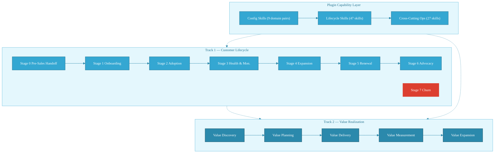

The narrative above is what this diagram shows: two tracks running in parallel (lifecycle and value realization), with the plugin's three capability tiers (config, lifecycle, cross-cutting ops) augmenting both. The dotted lines indicate the plugin does not own either track — the CSM does. The plugin accelerates and structures execution within both.

---

## Two-Layer Outcome/Value Model

Before any customer-facing work begins, the plugin's value architecture requires two distinct activities. These are separate concerns with different owners and different timescales.

### Layer 1 — Market-Level Outcome Catalog

**Skill:** `rev-ops.outcome-statement-builder`
**Owner:** RevOps / CS Leadership
**Timing:** Pre-deployment, not per-account

Layer 1 builds the canonical set of outcome and value statements derived from product capabilities and ICP patterns. These statements describe what the product *can* deliver to the market — not what any specific customer will receive. They live in the Outcome Catalog and serve as the structured input for all downstream customer-level work.

`rev-ops.outcome-statement-builder` in catalog-build mode traverses the Seven-Stage Value Chain:

| Value Chain Stage | L1 Output |
|---|---|
| Product Capabilities | Capability inventory by product area |
| Deliverable Outcomes | What the product produces when used correctly |
| Desired Outcomes | What customers are trying to achieve |
| Business Goals | The organizational objectives outcomes serve |
| Expected Value | The value customers anticipate before purchase |
| Realized Value | The value customers achieve post-deployment |
| Business Impact | Measurable organizational change |

**Capability add:** Without this layer, CSMs construct outcome language ad hoc per account, producing inconsistent framing that doesn't accumulate into organizational intelligence. The catalog creates a shared vocabulary that scales across the entire CS team.

### Layer 2 — Account-Level Value Instantiation

**Primary skill:** `csm.value-statement`
**Supporting skill:** `rev-ops.outcome-statement-builder` (customer-tailoring mode)
**Owner:** CSM, per account
**Timing:** Stage 0 initialization, then updated at each stage gate

Layer 2 takes L1 catalog entries and instantiates them with customer-specific terminology, metrics baselines, stakeholder language, and business context. A L1 statement like "reduces time-to-resolution for support escalations" becomes "cuts Tier-2 escalation cycle time from 4.2 days to under 2 days (Sarah Kim, VP Support, Q1 target)."

`csm.value-statement` produces L2 artifacts throughout Stages 2–6, consuming L1 as structural scaffolding while adding the account specificity that makes value conversations land. `rev-ops.outcome-statement-builder` in customer-tailoring mode handles the translation step at Stage 0 when the L1→L2 mapping is first established.

**Capability add:** The L2 layer is where most CSM time was previously lost — rebuilding outcome context from scratch at every renewal conversation, QBR, or escalation. The plugin maintains this layer persistently, so the CSM arrives at every conversation with an already-current value statement that needs refinement, not reconstruction.

---

## Master Integration Model

The three systems — Value Chain, Customer Lifecycle, and Value Realization — operate as an integrated framework. This diagram shows the full connection topology.

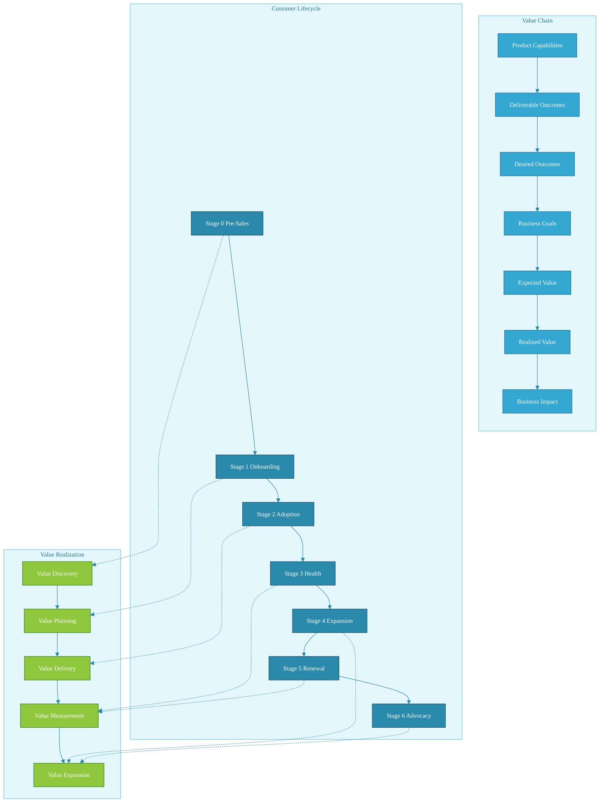

Reading this diagram: the Value Chain (top, blue) runs vertically from product capabilities to business impact. The Customer Lifecycle (middle, green) runs horizontally through seven stages. The Value Realization stages (bottom, yellow) map onto lifecycle stages via the dotted connections on the left. The plugin skills annotating the Value Chain connections show where specific skills operationalize each chain transition. The full skill-to-stage mapping appears in the sections below.

---

## Stage 0 — Pre-Sales Handoff & Plugin Configuration

**Lifecycle Stage:** Pre-Sales Handoff
**Value Realization Stage:** Value Discovery
**Primary objective:** Configure the plugin for organizational context, establish the L1 Outcome Catalog, and capture customer-specific context from the sales handoff before any customer-facing activity begins.

### Capability Add at Stage 0

Stage 0 is where the plugin's leverage ratio is highest. Without configuration, every subsequent skill operates from generic defaults. With a properly configured Stage 0, every downstream skill — health scoring, QBR content, renewal forecasting, value statements — operates from your organization's specific language, playbooks, segment definitions, and outcome catalog.

The config skill pattern (`cold-start-interview` + `customize`) runs independently per domain. A CS team can configure all five domains in a single working session, establishing a shared context layer that persists across every account interaction thereafter.

### Plugin Skills — Stage 0

**Configuration Skills (run once at plugin deployment):**

| Skill | Domain | Role |
|---|---|---|
| `cs-ops.cold-start-interview` | cs-ops | Captures ops team structure, toolstack, data sources, metric definitions |
| `cs-ops.customize` | cs-ops | Writes domain CLAUDE.md with org-specific ops context |
| `csm.cold-start-interview` | csm | Captures CSM methodology, playbook preferences, segment definitions |
| `csm.customize` | csm | Writes domain CLAUDE.md with CSM workflow context |
| `onboarding.cold-start-interview` | onboarding | Captures onboarding methodology, milestone frameworks, TTV targets |
| `onboarding.customize` | onboarding | Writes domain CLAUDE.md with onboarding-specific context |
| `renewals.cold-start-interview` | renewals | Captures renewal process, negotiation norms, risk thresholds |
| `renewals.customize` | renewals | Writes domain CLAUDE.md with renewals-specific context |
| `rev-ops.cold-start-interview` | rev-ops | Captures revenue model, CRM schema, forecast methodology, segmentation |

**Value Architecture Skills (run per deployment and per new account):**

| Skill | Role |
|---|---|
| `rev-ops.outcome-statement-builder` | L1 catalog build (run once per product version) + L2 customer tailoring (run per new account at handoff) |
| `rev-ops.sales-cs-handoff-quality-scoring` | Scores incoming sales handoff data quality; surfaces gaps before onboarding kick-off |

### Value Chain Focus — Stage 0

| Value Chain Stage | Activity | Plugin Skill |
|---|---|---|
| Product Capabilities | Map product features to deliverable outcomes for L1 catalog | `rev-ops.outcome-statement-builder` (L1 build) |
| Deliverable Outcomes | Build canonical outcome statements from capability inventory | `rev-ops.outcome-statement-builder` (L1 build) |
| Desired Outcomes | Capture customer-stated goals from sales handoff data | `rev-ops.outcome-statement-builder` (L2 tailor) |
| Business Goals | Extract organizational objectives from deal context | `rev-ops.sales-cs-handoff-quality-scoring` |
| Expected Value | Document value commitments made during sales cycle | `rev-ops.sales-cs-handoff-quality-scoring` |

### Stage 0 Workflow

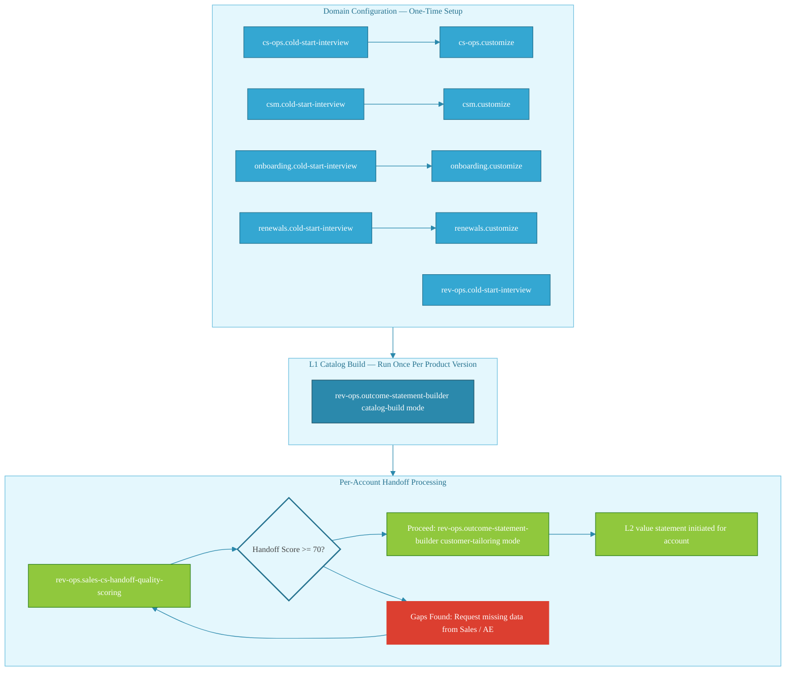

Three sequential phases. Domain configuration runs once at plugin deployment — nine cold-start-interview + customize pairs establish organizational context across all domains (note: `rev-ops.cold-start-interview` has no corresponding customize skill; it writes directly to the rev-ops domain context). L1 catalog build runs once per significant product update — `rev-ops.outcome-statement-builder` in catalog-build mode creates the market-level outcome statements the whole team references. Per-account handoff processing runs for each new customer — `rev-ops.sales-cs-handoff-quality-scoring` gates entry to `rev-ops.outcome-statement-builder` (customer-tailoring mode), ensuring poor-quality handoffs are remediated before L2 value work begins.

### Value Chain Gap Risks — Stage 0

| Gap Risk | Indicator | Plugin Response |
|---|---|---|
| Incomplete sales handoff | `rev-ops.sales-cs-handoff-quality-scoring` score below 70 | Flag specific gaps to AE; block onboarding advancement until resolved |
| Missing L1 catalog | No outcome-statement-builder catalog artifact at deployment | Run `rev-ops.outcome-statement-builder` (catalog-build mode) before any account onboarding |
| L2 tailoring skipped | Account enters Stage 1 without initialized value statement | `csm.value-statement` at Stage 2 lacks structural input; value conversation quality degrades throughout lifecycle |
| Domain config incomplete | Skills operating on generic defaults | Run all `cold-start-interview` + `customize` pairs before customer-facing work begins |

### Stage 0 Gate Criteria

| Criterion | Verification |
|---|---|
| All five domain context files written | Domain CLAUDE.md files exist and are populated |
| L1 Outcome Catalog exists for current product version | `rev-ops.outcome-statement-builder` catalog artifact present |
| Handoff quality score >= 70 | `rev-ops.sales-cs-handoff-quality-scoring` output confirmed |
| L2 value statement initialized for account | `rev-ops.outcome-statement-builder` customer-tailoring output present |
| Customer objectives documented | CSM domain context reflects account-specific goal language |


---

## Stage 1 — Onboarding

**Lifecycle Stage:** Onboarding
**Value Realization Stage:** Value Planning → Value Delivery (early)
**Primary objective:** Translate sales commitments into a structured onboarding plan with measurable success criteria, and execute against that plan through to Time-to-Value.

### Capability Add at Stage 1

The onboarding domain's seven skills form a complete execution track from kick-off preparation through handoff documentation. Without the plugin, these activities — kick-off prep, plan construction, success criteria definition, milestone tracking, blocker review, TTV analysis — are performed ad hoc with quality varying by CSM tenure and workload. With the plugin, each activity produces a structured output that feeds the next, creating a documented evidence chain from onboarding start to Stage 2 transition.

`onboarding.ttv-analysis` delivers the highest leverage: it surfaces velocity patterns across the onboarding cohort, identifying accounts falling behind TTV targets before the miss becomes visible in lagging health metrics. A CSM working without this skill can only assess the accounts on their desk; the skill surfaces the cohort pattern before any individual account escalates.

### Plugin Skills — Stage 1

| Skill | Value Chain Role |
|---|---|
| `onboarding.kickoff-prep` | Converts L2 value statement and handoff data into kick-off agenda and pre-read |
| `onboarding.onboarding-plan` | Structures the end-to-end onboarding track with milestones, owners, and timeline |
| `onboarding.success-criteria` | Defines measurable criteria linking onboarding milestones to desired outcomes |
| `onboarding.milestone-tracker` | Tracks milestone completion against plan; surfaces deviations in real time |
| `onboarding.blocker-review` | Diagnoses blockers; classifies by type (technical, adoption, organizational) |
| `onboarding.ttv-analysis` | Analyzes Time-to-Value trajectory cohort-wide; flags at-risk accounts |
| `onboarding.handoff-doc` | Produces Stage 1→2 handoff artifact with outcomes achieved and open items |

### Value Chain Focus — Stage 1

| Value Chain Stage | Activity | Plugin Skill |
|---|---|---|
| Deliverable Outcomes | Define what product usage will produce in this account's context | `onboarding.success-criteria` |
| Desired Outcomes | Map customer goals to onboarding milestones | `onboarding.onboarding-plan` |
| Business Goals | Connect milestone completion to organizational objectives | `onboarding.kickoff-prep` |
| Expected Value | Document value timeline and TTV commitment | `onboarding.ttv-analysis` |
| Realized Value (early signal) | Track first value realization moments against TTV target | `onboarding.milestone-tracker`, `onboarding.ttv-analysis` |

### Stage 1 Workflow

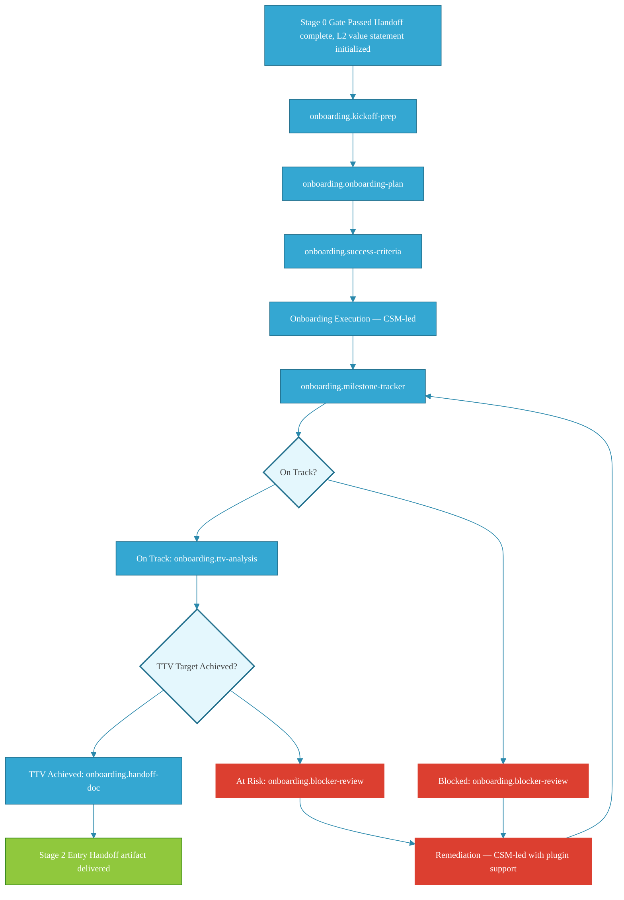

Planning skills run sequentially before onboarding begins. During execution, `milestone-tracker` drives a continuous assessment loop. Blockers route through `blocker-review` before remediation. `ttv-analysis` gates Stage 2 entry — accounts not on TTV trajectory surface here before they appear in churn signals.

### Value Chain Gap Risks — Stage 1

| Gap Risk | Indicator | Plugin Response |
|---|---|---|
| Success criteria disconnected from L2 value statement | Milestones defined without outcome linkage | `onboarding.success-criteria` requires L2 input; rebuild value statement first if absent |
| TTV slippage not detected early | Milestone completion on schedule but velocity declining | `onboarding.ttv-analysis` cohort view surfaces this before individual account view shows it |
| Blockers classified incorrectly | Technical blockers treated as adoption issues | `onboarding.blocker-review` type classification; each type has a different remediation path |
| Handoff artifact incomplete | Stage 2 CSM lacks context on unresolved items | `onboarding.handoff-doc` requires milestone summary, open items, and TTV status before generating |

### Stage 1 Gate Criteria

| Criterion | Verification |
|---|---|
| TTV achieved or variance documented with plan | `onboarding.ttv-analysis` output |
| All critical milestones completed or formally deferred | `onboarding.milestone-tracker` status |
| Handoff document produced | `onboarding.handoff-doc` artifact present |
| Success criteria confirmed measurable | `onboarding.success-criteria` output reviewed |
| No open P0/P1 blockers | `onboarding.blocker-review` clear or escalation documented |

---

## Stage 2 — Adoption & Success Planning

**Lifecycle Stage:** Adoption
**Value Realization Stage:** Value Delivery
**Primary objective:** Establish the ongoing CSM relationship, build the success plan, execute TARO plays, and maintain the L2 value statement as the account realizes initial value.

### Capability Add at Stage 2

Stage 2 is where the CSM relationship becomes a structured practice rather than an informal check-in cadence. The six csm-domain skills create the execution infrastructure for consistent, value-linked engagement. `csm.success-plan-builder` is the structural anchor — without it, value delivery is implicit and unmeasurable. With it, every CSM interaction traces back to documented commitments.

`csm.value-statement` enters its primary lifecycle role here: maintaining the L2 value narrative as the account moves from Value Planning into active Value Delivery. The CSM arrives at every call with a current, evidence-linked value statement rather than reconstructing the narrative from CRM notes and memory.

### Plugin Skills — Stage 2

| Skill | Value Chain Role |
|---|---|
| `csm.success-plan-builder` | Creates the mutual success plan linking customer goals to product usage milestones |
| `csm.taro-play-runner` | Executes TARO (Task, Action, Resource, Outcome) plays for structured engagement responses |
| `csm.stakeholder-map` | Maps customer stakeholders to value chain stages and engagement needs |
| `csm.account-research` | Surfaces account context, company signals, and strategic initiatives |
| `csm.call-prep` | Prepares agenda, talking points, and value narrative for each customer interaction |
| `csm.value-statement` | Maintains and evolves the L2 value statement; primary artifact for value delivery conversations |

### Value Chain Focus — Stage 2

| Value Chain Stage | Activity | Plugin Skill |
|---|---|---|
| Desired Outcomes | Document customer-stated goals in structured success plan | `csm.success-plan-builder` |
| Business Goals | Map stakeholders to organizational objectives | `csm.stakeholder-map` |
| Expected Value | Maintain current value narrative against original expectations | `csm.value-statement` |
| Realized Value (in progress) | Track in-flight value realization against success plan commitments | `csm.success-plan-builder`, `csm.taro-play-runner` |

### Stage 2 Workflow

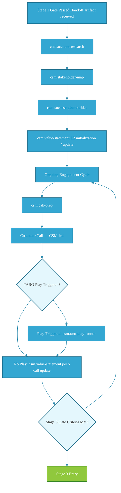

A setup sequence (account research → stakeholder map → success plan → value statement initialization) precedes the recurring engagement cycle. Each cycle runs call-prep → customer call → TARO play execution if triggered → value statement update. The value statement is the running record of value delivery progress; it updates after every significant interaction.

### Value Chain Gap Risks — Stage 2

| Gap Risk | Indicator | Plugin Response |
|---|---|---|
| Success plan disconnected from L2 value statement | Plan milestones don't trace to outcome catalog entries | `csm.success-plan-builder` requires L2 input; rebuild value statement first |
| Stakeholder map incomplete | Value conversations reaching wrong audience tier | `csm.stakeholder-map` update before next executive interaction |
| Value statement not maintained | CSM building narrative from scratch at each call | `csm.call-prep` surfaces stale value statement; triggers `csm.value-statement` update |
| TARO plays not executed on trigger signals | Adoption gaps visible but no structured response | `csm.taro-play-runner` requires play selection; CSM must classify signal type to activate |

### Stage 2 Gate Criteria

| Criterion | Verification |
|---|---|
| Mutual success plan documented and customer-confirmed | `csm.success-plan-builder` artifact + customer acknowledgment |
| L2 value statement current | `csm.value-statement` last-updated within 30 days |
| Key stakeholder map complete | `csm.stakeholder-map` covers executive sponsor and day-to-day champion |
| At least one TARO play executed | `csm.taro-play-runner` completion record |
| Product adoption reaching defined threshold | CSM-assessed; feeds into `csm.health-score-review` at Stage 3 |

---

## Stage 3 — Health Monitoring & Risk Management

**Lifecycle Stage:** Health & Monitoring
**Value Realization Stage:** Value Measurement
**Primary objective:** Systematically assess account health, communicate value realized to date through QBRs, identify and escalate risk, and maintain operational visibility across the portfolio.

### Capability Add at Stage 3

Stage 3 is where reactive CSM practice becomes proactive. Without systematic health review and QBR infrastructure, CSMs detect risk when customers mention it — by which point the risk has compounded. The plugin shifts detection earlier: `csm.health-score-review` surfaces deteriorating signals before they reach the customer relationship, `csm.risk-flag` structures the risk narrative for internal escalation, and `csm.qbr-builder` ensures every executive touchpoint is value-linked rather than activity-summarizing.

The cs-ops skills at this stage (`cs-ops.health-model-review`, `cs-ops.playbook-auditor`) operate at portfolio level — evaluating whether the health model itself is working and whether playbooks are producing intended outcomes across accounts. These are the skills that distinguish a team running on systemic intelligence from a team running on individual CSM judgment.

### Plugin Skills — Stage 3

| Skill | Value Chain Role |
|---|---|
| `csm.health-score-review` | Analyzes account health signals; produces risk-scored assessment |
| `csm.qbr-builder` | Constructs QBR content linking activity to realized value |
| `csm.risk-flag` | Documents and structures risk narrative for internal escalation |
| `csm.escalation-memo` | Produces executive-grade escalation documentation for at-risk accounts |
| `cs-ops.health-model-review` | Portfolio-level review of health model accuracy and signal weighting |
| `cs-ops.playbook-auditor` | Evaluates playbook effectiveness across accounts; surfaces pattern failures |

### Value Chain Focus — Stage 3

| Value Chain Stage | Activity | Plugin Skill |
|---|---|---|
| Realized Value | Measure value delivered against success plan commitments | `csm.health-score-review`, `csm.qbr-builder` |
| Expected Value | Compare current realization against original value expectations | `csm.qbr-builder`, `csm.value-statement` |
| Business Goals | Validate product usage is serving organizational objectives | `csm.qbr-builder` |
| Business Impact | Identify early indicators of measurable organizational change | `csm.qbr-builder` |

### Stage 3 Workflow

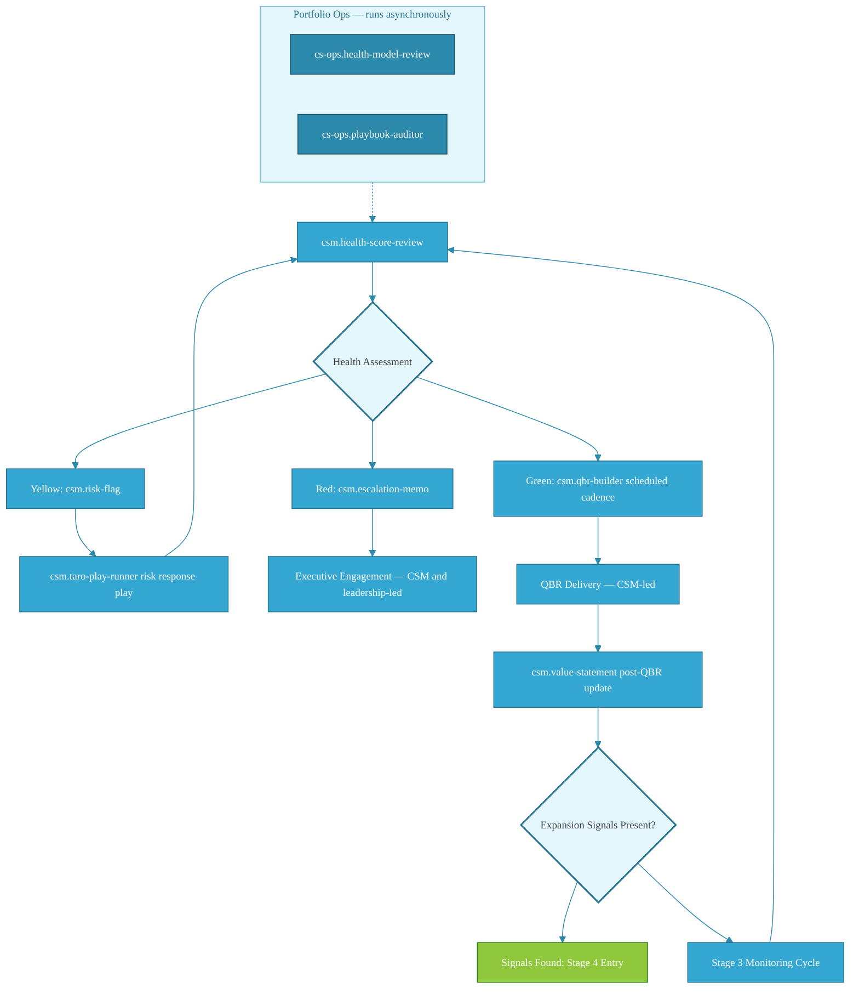

Every Stage 3 cycle begins with `csm.health-score-review`. Green accounts proceed to QBR on cadence. Yellow accounts route through `csm.risk-flag` and TARO play execution. Red accounts escalate via `csm.escalation-memo` to executive engagement. The cs-ops portfolio skills run asynchronously, feeding health model calibration back into the assessment loop. Expansion signal detection at QBR completion triggers Stage 4 entry.

### Value Chain Gap Risks — Stage 3

| Gap Risk | Indicator | Plugin Response |
|---|---|---|
| Health model miscalibrated | Accounts churning with no prior yellow/red signals | `cs-ops.health-model-review` recalibration; adjust signal weights |
| QBR content activity-focused not value-focused | Slides show feature usage, not outcome achievement | `csm.qbr-builder` requires current value statement input; update L2 before QBR build |
| Risk escalation too late | `csm.risk-flag` triggered after customer decision made | Increase `csm.health-score-review` cadence; review yellow threshold calibration |
| Playbook execution producing no improvement | Same accounts cycling through same risk plays | `cs-ops.playbook-auditor` surfaces pattern; triggers playbook revision |

### Stage 3 Gate Criteria

| Criterion | Verification |
|---|---|
| At least one QBR delivered with value-linked content | `csm.qbr-builder` artifact + CSM confirmation |
| No unaddressed Red health scores | `csm.health-score-review` + `csm.escalation-memo` records |
| L2 value statement updated post-QBR | `csm.value-statement` artifact dated post-QBR |
| Expansion signals identified or absence confirmed | `renewals.expansion-signal` run (Stage 4 entry trigger) |


---

## Stage 4 — Value Expansion & Growth

**Lifecycle Position:** Post-adoption, pre-renewal  
**Value Realization Stage:** Value Measurement → Value Expansion  
**Value Chain Position:** Realized Value → Business Impact

### Capability Add — What the Plugin Unlocks

Stage 4 is where value realization shifts from narrative to evidence. The CSM's challenge is identifying expansion signals before they become obvious — and converting realized value data into growth motion. Without systematic support, this stage relies on CSM intuition and ad-hoc data pulls. The plugin turns it into a structured, evidence-driven process.

The highest-leverage capability add here is the expansion signal and outcome-to-value tracking pair: `renewals.expansion-signal` surfaces growth indicators from usage and engagement data, while `rev-ops.outcome-to-value-tracking` connects delivered outcomes to the value chain stages where business impact is realized. Together, they give the CSM a quantified expansion brief — not just a hunch that the account is ready to grow.

`rev-ops.next-best-action-recommendation` adds recommendation intelligence, reducing the decision burden on the CSM. `rev-ops.revenue-leakage-scanning` surfaces at-risk revenue before it becomes a churn or contraction signal — a proactive intervention the CSM would otherwise catch only during renewal prep.

`csm.value-statement` plays a dual role in Stage 4: it converts Stage 3 health evidence into a realized-value narrative for the expansion conversation, and it pre-stages the value story for Stage 5 renewal.

### Plugin Skills — Stage 4

| Skill ID | Role | Capability Add |
|---|---|---|
| `renewals.expansion-signal` | Expansion signal detection | Surfaces usage, adoption, and engagement indicators that predict upsell/cross-sell readiness |
| `rev-ops.outcome-to-value-tracking` | Value chain tracing | Maps delivered outcomes to value chain stages; quantifies realized vs. expected value |
| `rev-ops.deal-to-outcome-tracing` | Deal-outcome linkage | Traces original deal commitments forward to current outcome delivery; surfaces gaps |
| `rev-ops.next-best-action-recommendation` | Growth action intelligence | Recommends prioritized next actions based on account health, usage, and outcome data |
| `rev-ops.revenue-leakage-scanning` | Revenue risk detection | Identifies at-risk revenue from underutilization, scope creep, or contract misalignment |
| `csm.value-statement` | Realized value narrative | Converts Stage 3 evidence into customer-specific value story; prepares expansion conversation |

### Value Chain Focus — Stage 4

| Chain Stage | Stage 4 Activity | Plugin Skill |
|---|---|---|
| Realized Value | Measure outcomes delivered vs. success criteria | `rev-ops.outcome-to-value-tracking` |
| Realized Value → Business Impact | Trace deal commitments to current outcomes | `rev-ops.deal-to-outcome-tracing` |
| Business Impact | Quantify business impact achieved; frame for expansion | `csm.value-statement` |
| Business Impact → Expansion | Identify growth signals and next-best actions | `renewals.expansion-signal` + `rev-ops.next-best-action-recommendation` |
| Business Impact (at-risk) | Detect revenue leakage before renewal | `rev-ops.revenue-leakage-scanning` |

### Stage 4 Workflow

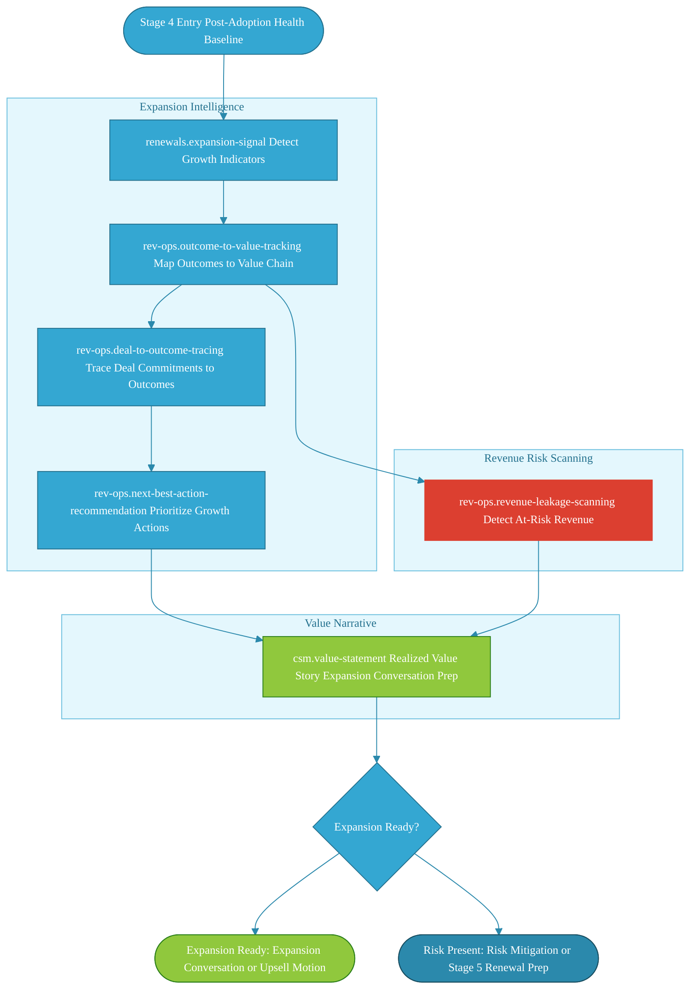

The diagram shows two parallel plugin tracks running from the outcome/deal evidence base. The Expansion Intelligence track (blue) converts outcome data into prioritized growth actions. The Revenue Risk Scanning track (amber) runs concurrently to catch leakage before it compounds. Both feed the Value Narrative block, which the CSM uses to drive either an expansion conversation or a pre-emptive risk mitigation motion.

### Value Chain Gap Risks — Stage 4

| Gap | Risk | Mitigation |
|---|---|---|
| No outcome-to-value mapping | Expansion conversation relies on anecdote, not evidence | Run `rev-ops.outcome-to-value-tracking` against Stage 3 health data before any expansion motion |
| Deal commitments not traced forward | Original value hypothesis disconnected from current delivery | `rev-ops.deal-to-outcome-tracing` surfaces gaps; CSM addresses before renewal |
| Expansion signals missed | Growth opportunity identified too late; competitor enters | `renewals.expansion-signal` runs on a cadence, not just at renewal trigger |
| Revenue leakage undetected | At-risk revenue compounds until churn | `rev-ops.revenue-leakage-scanning` runs in parallel with expansion motion |

### Stage 4 Gate Criteria

| Criterion | Evidence Required |
|---|---|
| Realized value quantified | `rev-ops.outcome-to-value-tracking` output mapped to success criteria |
| Deal-to-outcome gap assessed | `rev-ops.deal-to-outcome-tracing` completed; gaps documented or resolved |
| Expansion signals documented | `renewals.expansion-signal` output reviewed with CSM |
| Revenue leakage assessed | `rev-ops.revenue-leakage-scanning` completed; findings actioned or noted |
| Value story prepared | `csm.value-statement` updated with realized value evidence for Stage 5 entry |


---

## Stage 5 — Renewal

**Lifecycle Position:** Renewal decision window  
**Value Realization Stage:** Value Expansion → Value Measurement (retrospective)  
**Value Chain Position:** Business Impact → Realized Value (renewal justification)

### Capability Add — What the Plugin Unlocks

Renewal is the moment where the entire value chain either validates or collapses. The CSM's job is to enter the renewal conversation with a complete, evidence-backed brief — not to reconstruct the account story under time pressure. Nine skills converge in Stage 5 because renewal preparation is genuinely multi-dimensional: risk assessment, contract mechanics, negotiation positioning, executive communication, and churn prevention each require distinct outputs.

The plugin's highest-leverage capability add is the combination of `renewals.renewal-forecast` and `renewals.risk-assessment` as the opening moves. These two together give the CSM a probabilistic renewal picture and a prioritized risk inventory before the first renewal conversation. Everything downstream — contract review, negotiation prep, executive summary — is built on that foundation.

`csm.renewal-readiness` bridges the CSM-facing and renewal-team-facing views: it generates the account health summary the CSM uses to brief stakeholders and confirm readiness. `rev-ops.early-churn-downgrade-signal-detection` runs as the early-warning layer — it should fire well before Stage 5 formally opens, but its primary actioning happens here.

The CSM remains the relationship anchor and the judgment layer on all renewal decisions. The plugin compresses the preparation work from days to hours; the CSM owns the conversation.

### Plugin Skills — Stage 5

| Skill ID | Role | Capability Add |
|---|---|---|
| `renewals.renewal-forecast` | Renewal probability modeling | Generates forecast with health score, risk factors, and confidence level |
| `renewals.risk-assessment` | Renewal risk inventory | Prioritized risk register with severity, likelihood, and recommended mitigation |
| `renewals.contract-review` | Contract analysis | Reviews contract terms, identifies renewal blockers, flags price/scope misalignments |
| `renewals.negotiation-prep` | Negotiation positioning | Builds negotiation brief with anchor points, walk-away thresholds, and concession map |
| `renewals.price-increase-prep` | Price increase communication | Structures price increase framing with value evidence and objection handling |
| `renewals.executive-summary` | Stakeholder communication | Generates executive-ready renewal brief for sponsor alignment |
| `renewals.churn-analysis` | Churn risk deep-dive | Analyzes churn indicators when risk-assessment flags high-severity signals |
| `csm.renewal-readiness` | Readiness assessment | CSM-facing account health brief; confirms Stage 5 readiness; surfaces gaps |
| `rev-ops.early-churn-downgrade-signal-detection` | Early warning | Detects churn/downgrade signals from usage, sentiment, and engagement data |

### Value Chain Focus — Stage 5

| Chain Stage | Stage 5 Activity | Plugin Skill |
|---|---|---|
| Business Impact | Assess renewal probability against realized impact | `renewals.renewal-forecast` |
| Realized Value | Build evidence-based renewal case | `csm.renewal-readiness` + `renewals.executive-summary` |
| Expected Value → Realized Value (gap) | Identify where expected value was not delivered | `renewals.risk-assessment` + `renewals.churn-analysis` |
| Business Goals | Align renewal terms to customer's forward business goals | `renewals.negotiation-prep` + `renewals.contract-review` |
| Business Impact (signal) | Detect churn/downgrade risk before renewal window | `rev-ops.early-churn-downgrade-signal-detection` |

### Stage 5 Workflow

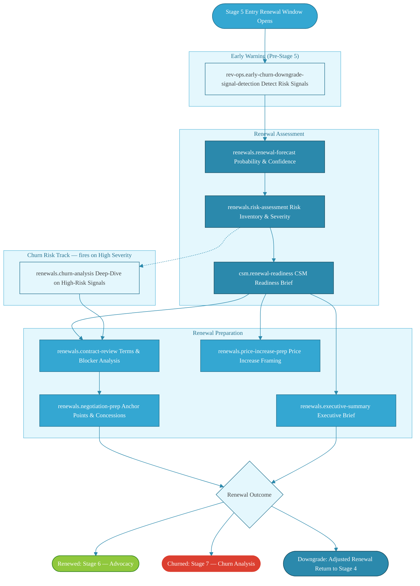

Stage 5 has three distinct tracks that converge on the renewal outcome decision. The Early Warning track (amber) should complete before Stage 5 formally opens. The Assessment track (blue, left) builds the probabilistic renewal case. The Preparation track (blue, right) converts that case into negotiation and communication assets. When Risk Assessment flags high severity, a Churn Risk track fires a deep-dive before the contract review proceeds.

### Value Chain Gap Risks — Stage 5

| Gap | Risk | Mitigation |
|---|---|---|
| No renewal forecast before conversation | CSM enters negotiation without probability anchor | `renewals.renewal-forecast` mandatory before any customer renewal conversation |
| Risk assessment skipped | Negotiation proceeds without knowing key objections | `renewals.risk-assessment` runs as Stage 5 entry gate, not optional |
| Contract terms unreviewed | Renewal blocked by overlooked clause or price misalignment | `renewals.contract-review` surfaces blockers; CSM addresses before negotiation |
| Churn signals detected but not analyzed | High-risk account enters negotiation without mitigation plan | `renewals.churn-analysis` mandatory when risk-assessment severity is HIGH |
| Executive brief absent | Sponsor misaligned; renewal stalls at executive level | `renewals.executive-summary` generated before sponsor engagement |

### Stage 5 Gate Criteria

| Criterion | Evidence Required |
|---|---|
| Renewal forecast complete | `renewals.renewal-forecast` output with probability and key risk factors |
| Risk inventory documented | `renewals.risk-assessment` completed; high-severity items actioned |
| CSM readiness confirmed | `csm.renewal-readiness` brief reviewed; gaps addressed |
| Contract reviewed | `renewals.contract-review` completed; blockers resolved or flagged |
| Negotiation brief prepared | `renewals.negotiation-prep` output reviewed by CSM |
| Executive brief prepared | `renewals.executive-summary` generated for sponsor communication |
| Churn analysis (if applicable) | `renewals.churn-analysis` completed when triggered by risk assessment |


---

## Stage 6 — Advocacy & Expansion

**Lifecycle Position:** Post-renewal, mature relationship  
**Value Realization Stage:** Value Expansion (sustained)  
**Value Chain Position:** Business Impact → Realized Value (ongoing cycle)

### Capability Add — What the Plugin Unlocks

Stage 6 is the rarest and most valuable position in the customer lifecycle: a customer who has renewed, is achieving business impact, and is positioned to become an advocate or expansion vehicle. The plugin's role here is deliberately lean — two skills, both focused on converting relationship equity into business evidence.

`csm.value-statement` in Stage 6 operates at peak Layer 2 maturity. The customer's terminology, metrics, and business context have been refined across Stages 2–5. The value statement generated here is the culmination of the entire value chain — a customer-specific, metric-grounded narrative that the customer themselves can validate and co-own. This is what makes reference calls, case studies, and co-marketing conversations possible.

`rev-ops.revenue-brief-generation` converts the account's value evidence into a revenue intelligence brief for RevOps and Sales: expansion opportunity sizing, reference potential, and growth model contribution. It closes the loop from the original deal hypothesis (Stage 0 Layer 1 catalog) back to realized business impact.

The CSM's role in Stage 6 is relationship stewardship and advocacy cultivation — the plugin provides the evidence infrastructure that makes those conversations credible.

### Plugin Skills — Stage 6

| Skill ID | Role | Capability Add |
|---|---|---|
| `csm.value-statement` | Mature value narrative | Peak Layer 2 expression — customer-validated value story ready for advocacy and co-marketing use |
| `rev-ops.revenue-brief-generation` | Revenue intelligence | Converts account outcomes to expansion opportunity sizing and revenue model contribution |

### Value Chain Focus — Stage 6

| Chain Stage | Stage 6 Activity | Plugin Skill |
|---|---|---|
| Business Impact | Document sustained business impact; prepare for advocacy activation | `csm.value-statement` |
| Business Impact → Realized Value (cycle) | Convert impact evidence into revenue intelligence for expansion and referral | `rev-ops.revenue-brief-generation` |
| Realized Value | Customer co-validates value narrative for external use (reference, case study) | `csm.value-statement` (co-authoring mode) |

### Stage 6 Workflow

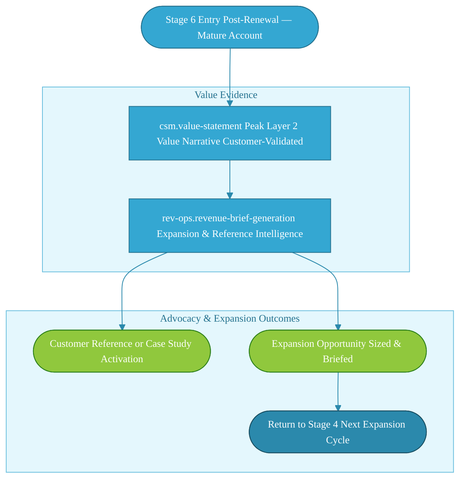

Stage 6 is the simplest workflow in the guide — two skills, two outputs, three possible outcomes. Simplicity here is intentional: the CSM and customer relationship carry Stage 6; the plugin provides the evidence layer that activates it. When expansion opportunity is identified, the workflow cycles back to Stage 4 — the customer re-enters the Value Measurement → Value Expansion track as a growing account.

### Value Chain Gap Risks — Stage 6

| Gap | Risk | Mitigation |
|---|---|---|
| Value statement not updated post-renewal | Advocacy conversation relies on stale narrative | `csm.value-statement` refreshed after each renewal with updated metrics |
| Revenue brief not generated | Expansion opportunity and reference potential invisible to Sales/RevOps | `rev-ops.revenue-brief-generation` runs as standard Stage 6 activity |
| Customer not engaged in value narrative | Co-ownership absent; reference activation fails | CSM involves customer in `csm.value-statement` review before advocacy ask |

### Stage 6 Gate Criteria

| Criterion | Evidence Required |
|---|---|
| Value narrative current | `csm.value-statement` updated post-renewal with validated metrics |
| Revenue brief generated | `rev-ops.revenue-brief-generation` output shared with RevOps |
| Advocacy readiness assessed | CSM has documented customer's advocacy willingness and scope |
| Expansion cycle initiated (if applicable) | Stage 4 re-entry triggered for identified growth opportunities |


---

## Stage 7 — Churn & Non-Renewal

**Lifecycle Position:** Post-renewal decision (churn outcome)  
**Value Realization Stage:** N/A — retrospective analysis  
**Value Chain Position:** Value chain failure diagnosis

### Capability Add — What the Plugin Unlocks

Stage 7 is not a failure of the CSM — it's a failure of the value chain. Something broke between product capabilities and business impact: a gap in outcome delivery, a mismatch between expected and realized value, an adoption barrier that compounded, or an external factor that no amount of CS work could overcome. The plugin's role here is forensic: `renewals.churn-analysis` reconstructs what happened and at which stage of the value chain the failure originated.

This is also the stage where Layer 1 and Layer 2 outcomes are audited. Did the outcome catalog accurately represent what the product could deliver for this customer segment? Was the value statement built on achievable outcomes, or were the success criteria set beyond what the product could support? The answers feed back into Stage 0 for the next cohort.

The CSM's role in Stage 7 is churn conversation ownership and post-mortem contribution. The plugin produces the structured analysis; the CSM validates it against their relationship knowledge and contributes the qualitative context that no data signal captures.

### Plugin Skills — Stage 7

| Skill ID | Role | Capability Add |
|---|---|---|
| `renewals.churn-analysis` | Churn post-mortem | Structured analysis of churn root cause mapped to value chain failure point |

### Value Chain Failure Framework — Stage 7

When a customer churns, the value chain broke at one or more links. `renewals.churn-analysis` maps the failure to the chain:

| Chain Link | Failure Mode | Signal |
|---|---|---|
| Product Capabilities → Deliverable Outcomes | Product didn't deliver promised capabilities | Feature gaps, support escalations, low usage of core features |
| Deliverable Outcomes → Desired Outcomes | Capabilities delivered but outcomes not achieved | Usage present but success criteria not met |
| Desired Outcomes → Business Goals | Outcomes achieved but not aligned to customer's actual goals | Success criteria met but customer still churned |
| Business Goals → Expected Value | Goals achieved but value not perceived | Sponsor mismatch; champion loss; value story never landed |
| Expected Value → Realized Value | Value realized but below expectation threshold | ROI below what was committed in pre-sales |
| Realized Value → Business Impact | Value realized but business impact not visible | Impact not measured or not attributed to product |

### Stage 7 Workflow

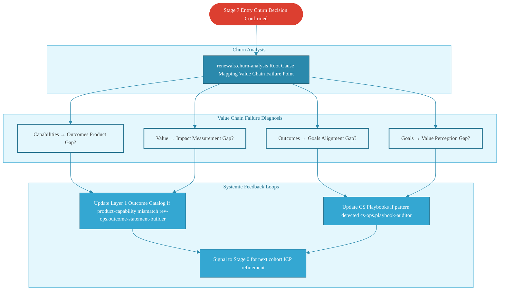

Stage 7 is the only stage where the workflow's primary output feeds backward into the system rather than forward. Churn analysis findings close the loop: product-capability mismatches update the Layer 1 outcome catalog; process and execution failures update CS playbooks; both signals feed Stage 0 for ICP and configuration refinement on the next cohort. This feedback loop is what makes the value chain a learning system, not just a delivery framework.

### Value Chain Gap Risks — Stage 7

| Gap | Risk | Mitigation |
|---|---|---|
| Churn analysis not completed | Root cause unknown; pattern repeats | `renewals.churn-analysis` mandatory on all churns, not just high-value accounts |
| Failure point not mapped to value chain | Qualitative "they just weren't a good fit" replaces structural diagnosis | Require chain-link failure mapping in every churn analysis output |
| Findings not fed back to Stage 0 | Next cohort repeats same failure | Structured feedback to outcome catalog and playbook auditor |
| CSM qualitative context not captured | Data-only analysis misses champion loss, executive misalignment | CSM contributes relationship context as required input to churn analysis |

### Stage 7 Gate Criteria

| Criterion | Evidence Required |
|---|---|
| Churn analysis completed | `renewals.churn-analysis` output with value chain failure point identified |
| Failure mode categorized | Chain-link failure mapped to one or more categories |
| Feedback loop initiated | L1 catalog or playbook update triggered where applicable |
| Stage 0 signal documented | ICP or configuration refinement recommendation recorded for next cohort |


---

## Value Chain Monitoring Dashboard

The Value Chain Monitoring Dashboard translates the plugin's skill outputs into a living operational view of where each account stands across the seven-stage lifecycle and five-stage value realization framework. It is not a reporting artifact — it is the CSM's weekly operational brief, generated by combining outputs from multiple skill runs.

### Dashboard Composition

Each dashboard row maps one account to its current position. The plugin skills that feed each column are listed below:

| Dashboard Column | Source Skill(s) | Update Cadence |
|---|---|---|
| **Lifecycle Stage** | `csm.renewal-readiness`, `renewals.renewal-forecast` | Weekly |
| **Value Realization Stage** | `rev-ops.outcome-to-value-tracking`, `csm.value-statement` | Bi-weekly |
| **Health Score** | `cs-ops.health-model-review` + `csm.health-score-review` | Weekly |
| **Expansion Signal** | `renewals.expansion-signal` | Weekly |
| **Risk Flag** | `csm.risk-flag`, `renewals.risk-assessment`, `rev-ops.early-churn-downgrade-signal-detection` | Weekly |
| **Revenue Leakage** | `rev-ops.revenue-leakage-scanning` | Bi-weekly |
| **Next Best Action** | `rev-ops.next-best-action-recommendation` | Weekly |
| **Value Statement Currency** | `csm.value-statement` | Quarterly or post-milestone |

### Dashboard State — Value Chain Position by Account Tier

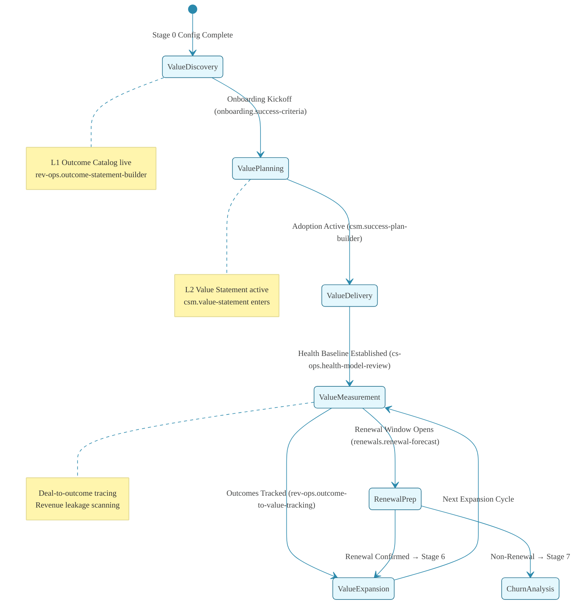

The state diagram maps the five Value Realization Stages to their lifecycle entry points and the plugin skills that signal each transition. An account that stalls in ValueDelivery — never reaching ValueMeasurement — is a leading indicator that `cs-ops.health-model-review` and `csm.health-score-review` are not running on cadence.

### Monitoring Cadences

| Cadence | Skills to Run | Account Scope |
|---|---|---|
| **Weekly** | `renewals.expansion-signal`, `csm.risk-flag`, `rev-ops.next-best-action-recommendation`, `rev-ops.early-churn-downgrade-signal-detection` | All active accounts |
| **Bi-weekly** | `csm.health-score-review`, `cs-ops.health-model-review`, `rev-ops.outcome-to-value-tracking`, `rev-ops.revenue-leakage-scanning` | Segments 1 and 2 (high-value, high-risk) |
| **Monthly** | `renewals.renewal-forecast`, `renewals.risk-assessment`, `rev-ops.deal-to-outcome-tracing` | All accounts entering 180-day renewal window |
| **Quarterly** | `csm.value-statement` (refresh), `renewals.executive-summary` | Strategic accounts, QBR preparation |
| **Ad-hoc (triggered)** | `csm.escalation-memo`, `renewals.churn-analysis`, `onboarding.blocker-review` | Triggered by risk-flag or health score threshold breach |


---

## Recovery Workflows

Recovery workflows activate when gate criteria fail or health signals breach thresholds. Each workflow below maps the plugin skills that support the recovery motion. The CSM leads every recovery; the plugin compresses the diagnostic and communication preparation work.

### Recovery 1 — Onboarding Stall

**Trigger:** Stage 1 gate criteria not met by TTV milestone date; health score below threshold during onboarding.

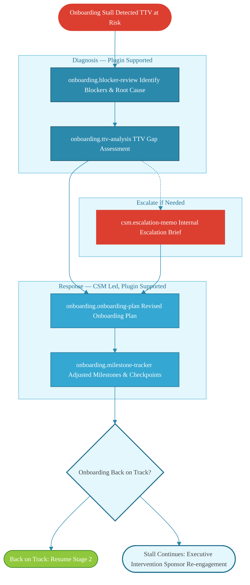

### Recovery 2 — Adoption Stall

**Trigger:** Stage 2 health score declining; success plan milestones missed; low feature adoption in core use cases.

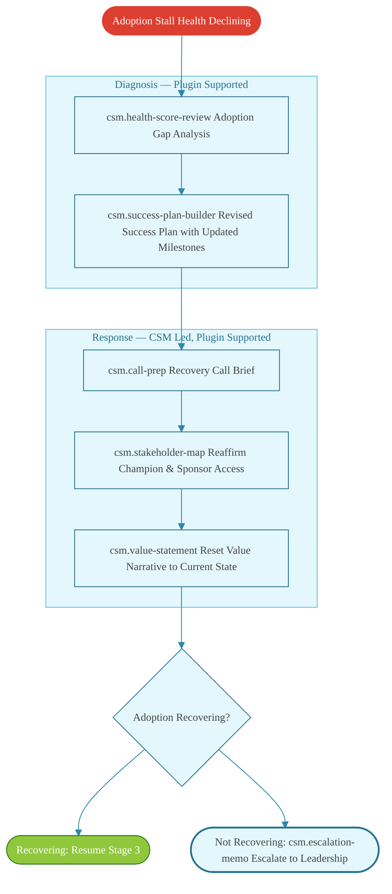

### Recovery 3 — Health Score Deterioration

**Trigger:** Stage 3 health score crosses red threshold; risk-flag fires; escalation criteria met.

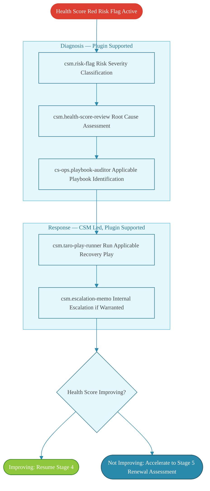

### Recovery 4 — Value Realization Gap

**Trigger:** `rev-ops.outcome-to-value-tracking` shows realized value below expected value threshold; deal-to-outcome tracing identifies undelivered commitments.

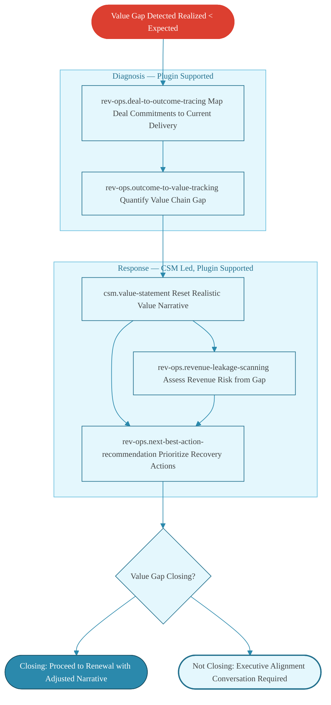

### Recovery 5 — Renewal At-Risk

**Trigger:** `renewals.renewal-forecast` returns low-confidence or high-risk; Stage 5 risk assessment flags multiple HIGH-severity items; churn signals active.

```mermaid
%%{init: {'theme': 'base', 'themeVariables': {'fontFamily': 'Poppins', 'fontSize': '13px', 'primaryColor': '#E4F7FD', 'primaryTextColor': '#424343', 'primaryBorderColor': '#6BBFDE', 'secondaryColor': '#E4F7FD', 'tertiaryColor': '#E4F7FD', 'tertiaryBorderColor': '#6BBFDE', 'clusterBkg': '#E4F7FD', 'clusterBorder': '#6BBFDE', 'titleColor': '#24718E', 'lineColor': '#2B89AC', 'nodeBorder': '#24718E', 'mainBkg': '#E4F7FD', 'edgeLabelBackground': 'transparent'}}}%%
flowchart TD
    classDef primary fill:#34A7D2,stroke:#24718E,color:#fff
    classDef secondary fill:#2B89AC,stroke:#194E61,color:#fff
    classDef success fill:#90C83D,stroke:#2D801B,color:#fff
    classDef alert fill:#DC3F30,stroke:#DC3F30,color:#fff
    classDef risk fill:#E4F7FD,stroke:#24718E,stroke-width:2px
    R5_TRIGGER([Renewal At-Risk Multiple HIGH Severity Flags]) --> CHURN

    subgraph DIAGNOSE ["Diagnosis — Plugin Supported"]
        CHURN[renewals.churn-analysis Root Cause Deep-Dive] --> RISK
        RISK[renewals.risk-assessment Prioritized Risk Inventory]
    end

    subgraph RESPOND ["Response — CSM Led, Plugin Supported"]
        NEGO[renewals.negotiation-prep At-Risk Negotiation Brief] --> EXEC
        EXEC[renewals.executive-summary Executive Intervention Brief] --> CONTRACT
        CONTRACT[renewals.contract-review Flex Terms Identification]
    end

    subgraph SAVE ["Save Attempt"]
        PRICE[renewals.price-increase-prep Restructured Commercial Offer (if applicable)]
    end

    RISK --> NEGO
    CONTRACT --> PRICE
    PRICE --> R5_EXIT{Renewal Saved?}
    R5_EXIT --> STAGE6([Saved: Stage 6 — Advocacy])
    R5_EXIT --> STAGE4([Downgrade: Adjusted Renewal Return to Stage 4])
    R5_EXIT --> STAGE7([Churned: Stage 7 — Churn Analysis])
    class R5_TRIGGER alert
    class STAGE6 success
    class STAGE4 secondary
    class STAGE7 alert
```

### Recovery 6 — Post-Churn Learning Loop

**Trigger:** Stage 7 entry — churn confirmed. Not a save motion; a systemic learning motion.

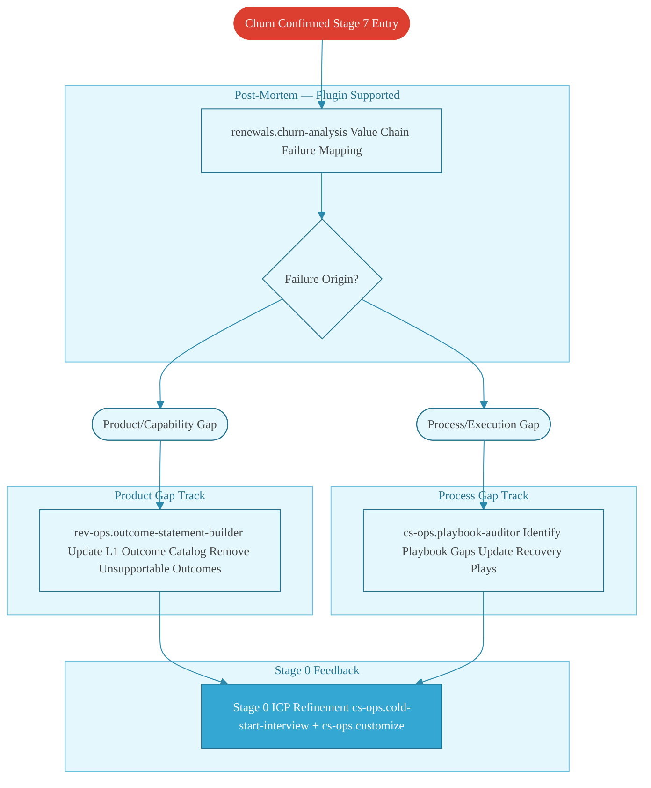

Recovery 6 is the only workflow where the terminal node is a system input, not an account outcome. The churn learning loop feeds directly into Stage 0 configuration, completing the feedback cycle that makes the entire framework adaptive over time.


---

## Cross-Cutting Operations

Cross-cutting operations are the 27 skills in the plugin that do not map to a single lifecycle stage — they operate at the portfolio, team, or revenue-system level. They run on cadences, not triggers. Without them, the lifecycle work described in Stages 0–7 operates on a foundation that may be drifting: stale data, unreviewed processes, miscalibrated health models, and pipeline forecasts that don't reflect reality.

This section organizes these skills into four functional subsections matching their operational scope.

### CS Operations — Portfolio & Process Health

These five skills provide the operational infrastructure that individual CSMs depend on. They are typically owned by CS Operations, not individual CSMs.

| Skill ID | Function | Run Cadence |
|---|---|---|
| `cs-ops.capacity-planner` | Models CSM capacity against current book-of-business; surfaces over/under-allocation | Monthly or at hiring/territory change |
| `cs-ops.data-quality-check` | Audits CRM and CS platform data quality; flags staleness and missing fields | Bi-weekly |
| `cs-ops.metric-dashboard` | Generates portfolio-level CS health metrics across segments | Weekly |
| `cs-ops.process-doc` | Documents CS processes, playbooks, and SOPs | On process change or quarterly review |
| `cs-ops.segment-analyzer` | Analyzes account segments for health patterns, churn risk clusters, and expansion concentration | Monthly |

**Value Chain Relevance:** These skills ensure that the data feeding Stage-level skill outputs is reliable. A `cs-ops.data-quality-check` finding that customer health scores are missing for 30% of accounts directly degrades every Stage 3 and Stage 5 skill output that depends on health data.

### RevOps — Pipeline & Forecast

These nine skills cover the forward-looking revenue intelligence that CS outcomes feed into. They are owned by RevOps and inform both the CS team's account prioritization and the Sales team's pipeline strategy.

| Skill ID | Function | Run Cadence |
|---|---|---|
| `rev-ops.pipeline-coverage-analysis` | Assesses pipeline coverage ratio against quota by segment and rep | Weekly |
| `rev-ops.pipeline-velocity-tracking` | Tracks deal velocity changes across stages; detects slowdowns | Weekly |
| `rev-ops.forecast-variance-analysis` | Compares forecast to actuals; identifies systemic over/under-forecasting patterns | Monthly |
| `rev-ops.growth-model-vs-actuals-tracking` | Tracks growth model assumptions against realized growth; surfaces model drift | Monthly |
| `rev-ops.gtm-unified-metrics-pulse` | Single GTM health pulse across pipeline, expansion, retention, and churn | Weekly |
| `rev-ops.scenario-modeling` | Models revenue scenarios under different churn, expansion, and new-logo assumptions | Quarterly or at plan change |
| `rev-ops.quota-sensitivity-analysis` | Analyzes quota attainment sensitivity to key variable changes | Quarterly |
| `rev-ops.mid-year-replan-triggering` | Identifies when mid-year plan rebase is warranted based on actuals vs. model | Mid-year review |
| `rev-ops.annual-planning-workflow` | Orchestrates annual planning process across Sales, CS, and RevOps | Annual |

**Value Chain Relevance:** Pipeline and forecast skills connect Stage 6 `rev-ops.revenue-brief-generation` outputs to the forward revenue model. When `renewals.churn-analysis` surfaces a churn pattern, `rev-ops.forecast-variance-analysis` is the downstream skill that quantifies the revenue impact.

### RevOps — Deal Quality & Data Integrity

These ten skills maintain the integrity of the deal and account data that all CS skills depend on. Poor deal data is the single most common failure mode in the value chain — expected value commitments that were never entered correctly, outcomes that were promised verbally but not tracked, and CRM records that drift from reality.

| Skill ID | Function | Run Cadence |
|---|---|---|
| `rev-ops.crm-hygiene-audit` | Audits CRM records for completeness, accuracy, and field consistency | Bi-weekly |
| `rev-ops.cross-system-reconciliation` | Reconciles data across CRM, CS platform, and billing system | Monthly |
| `rev-ops.data-decay-tracking` | Tracks rate of data staleness across contact, account, and opportunity records | Monthly |
| `rev-ops.deal-classification` | Classifies deals by segment, ICP fit, complexity, and CS resource requirements | On deal close |
| `rev-ops.deal-health-scoring` | Scores deal health based on engagement, timeline adherence, and stakeholder coverage | Weekly (active deals) |
| `rev-ops.deal-desk-workflow-management` | Manages deal desk review and approval workflows for non-standard deals | On non-standard deal submission |
| `rev-ops.discount-threshold-monitoring` | Monitors discount levels against policy thresholds; flags exceptions | Weekly |
| `rev-ops.duplicate-detection` | Identifies duplicate account, contact, and opportunity records across systems | Bi-weekly |
| `rev-ops.field-completion-monitoring` | Monitors required field completion rates across CRM stages | Weekly |
| `rev-ops.stage-integrity-audit` | Audits deal stage progression for integrity; detects stage skipping and stale stages | Weekly |

**Value Chain Relevance:** These skills feed Stage 0 data quality and the Layer 1 outcome catalog accuracy. `rev-ops.deal-classification` at deal close is the input to Stage 0 CS configuration. `rev-ops.stage-integrity-audit` failures indicate that the value chain is being tracked against inaccurate deal data.

### RevOps — Capacity & Strategy

These three skills operate at the organizational design level — CS capacity modeling at scale and change communication.

| Skill ID | Function | Run Cadence |
|---|---|---|
| `rev-ops.unit-of-growth-calculator` | Models the cost and capacity implications of a single unit of growth (new logo, expansion, renewal) | At plan cycle or growth model change |
| `rev-ops.closed-won-to-cs-capacity-modeling` | Maps new deal velocity to CS capacity; surfaces hiring signal | Weekly (during high-growth periods) |
| `rev-ops.change-communication-packaging` | Packages process, territory, or system changes into structured CSM communication | On significant operational change |

**Value Chain Relevance:** `rev-ops.closed-won-to-cs-capacity-modeling` is the operational link between the Stage 0 pipeline and the CS team's ability to execute Stages 1–6. When deal velocity exceeds CS capacity, the entire value chain degrades — not because of skill execution failures, but because CSMs are overloaded.

### Cross-Cutting Operations — Summary View

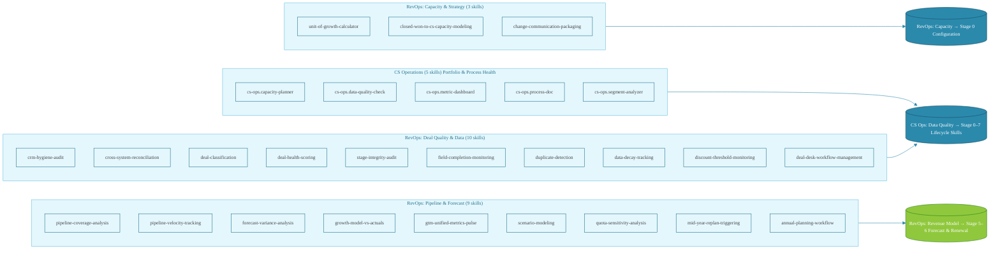

The diagram shows how the four subsections connect to the lifecycle skills. CS Operations and Deal Quality feed data quality into the lifecycle. Pipeline & Forecast feeds the renewal and revenue intelligence layers. Territory & Strategy feeds Stage 0 capacity configuration — the starting condition for every customer journey.


---

# Implementation Guidance

This section covers the practical mechanics of deploying the Claude for Customer Success plugin within a CS organization — configuration sequence, rollout strategy, CSM adoption patterns, integration touchpoints, and how to measure whether the capability-add is delivering.

---

## Plugin Deployment Context

The Claude for Customer Success plugin runs inside **Cowork mode** — Anthropic's desktop agentic environment. Each CSM installs the plugin locally; it connects to their CRM, CS platform, and RevOps tooling through MCP connectors configured at the org level.

**Prerequisites before any CSM uses stage-specific skills:**

1. Cowork installed and authenticated on the CSM's machine
2. Claude for Customer Success plugin installed from the marketplace
3. MCP connectors configured: CRM (HubSpot/Salesforce), CS platform (Gainsight/ChurnZero/Totango), calendar, email
4. RevOps admin has run `rev-ops.cold-start-interview` to seed the Outcome Catalog (Layer 1)
5. CS Ops admin has run `cs-ops.cold-start-interview` + `cs-ops.customize` to establish team-level operating defaults

The Outcome Catalog seeded in step 4 is the foundation every downstream skill draws from. Running stage-specific skills before the catalog exists produces generic output — the plugin can still operate, but the value chain integration is shallow until Layer 1 is in place.

---

## Recommended Rollout Sequence

### Phase 1 — Foundation (Week 1–2, RevOps + CS Ops Leads)

| Step | Who | Skill | Output |
|------|-----|-------|--------|
| 1 | RevOps Lead | `rev-ops.cold-start-interview` | Outcome Catalog seeded (Layer 1) |
| 2 | RevOps Lead | `rev-ops.outcome-statement-builder` (catalog mode) | Canonical outcome/value statements for top segments |
| 3 | CS Ops Admin | `cs-ops.cold-start-interview` | CS ops defaults established |
| 4 | CS Ops Admin | `cs-ops.customize` | Team-level configuration applied |
| 5 | CS Ops Admin | `cs-ops.handoff-quality-scoring` | Handoff quality baseline captured |

Do not move to Phase 2 until the Outcome Catalog has at least one segment fully populated and handoff quality scoring is running.

### Phase 2 — Onboarding Domain (Week 3–4, Onboarding CSMs)

| Step | Who | Skill | Output |
|------|-----|-------|--------|
| 6 | Onboarding Lead | `onboarding.cold-start-interview` | Onboarding motion defaults |
| 7 | Onboarding Lead | `onboarding.customize` | Per-segment onboarding config |
| 8 | Onboarding CSMs | `onboarding.kickoff-preparation` | First augmented customer kickoffs |
| 9 | Onboarding CSMs | `onboarding.success-plan-builder` | Success plans with Layer 2 instantiation |
| 10 | Onboarding CSMs | `onboarding.stakeholder-map-builder` + `onboarding.mutual-action-plan-builder` | Full onboarding motion live |

Validate: CSMs can run a full Stage 1 workflow (kickoff → success plan → stakeholder map → MAP → progress reports) end-to-end before moving on.

### Phase 3 — CSM Domain (Week 5–6, Account CSMs)

| Step | Who | Skill | Output |
|------|-----|-------|--------|
| 11 | CSM Lead | `csm.cold-start-interview` | CSM motion defaults |
| 12 | CSM Lead | `csm.customize` | Per-tier or per-segment CSM config |
| 13 | Account CSMs | `csm.health-score-interpreter` | First health score augmentation |
| 14 | Account CSMs | `csm.qbr-builder` + `csm.value-statement` | QBR workflow live |
| 15 | Account CSMs | `csm.risk-profile-builder` + `csm.save-play-generator` | Risk management motion live |

### Phase 4 — Renewals Domain (Week 7–8, Renewal CSMs)

| Step | Who | Skill | Output |
|------|-----|-------|--------|
| 16 | Renewals Lead | `renewals.cold-start-interview` | Renewals motion defaults |
| 17 | Renewals Lead | `renewals.customize` | Renewal-tier configuration |
| 18 | Renewal CSMs | `renewals.renewal-forecast` + `renewals.risk-assessment` | Renewal pipeline visibility |
| 19 | Renewal CSMs | `renewals.negotiation-prep` + `renewals.contract-review` | Deal execution augmentation |
| 20 | Renewal CSMs | `renewals.executive-summary` + `csm.renewal-readiness` | Full renewal motion live |

### Phase 5 — RevOps Full Activation (Week 9–10, RevOps Team)

| Step | Who | Skill | Output |
|------|-----|-------|--------|
| 21 | RevOps | `rev-ops.expansion-signal` + `rev-ops.next-best-action-recommendation` | Expansion pipeline feeds live |
| 22 | RevOps | `rev-ops.revenue-leakage-scanning` + `rev-ops.churn-analysis` | Revenue integrity motion live |
| 23 | RevOps | `rev-ops.deal-to-outcome-tracing` + `rev-ops.outcome-to-value-tracking` | Value chain traceability live |
| 24 | RevOps | `rev-ops.unit-of-growth-calculator` + `rev-ops.closed-won-to-cs-capacity-modeling` | Strategic capacity planning augmented |
| 25 | All | `rev-ops.playbook-auditor` | First ecosystem audit run |

---

## CSM Adoption Guidance

### Habit Formation by Lifecycle Stage

The plugin delivers value through consistent use at specific workflow trigger points. CSMs who use skills sporadically get sporadic value; those who wire skills to their existing calendar and CRM workflows see compounding returns.

**Stage 1 (Onboarding):** The highest-leverage habit is running `onboarding.kickoff-preparation` 24–48 hours before every new customer kickoff. This single habit creates the Layer 2 instantiation that all downstream value tracking depends on. If a CSM only adopts one habit in Phase 2, this is it.

**Stage 2 (Adoption & Success Planning):** Wire `csm.health-score-interpreter` to the weekly health score review. Don't wait for a red score — run it on amber signals to catch deterioration before it becomes a save situation.

**Stage 3 (Health Monitoring):** `csm.risk-profile-builder` should run any time a health score drops more than 10 points in a single week, or when a key stakeholder change is detected via CRM activity. The save motion (`csm.save-play-generator`) should feel like a natural next step, not an emergency response.

**Stage 4 (Expansion):** CSMs often under-use expansion skills because expansion feels like "sales territory." Reframe: `rev-ops.expansion-signal` is a customer health signal — it fires when a customer is succeeding, not when a quota needs filling. Pair it with `csm.value-statement` delivery to close the loop.

**Stage 5 (Renewal):** Start the renewal motion 120 days out for enterprise accounts, 60 days for mid-market. `renewals.renewal-forecast` + `renewals.risk-assessment` at T-120 surfaces the deals that need early intervention. CSMs who wait until T-60 to run these skills consistently face compressed recovery windows.

**Stage 6 (Advocacy):** `rev-ops.revenue-brief-generation` is the most underused skill in the plugin. It turns a renewal conversation into a strategic business review. Use it for every Tier 1 account at least once per quarter.

### Skills to Prioritize for New CSMs

New CSMs joining the team after plugin deployment should onboard in this sequence:

1. `csm.cold-start-interview` + `csm.customize` — establish personal operating context
2. `onboarding.kickoff-preparation` — first customer-facing augmentation
3. `csm.health-score-interpreter` — weekly rhythm skill
4. `csm.value-statement` — core narrative skill, used at every stage
5. `csm.qbr-builder` — prepares for the first QBR (typically at Day 90)

Everything else follows naturally as the account matures through the lifecycle.

### Skills That Require RevOps Pre-Work

These skills produce generic or low-value output if the Outcome Catalog (Layer 1) has not been seeded:

- `csm.value-statement` — needs Layer 1 canonical statements to instantiate against
- `onboarding.success-plan-builder` — needs outcome/value framework from catalog
- `rev-ops.outcome-to-value-tracking` — needs catalog entries as tracking targets
- `rev-ops.deal-to-outcome-tracing` — needs catalog outcomes to trace back to deals

If CSMs report that these skills are producing generic output, the root cause is almost always a missing or incomplete Outcome Catalog. Run `rev-ops.outcome-statement-builder` in catalog-build mode to populate it.

---

## Integration with Existing CS Tooling

The plugin does not replace existing CS infrastructure — it augments the human layer that operates on top of it. Integration touchpoints by system:

### CRM (HubSpot / Salesforce)

| Plugin Activity | CRM Integration Point |
|----------------|----------------------|
| `csm.health-score-interpreter` output | Log as activity note on account record |
| `csm.risk-profile-builder` output | Update risk flag / stage field on account |
| `renewals.renewal-forecast` output | Sync forecast amount and close date |
| `rev-ops.expansion-signal` output | Create expansion opportunity record |
| `cs-ops.handoff-quality-scoring` output | Tag handoff quality score on opportunity |
| Churn analysis findings | Log churn reason code on closed-lost record |

The plugin reads account data from CRM via MCP connector. It does not write back automatically — CSMs review plugin output and log to CRM per their team's SOP. Some teams configure the MCP connector to allow write-back for specific fields (risk flags, renewal forecast); this is a RevOps configuration decision.

### CS Platform (Gainsight / ChurnZero / Totango)

| Plugin Activity | CS Platform Integration Point |
|----------------|------------------------------|
| `csm.health-score-interpreter` | Cross-reference against platform health score; surface discrepancies |
| `onboarding.success-plan-builder` output | Mirror success plan milestones as CTAs or tasks |
| `csm.save-play-generator` output | Trigger escalation CTA in platform |
| `renewals.risk-assessment` output | Update renewal risk rating in platform |
| Value delivery cadence progress | Log milestone completion against success plan |

The plugin does not replace CS platform health scoring — it interprets and contextualizes it. CSMs continue logging activities in the CS platform per existing SOP; the plugin adds a reasoning and synthesis layer on top.

### RevOps Systems (BI / Data Warehouse / Rev Intelligence)

| Plugin Activity | RevOps System Integration Point |
|----------------|--------------------------------|
| `rev-ops.outcome-to-value-tracking` output | Feed into QBR data layer |
| `rev-ops.revenue-leakage-scanning` findings | Triage list for RevOps weekly review |
| `rev-ops.deal-to-outcome-tracing` output | Populate sales-to-CS handoff scorecard |
| `rev-ops.closed-won-to-cs-capacity-modeling` output | Input to headcount and quota planning models |
| `rev-ops.unit-of-growth-calculator` output | Feed into resource allocation and growth model |

---

## Measuring Capability-Add Impact

The plugin is a capability-add for human CSMs — not an autonomous agent. Measuring its impact requires separating what the plugin enables from what the CSM achieves with that enablement.

### Leading Indicators (Adoption)

These measure whether CSMs are using the plugin consistently enough for it to have an effect:

| Metric | Target | Measured By |
|--------|--------|-------------|
| % CSMs with Outcome Catalog configured | 100% by end of Phase 1 | Rev-ops admin check |
| % new customer kickoffs with `kickoff-preparation` run | >80% | Skill usage log |
| % health score reviews with `health-score-interpreter` run | >70% | Skill usage log |
| % renewals T-120 with `renewal-forecast` + `risk-assessment` run | >90% for Tier 1 | Skill usage log |
| % QBRs with `qbr-builder` run | >85% | Skill usage log |

### Lagging Indicators (Outcomes)

These measure whether the capability-add is producing measurable business results:

| Metric | Baseline Source | Target Movement |
|--------|----------------|-----------------|
| Time-to-first-value (onboarding) | Pre-plugin median | -20% within 2 quarters |
| Health score accuracy (predicted vs actual churn) | CS platform historical | +15% precision within 1 quarter |
| Renewal forecast accuracy at T-60 | RevOps historical | +10% accuracy within 2 quarters |
| Expansion pipeline generated per CSM per quarter | CRM historical | +25% within 3 quarters |
| Churn rate for accounts with complete value chain tracking | CS platform segment | Benchmark vs no-tracking cohort |
| Time spent on QBR preparation per CSM | CSM time log | -40% within 1 quarter |

### Value Chain Traceability Score

This is the aggregate health metric for whether the plugin is delivering its core promise — traceability from product capabilities through to business impact.

A **Value Chain Traceability Score** can be computed per account as the fraction of the seven value chain links with active, non-stale data:

```
Score = (# links with active tracking data) / 7

Links:
  1. Product Capabilities   → csm/onboarding skill outputs exist
  2. Deliverable Outcomes   → rev-ops.outcome-statement-builder entries exist
  3. Desired Outcomes       → csm.value-statement with customer terminology exists
  4. Business Goals         → success plan with executive-level goals documented
  5. Expected Value         → quantified value hypothesis in success plan
  6. Realized Value         → qbr-builder with actual vs expected comparison
  7. Business Impact        → rev-ops.revenue-brief-generation output exists
```

Accounts with a score of 5/7 or higher consistently outperform on renewal rate and expansion revenue. [Speculative — directional hypothesis pending internal benchmarking; track as a leading indicator and validate with your own cohort data.]

Accounts with a score below 3/7 at T-90 should trigger a value chain audit using the Stage 3 health monitoring workflow.

### Quarterly Plugin Health Review

RevOps should run the following skill sequence once per quarter to assess plugin ecosystem health:

1. `rev-ops.playbook-auditor` — identify skill gaps and stale patterns
2. `rev-ops.churn-analysis` — surface whether churn patterns have changed
3. `rev-ops.outcome-to-value-tracking` — verify value chain coverage across portfolio
4. `cs-ops.handoff-quality-scoring` — check whether handoff quality is trending up

Findings feed into the next-quarter rollout priorities and any reconfiguration of `cs-ops.customize` or domain-level `customize` skills.

---

## Common Deployment Failures and Mitigations

| Failure Pattern | Root Cause | Mitigation |
|----------------|-----------|-----------|
| Skills producing generic output | Outcome Catalog not seeded (Layer 1 missing) | Run `rev-ops.cold-start-interview` + `rev-ops.outcome-statement-builder` in catalog mode first |
| CSMs skipping `kickoff-preparation` | Habit not wired to calendar trigger | Add plugin kickoff step to onboarding SOP; make it a calendar reminder |
| Health score interpretation diverges from platform | CSM using plugin in isolation from platform data | Configure MCP connector to pull live health score data into context |
| Renewal forecast still inaccurate after plugin adoption | `renewal-forecast` skill not getting current CRM pipeline data | Check MCP connector read permissions on deal/opportunity objects |
| `csm.value-statement` producing boilerplate | Customer-specific outcome data not in context | Verify Layer 2 instantiation happened at kickoff; re-run `onboarding.kickoff-preparation` |
| RevOps skills running but not influencing decisions | Output not integrated into RevOps weekly cadence | Define specific CRM/BI write-back protocol; add plugin output review to RevOps weekly agenda |
| Plugin adoption drops after initial rollout | No feedback loop on impact | Instrument leading indicators (§ above); share monthly "plugin impact" summary with CS team |

---

## A Note on Augmentation vs. Replacement

This guide has consistently framed the plugin as a capability-add — and that framing is architectural, not aspirational.

The skills in this plugin are designed to surface, synthesize, and structure information that a CSM would otherwise spend hours producing manually. What the plugin cannot do: build trust with a customer stakeholder, exercise judgment in a politically sensitive renewal, decide whether a customer relationship is salvageable, or take accountability for a missed outcome.

The most effective CSM + plugin partnerships treat every plugin output as a first draft, not a final answer. The CSM's job is to bring domain knowledge, relationship context, and judgment to the output — and the plugin's job is to ensure that the CSM never walks into that judgment call without the best available data and structure behind them.

The value chain only closes when both layers are working. Plugin coverage without CSM engagement produces data without insight. CSM engagement without plugin coverage produces insight without traceability. The combination — systematic coverage with human judgment at every gate — is what makes the seven-stage chain complete.

