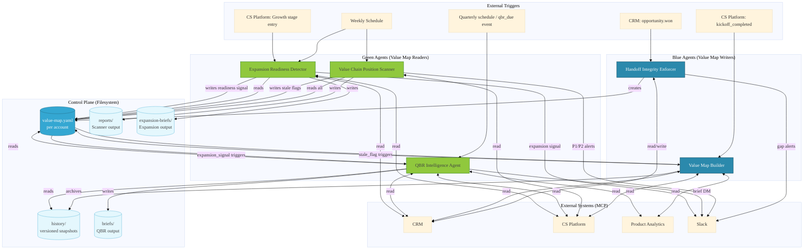

# Value Map System

**Type:** Multi-cookbook agent system  
**Role:** Customer Value Tracking, Intelligence, and Expansion Readiness

---

## Purpose

The Value Map System is a coordinated fleet of five Claude Agent SDK cookbooks that
collectively instrument the customer value chain from handoff through expansion. Each
cookbook operates as an independent agent with defined read/write authority over a shared
filesystem control plane — the Customer Value Map.

The system answers three operational questions on every active account:

1. **Is the customer getting value?** — Tracked via position in the seven-stage value chain
   and evidence density in the four-quadrant Value Map.
2. **Where is value leaking?** — Detected via five leakage patterns diagnosed by the Value
   Chain Position Scanner and surfaced to CSMs via P1/P2/P3 intervention ranking.
3. **Is the account ready for expansion?** — Evaluated by the Expansion Readiness Detector
   using stage position, realized value density, leakage posture, and executive engagement
   signals from the Value Map history.

---

## The Customer Value Map

Every account in the system has a single authoritative Value Map file:

```
{VALUE_MAP_BASE_PATH}/value-maps/{account_id}/value-map.yaml
```

Version history is archived before every write:

```
{VALUE_MAP_BASE_PATH}/value-maps/{account_id}/history/
```

### Four Quadrants

| Quadrant | Holds |
|----------|-------|
| `promised_outcomes` | What was committed in the sales motion |
| `delivered_capabilities` | What has been deployed and activated |
| `realized_value` | Outcomes the customer has confirmed or evidence demonstrates |
| `unrealized_potential` | Gaps between capability and realized outcome |

### Seven-Stage Value Chain (position_vector)

| Stage | Name | Description |
|-------|------|-------------|
| 1 | Product Capabilities | Core features and capabilities available |
| 2 | Deliverable Outcomes | Outcomes the product can deliver |
| 3 | Desired Outcomes | Customer's stated desired outcomes |
| 4 | Business Goals | Outcomes mapped to business objectives |
| 5 | Expected Value | Customer's expected value validated |
| 6 | Delivered Value | Value confirmed as delivered |
| 7 | Business Impact | Strategic business impact realized |

The `position_vector` in each Value Map tracks stage status (`not_started` /
`in_progress` / `completed`) and holds timestamped evidence entries for each stage.

### Evidence Standard

**Only named, specific data points from named sources qualify as evidence.** Health
scores, ARR, tenure, relationship length, and adoption rates are not evidence and
must never be used to advance stage position or infer expansion readiness.

---

## Blue/Green Authority Model

Cookbooks are classified as **Blue** (Value Map writers) or **Green** (Value Map
readers). This authority model is absolute — no exception path exists.

| Cookbook | Color | Write Authority |
|----------|-------|-----------------|
| Handoff Integrity Enforcer (HIE) | 🔵 Blue | Creates Value Map; writes `promised_outcomes`, `delivered_capabilities`, `position_vector` (initial) |
| Value Map Builder (VMB) | 🔵 Blue | Updates all four quadrants and `position_vector`; archives to `history/` before every write |
| Value Chain Position Scanner (VCS) | 🟢 Green | Reads all accounts; writes `stale_flag` and `leakage_diagnostics` only |
| QBR Intelligence Agent (QBR) | 🟢 Green | Reads Value Map and history; writes only to `{account_id}/qbr-briefs/` |
| Expansion Readiness Detector (ERD) | 🟢 Green | Reads Value Map and history; writes only to `{account_id}/expansion-briefs/` |

---

## Cookbooks

### 1. Handoff Integrity Enforcer (HIE)

**Directory:** `handoff-integrity-enforcer/`  
**Trigger:** CRM `opportunity.won` event  
**Purpose:** Validates sales-to-CS handoff data quality and initializes the Value Map.

HIE receives the CRM opportunity payload on deal close, checks for required fields and
commitment completeness, alerts the CSM via Slack on any gap, and creates the account's
Value Map with `promised_outcomes` and `delivered_capabilities` populated from the
opportunity data. No Value Map is created without a valid CRM opportunity record.

| Subagent | Role |
|----------|------|
| `handoff-validator` | Validates CRM opportunity fields; generates gap report |
| `value-map-initializer` | Creates `value-map.yaml`; populates initial quadrants |

### 2. Value Map Builder (VMB)

**Directory:** `value-map-builder/`  
**Trigger:** CS Platform `kickoff_completed` event; CSM manual invocation; `stale_flag`
set by Value Chain Position Scanner  
**Purpose:** Updates the Value Map as the account progresses through the value chain.

VMB pulls evidence from CS Platform touchpoints, product analytics events, and CRM
notes, then advances stage status in `position_vector` when evidence meets the threshold.
Every write is preceded by an archive of the current Value Map to `history/`. VMB also
diagnoses leakage patterns when evidence gaps are detected and writes findings to
`leakage_diagnostics`.

| Subagent | Role |
|----------|------|
| `evidence-gatherer` | Pulls timestamped touchpoints, analytics events, and notes from MCP sources |
| `stage-position-updater` | Advances `position_vector` stage status when evidence threshold is met |
| `leakage-diagnostics-writer` | Diagnoses and writes leakage pattern findings |

### 3. Value Chain Position Scanner (VCS)

**Directory:** `value-chain-position-scanner/`  
**Subagent files:** `value-chain-scanner/subagents/`  
**Trigger:** Weekly schedule (Monday 06:00); P1 mid-week re-scan (Thursday 06:00, P1
accounts only)  
**Purpose:** Fleet-wide sweep of all active accounts; produces ranked intervention report.

VCS reads every active account's Value Map, computes a Position Health Score (0–100),
diagnoses the five leakage patterns, and ranks accounts into six intervention tiers.
P1/P2 accounts receive a Slack alert to the assigned CSM. The scanner writes a
`stale_flag` to Value Maps not updated within the staleness threshold and dispatches
a VMB trigger.

**Position Health Score components:**

| Component | Weight |
|-----------|--------|
| Stage Alignment | 40 pts |
| Evidence Density | 30 pts |
| Active Leakage | 30 pts |

**Intervention tiers:** Tier 1 (P1 leakage + behind stage) → Tier 6 (healthy). Within
each tier, accounts are ranked by Position Health Score ascending. A 10-point staleness
penalty applies to ranking only — never stored in the Value Map.

**Five leakage patterns:**

| Pattern | Description |
|---------|-------------|
| `capability_outcome_gap` | Capabilities delivered but outcomes not realized |
| `outcome_goal_misalignment` | Realized outcomes don't map to stated business goals |
| `expectation_reality_disconnect` | Delivery diverges from what was promised |
| `value_perception_disconnect` | Customer doesn't recognize value that exists |
| `impact_communication_failure` | Value realized but not communicated to executive stakeholders |

| Subagent | Role |
|----------|------|
| `account-reader` | Reads all active Value Maps; computes Position Health Scores |
| `leakage-pattern-detector` | Diagnoses leakage patterns across all accounts |
| `intervention-ranker` | Applies tier classification and within-tier ranking |
| `report-writer` | Writes ranked intervention report; sends P1/P2 Slack alerts |

### 4. QBR Intelligence Agent (QBR)

**Directory:** `qbr-intelligence-agent/`  
**Subagent files:** `qbr-brief-generator/subagents/`  
**Trigger:** Quarterly schedule (`qbr_due` event); CSM manual invocation  
**Purpose:** Generates a structured QBR brief from Value Map history and live data.

QBR reads the full Value Map history (oldest to newest) to build a longitudinal value
narrative, then assembles a QBR brief covering realized value, leakage posture, stage
progression, and expansion angles. When active P1 or P2 leakage exists, the expansion
angles section is blocked and replaced with a note explaining the block — the full brief
is still produced. ERD (not QBR) is the agent that suppresses its entire output on
active leakage. The completed brief is written to `qbr-briefs/` and the CSM is notified
via Slack DM.

| Subagent | Role |
|----------|------|
| `evidence-collector` | Reads current Value Map and full history; assembles evidence package |
| `value-narrative-generator` | Produces realized value and stage progression narrative sections |
| `expansion-angle-identifier` | Evaluates expansion readiness signals; identifies named expansion angles |

### 5. Expansion Readiness Detector (ERD)

**Directory:** `expansion-readiness-detector/`  
**Trigger:** Weekly schedule (Monday 06:00); CS Platform `Growth` stage entry event  
**Purpose:** Evaluates per-account expansion readiness; produces CSM-ready expansion brief.

ERD applies a two-subagent pipeline. The readiness-scorer reads the Value Map and full
history, applies the P1/P2 leakage hard block, scores four expansion readiness dimensions,
and identifies up to three named, evidence-grounded expansion angles. If the account passes
all gates, the expansion-brief-generator composes and writes a six-section brief to
`expansion-briefs/`.

**Expansion readiness dimensions:**

| Dimension | Signal |
|-----------|--------|
| Value chain stage position | Stage 5+ required; Stage 7 = primary expansion motion |
| Realized value density | 3+ entries = high density; 0 = negative signal |
| Leakage posture | null/absent = clean; P3 = caution (with trend assessment) |
| Executive engagement (trailing window) | Confirmed cs_platform_touchpoint entries in stages 5–7 with EBR/QBR reference within `trailing_window_days` |

**Hard block:** P1 or P2 leakage in `leakage_diagnostics.intervention_priority` halts
the pipeline immediately. No expansion score, angle, or brief is produced. No signal,
instruction, or override path exists around this rule.

**Too-early exit:** Stage 4 or below in `position_vector` returns a too-early response
immediately. No dimension scoring. No expansion angles.

| Subagent | Role |
|----------|------|
| `readiness-scorer` | Read-only; applies hard block; scores four dimensions; identifies expansion angles |
| `expansion-brief-generator` | Write-only to `expansion-briefs/`; composes and writes six-section brief |

---

## Data Flow

The diagram below shows how external triggers, Value Map reads/writes, and MCP system
calls connect across the five cookbooks.



Blue agents (HIE, VMB) hold write authority over the Value Map quadrants and
`position_vector`. Green agents (VCS, QBR, ERD) read the Value Map and write only
to their designated output directories or signal flags. The filesystem is the
authoritative control plane — no governance state depends on platform-provided memory
or external state stores.

---

## MCP Server Dependencies

| MCP Server | Used By | Operations |
|------------|---------|------------|
| `crm` | HIE, VMB, QBR, ERD | Read opportunity records; read account metadata; read renewal dates |
| `cs-platform` | VMB, VCS, QBR, ERD | Read touchpoints; read EBR/QBR records; trigger events |
| `product-analytics` | VMB, QBR | Read feature usage events; read adoption milestones |
| `slack` | HIE, VCS, QBR, ERD | Send CSM alerts; send QBR brief DMs; send expansion signals |
| `email` (optional) | HIE | Send gap alert emails when Slack is unavailable |

All cookbooks implement a manual-first fallback:

1. **Live MCP pull** — preferred; pulls from connected systems automatically
2. **File-based input** — structured YAML/JSON passed at invocation; used when MCP is
   not yet connected or during testing
3. **Interactive prompting** — subagent solicits required fields via structured prompt;
   used for one-off invocations or demos

Each cookbook is operable before all MCP integrations are live.

---

## Filesystem Layout

```
{VALUE_MAP_BASE_PATH}/
├── value-maps/
│   └── {account_id}/
│       ├── value-map.yaml          ← authoritative current state
│       └── history/
│           └── value-map-{ISO-timestamp}.yaml  ← archived before every write
├── reports/
│   └── scanner-{YYYY-MM-DD}.md    ← VCS weekly intervention report
├── qbr-briefs/
│   └── {account_id}/
│       └── qbr-brief-{YYYY-MM-DD}.md
└── expansion-briefs/
    └── {account_id}/
        └── expansion-brief-{YYYY-MM-DD}.md
```

---

## System NEVER Rules

These rules apply across all five cookbooks. Each cookbook's NEVER list inherits
all six of these in addition to its own cookbook-specific rules.

1. **NEVER advance a value chain stage without cited evidence.** Inference from health
   scores, ARR, tenure, or relationship length is not evidence. Evidence means a named
   data point from a named source — a CS platform touchpoint, a product analytics event,
   or a QBR note with a specific date and reference.

2. **NEVER fire an expansion signal when active leakage exists in the Delivered Value
   quadrant.** P1 or P2 `intervention_priority` in `leakage_diagnostics` is an absolute
   block. No score, signal, angle, or brief is produced. No override path exists.

3. **NEVER write to a Value Map without archiving the previous version to `history/`.**
   The archive step is not optional and not skippable under any condition — including
   urgency, pipeline retry, or manual override.

4. **NEVER allow a green agent to write to the four quadrants or position vector.**
   VCS, QBR, and ERD write only to signal flags (`stale_flag`, `leakage_diagnostics`)
   or to their designated output directories outside the Value Map.

5. **NEVER create a Value Map for an account without an opportunity record in CRM.**
   HIE must confirm a valid CRM opportunity before `value-map.yaml` is created.

6. **NEVER generate a QBR brief or expansion brief without reading the full Value Map
   history.** Point-in-time assessment from the current file only is not sufficient.
   History must be read oldest-to-newest to establish longitudinal context.

---

## Environment Variables

| Variable | Used By | Description |
|----------|---------|-------------|
| `VALUE_MAP_BASE_PATH` | All | Root path for Value Map filesystem; all paths are relative to this |
| `CRM_MCP_SERVER` | HIE, VMB, QBR, ERD | MCP server name for CRM integration |
| `CS_PLATFORM_MCP_SERVER` | VMB, VCS, QBR, ERD | MCP server name for CS platform integration |
| `PRODUCT_ANALYTICS_MCP_SERVER` | VMB, QBR | MCP server name for product analytics |
| `SLACK_MCP_SERVER` | HIE, VCS, QBR, ERD | MCP server name for Slack notifications |
| `SCANNER_STALENESS_THRESHOLD_DAYS` | VCS | Days since last Value Map update before stale flag is set |
| `TRAILING_WINDOW_DAYS` | ERD | Days lookback for executive touchpoint evaluation (default: 90) |

---

## Prerequisites and Deployment Order

Deploy cookbooks in dependency order. HIE must be live before any Value Map can exist;
VMB must be live before VCS, QBR, or ERD can produce useful output.

```
1. HIE  — creates Value Maps on deal close
2. VMB  — updates Value Maps at kickoff and throughout the value journey
3. VCS  — reads fleet; requires Value Maps to exist
4. QBR  — reads history; requires Value Maps with at least one history version
5. ERD  — reads history; requires Value Maps with stage 5+ position
```

All cookbooks can be tested independently using file-based input before MCP integrations
are connected. See each cookbook's README for invocation examples.

---

## Cookbook Directories

| Cookbook | Orchestrator | Subagents |
|----------|-------------|-----------|
| Handoff Integrity Enforcer | `handoff-integrity-enforcer/` | `handoff-integrity-enforcer/subagents/` |
| Value Map Builder | `value-map-builder/` | `value-map-builder/subagents/` |
| Value Chain Position Scanner | `value-chain-position-scanner/` | `value-chain-scanner/subagents/` |
| QBR Intelligence Agent | `qbr-intelligence-agent/` | `qbr-brief-generator/subagents/` |
| Expansion Readiness Detector | `expansion-readiness-detector/` | `expansion-readiness-detector/subagents/` |

Each cookbook directory contains `agent.yaml` (orchestrator configuration) and
`README.md` (cookbook-specific invocation guide). Subagent directories contain
`.yaml` (agent configuration, model, system prompt, environment) and `.md`
(detailed behavioral spec and dispatch instructions) files for each subagent.

---

## Related

- [`ARCHITECTURE.md`](./ARCHITECTURE.md) — full system specification, design decisions,
  and subagent role summary table
