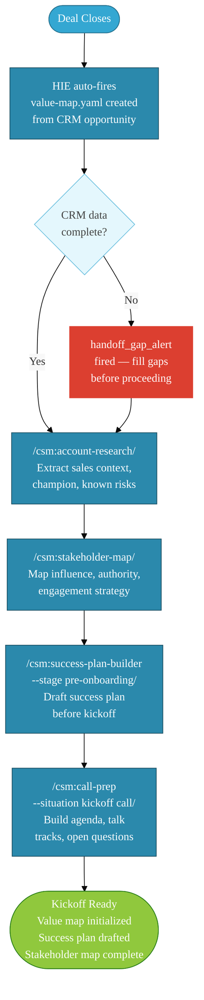
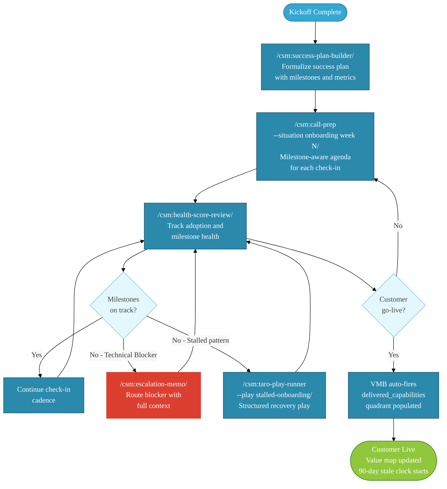
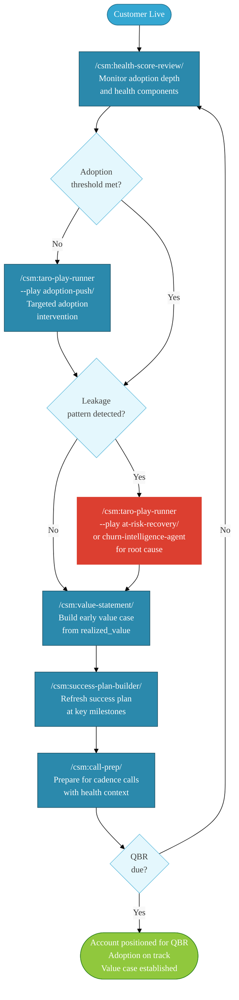
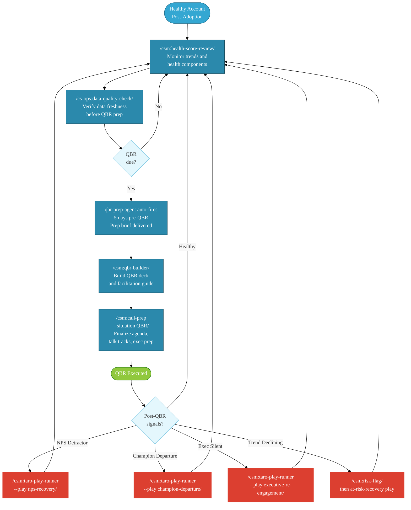
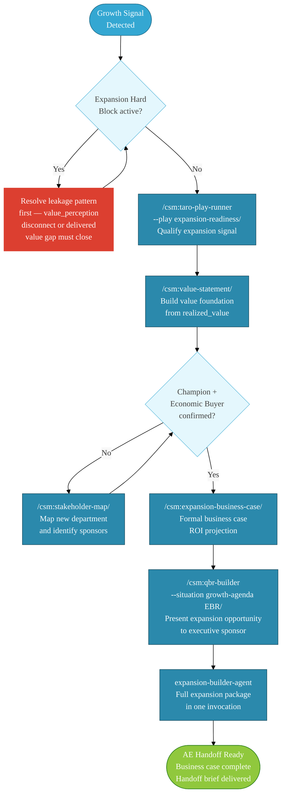
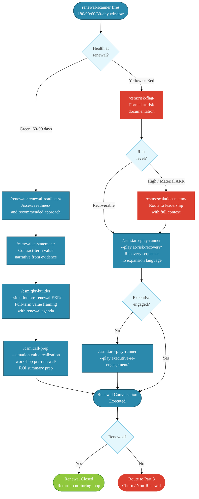
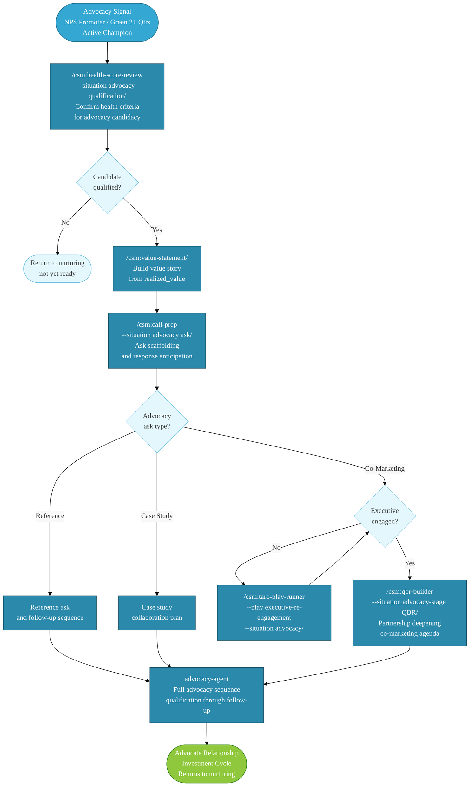
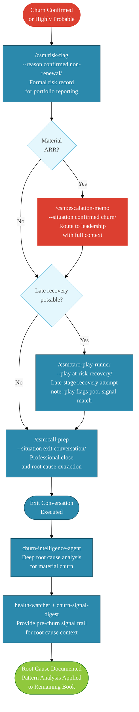

# Claude for Customer Success — Solo CSM Cookbook

**Audience:** Individual CSMs deploying the claude-for-customer-success plugin suite for solo use  
**Status:** [PROPOSED]  
**Purpose:** Specific, step-by-step operational guide for configuring and using the managed agents and skills across every stage of the customer lifecycle.

---

## Who This Is For and How It's Deployed

This cookbook is written for a **single CSM deploying the plugin suite for personal use** — not an enterprise IT rollout, not a team administrator provisioning for multiple users. You are the only person running cold-start. You are the only person whose connected data sources feed the agents. Every output, every alert, and every configured preference belongs to your session context.

That framing matters because it shapes how you should think about the entire system:

**What "solo user" means for plugin behavior:**

The plugins assume a single-user context throughout. When `health-watcher` surfaces an alert, it surfaces it to *you* — not to a shared inbox or a team channel unless you've explicitly configured a connector to route there. When the cold-start interview writes your `CLAUDE.md`, it writes *your* CS motion, your accounts, your thresholds — not a generalized team template. When an on-demand agent builds an expansion case, it builds it for you to review and decide on.

This is not a limitation. It means every output is already contextualized to your book. There is no "which CSM is this for?" ambiguity. The system knows who you are because you're the only one it knows.

**What you should expect from this deployment:**

- **One cold-start, fully yours.** Part 0 walks you through a cold-start interview that captures your CS motion, your accounts, your tool stack, and your preferences. You run this once. Everything downstream — managed agents, skill defaults, output formatting — inherits from it.

- **Agents that watch for you.** Once configured, the 11 managed agents in this suite run continuously across your book. You don't check them; they surface to you. A health crossing at 11pm shows up in your context when you open Claude the next morning.

- **Skills you invoke on demand.** The 17+ slash commands in this suite give you structured output on command: health reviews, QBR prep packages, renewal readiness assessments, churn analyses, expansion cases. Each takes your situation as input and returns a decision-ready deliverable.

- **Outputs that land where you work.** Every skill output and agent alert is designed to land in your connected environment — whether that's a file on disk, a CRM record, a Slack message, or a rendered card in Cowork. You configure the landing zone during cold-start.

**What this cookbook does not cover:**

This cookbook does not cover team or enterprise deployment — multi-user provisioning, shared connector configurations, admin-level permission management, or rollout coordination across a CS team. If you're deploying this suite for a team, contact SuccessCOACHING for enterprise deployment guidance.

---

> **⚠️ Reference Build — Tailoring Required**
>
> The plugins described in this cookbook are **reference builds**, not plug-and-play deployments. A reference build means the architecture and workflows are proven, but they are designed around generalizable patterns — not any specific company's systems, data sources, terminology, or CS motion.
>
> **Every deployment requires tailoring before it produces useful output.** Specifically:
>
> - **Data source connections** — the plugins reference connector types (CRM, CSP, product analytics); you wire in the specific tools your company uses
> - **Outcome statements** — the Provisional Outcome Catalog is generated from public product information and must be reviewed and validated against your actual customer outcomes before agents use it
> - **Account segmentation rules** — health thresholds, segment labels, and escalation triggers default to generic values; they must be adjusted to match your team's definitions
> - **Agent activation choices** — not every managed agent applies to every CS motion; activate only what maps to your coverage model
> - **Playbook language** — TARO plays and skill command outputs use neutral framing; adjust tone, terminology, and escalation paths to match how your organization operates
>
> The cold-start interview (§0.1) is the primary tailoring mechanism — it converts a reference build into a configured deployment. Skipping it means the entire suite operates on defaults that will not reflect your context. The outcome catalog build (§0.3) is the second required step; without it, agents describe activity, not value.
>
> Tailoring does not require writing code. It requires someone with working knowledge of the Claude plugin ecosystem and the target CS environment — typically the CSM deploying the suite, which in a solo deployment means you.

---

## Quick Start — First Value in Under 40 Minutes

If you want to understand before you configure, read the full document top to bottom. If you want working output fast, follow this path.

**Prerequisites:** Claude Cowork (desktop) or Claude Code (CLI) installed and running.

### Step 1 — Install the plugins (5 minutes)

Go to **§0.0 Install Your Plugins** and follow the environment-specific steps for Cowork or Claude Code. Install order matters — install `csm` first, then `cs-ops`, then the remaining plugins. When all five are installed, slash commands will resolve correctly.

### Step 2 — Run cold-start (15 minutes)

Type `/csm:cold-start` and follow the interview. Answer every question — partial configuration produces partial output. The interview covers: your CS motion, your connected data sources, your book of business profile, your output preferences, and your agent activation choices. At the end, you'll have a configured `CLAUDE.md` and `company-profile.md` that the entire suite inherits from.

> **Don't rush this step.** The cold-start answers are what separates a generic AI output from a contextualized one. A health alert that knows your high-touch accounts looks different from one that treats all accounts equally.

### Step 3 — Build your outcome catalog (10 minutes)

Run `/csm:outcome-catalog` and follow the prompts. This step constructs the Provisional Outcome Catalog and Value Register that every downstream skill command draws from — health summaries, QBR prep, expansion briefs, renewal narratives. Without it, Claude's outputs describe what happened; with it, they describe what value was realized.

The catalog generation pulls from the products and solutions you identified in cold-start. Review the generated outcome statements, confirm the ones that match your actual book, and flag any that don't apply. You only do this once per company profile; updates run automatically as new data arrives.

> **Why this can't be skipped.** The outcome catalog is what turns "customer used feature X" into "customer achieved outcome Y." Every agent that references value — health agents, renewal agents, expansion agents — depends on this mapping. Running the catalog before activating agents means your first outputs are already value-framed.

See **§0.3 Build Your Outcome Catalog and Value Register** for the full configuration reference.

### Step 4 — Verify and activate (5 minutes)

Run `/csm:system-status` to confirm connector health and agent activation state. Run `/cs-ops:configure` to verify your data source connections. If any connector shows red, address it before activating agents — agents cannot surface information from sources they cannot reach.

### Step 5 — Your first skill command

Pick the Part that matches your current work:

| Where you are right now | Start here |
|---|---|
| Taking over a new account | **Part 1 — Pre-Onboarding**, §1.1 |
| In active onboarding | **Part 2 — Onboarding**, §2.1 |
| Monitoring an established account | **Part 3 — Adoption**, §3.1 |
| Running a QBR this month | **Part 4 — Nurturing**, §4.2 |
| Working an expansion opportunity | **Part 5 — Growth**, §5.1 |
| In renewal window (60–90 days) | **Part 6 — Retention**, §6.1 |
| Building an advocacy motion | **Part 7 — Advocacy**, §7.1 |
| Managing an at-risk or churning account | **Part 8 — Outcome Intelligence**, §8.1 |

Run the first command in that section. Review the output. You now have working output from the suite — with outcomes, not just activity.

---

## How to Use This Cookbook

This document is organized in three bands: **setup**, **lifecycle operations**, and **reference**.

**Setup (Part 0):** Everything you do once. Cold-start interview, connector verification, outcome catalog build, value map setup, agent activation. If you skip Part 0, the rest of the cookbook produces generic output. Do Part 0 first.

**Lifecycle Operations (Parts 1–8):** One Part per lifecycle stage, organized in the order a customer moves through your book — Pre-Onboarding → Onboarding → Adoption → Nurturing → Growth → Retention → Advocacy → Outcome Intelligence. Each Part has the same internal structure:

- **Reference Table** — every managed agent and skill command available at this stage, with activation class and output type
- **Flow Diagram** — a Mermaid diagram showing where agents fire and where they hand off to skill commands
- **Solo CSM Scenario** — a running example following Meridian Analytics through the stage
- **Managed Agent Coverage** — what the agents watch for at this stage and what they surface
- **Numbered sections (e.g., 3.1, 3.2)** — specific workflows with exact command syntax, situation description guidance, and expected output

**Reference Sections:** After Part 8, five quick-reference tables cover: Skill-to-Lifecycle Stage Map, TARO Play Quick Reference, Managed Agent Alert Response Guide, Output Landing Zones, and Common Mistakes.

**Appendices (A–E):** Deeper reference material — monthly maintenance routines, advanced configuration options, optional data source integration, glossary, and troubleshooting.

### Reading Conventions

| Convention | Meaning |
|---|---|
| `/csm:skill-name` | A slash command you type in Claude |
| `[account]` | Replace with your actual account name |
| `--flag "value"` | Optional or required parameter to the command |
| **[Cowork]** callout | Step or behavior specific to Claude Cowork desktop |
| **[Claude Code]** callout | Step or behavior specific to Claude Code CLI |
| ⚡ | Action you take |
| 🤖 | Agent running automatically |
| G-code reference | Behavioral guardrail governing agent output |
| `health-watcher` (monospace) | An agent or system component name |

### When You're Unsure Which Command to Run

Check the **Part Reference Table** for the stage you're in. Every table lists both the managed agents watching automatically and the skills you can invoke, with a one-line description of what each returns. If you know roughly what you need (a health review, a renewal readiness check, a churn analysis), the table will route you to the exact command.

For cross-stage lookups — "I need to find every command that touches CRM" — use the **Quick Reference: Skill-to-Lifecycle Stage Map** after Part 8.

For troubleshooting when commands don't behave as expected, go directly to **Appendix E**.

---

## Table of Contents

- [Who This Is For and How It's Deployed](#who-this-is-for-and-how-its-deployed)
- [Quick Start — First Value in Under 40 Minutes](#quick-start--first-value-in-under-40-minutes)
- [How to Use This Cookbook](#how-to-use-this-cookbook)
- [What This Changes for Your Day](#what-this-changes-for-your-day)
- [How to Read This Document](#how-to-read-this-document)
- [Understanding Managed Agents](#understanding-managed-agents)
  - [The Three Activation Classes](#the-three-activation-classes)
  - [What Managed Agents Can and Cannot Do](#what-managed-agents-can-and-cannot-do)
  - [Where Agents and Skills Intersect](#where-agents-and-skills-intersect)
  - [A Note on Configuration](#a-note-on-configuration)
  - [What a Managed Agent Cookbook Is](#what-a-managed-agent-cookbook-is)
  - [The 11 Agent Cookbooks](#the-11-agent-cookbooks)
- [Required Plugins and Companion Resources](#required-plugins-and-companion-resources)
  - [Plugin Inventory](#plugin-inventory)
  - [§0.0 Install Your Plugins](#00-install-your-plugins--environment-specific-steps)
  - [Managed Agent Roster](#managed-agent-roster)
  - [Quick-Reference: Skill Command Format](#quick-reference-skill-command-format)
- [Part 0: One-Time Setup](#part-0-one-time-setup)
  - [0.1 Cold-Start Interview](#01-cold-start-interview)
  - [0.2 Verify Configuration](#02-verify-configuration)
  - [0.3 Build Your Outcome Catalog and Value Register](#03-build-your-outcome-catalog-and-value-register)
  - [0.4 Understanding the Value Map System](#04-understanding-the-value-map-system)
  - [0.5 Understanding How Skills Activate](#05-understanding-how-skills-activate)
  - [0.6 Activate Managed Agents](#06-activate-managed-agents)
  - [0.7 Connect Your Data Sources](#07-connect-your-data-sources)
  - [0.8 Writing Effective Situation Descriptions](#08-writing-effective-situation-descriptions)
- [Part 1: Stage 1 — Pre-Onboarding](#part-1-stage-1--pre-onboarding)
  - [Part 1 Reference Table](#part-1-reference-table)
  - [Part 1 Flow](#part-1-flow)
  - [Managed Agent Coverage](#managed-agent-coverage)
  - [1.1 Capture the Sales-to-CS Handoff](#11-capture-the-sales-to-cs-handoff)
  - [1.2 Stakeholder Mapping](#12-stakeholder-mapping)
  - [1.3 Pre-Kickoff Call Prep](#13-pre-kickoff-call-prep)
- [Part 2: Stage 2 — Onboarding](#part-2-stage-2--onboarding)
  - [Part 2 Reference Table](#part-2-reference-table)
  - [Part 2 Flow](#part-2-flow)
  - [Managed Agent Coverage](#managed-agent-coverage-1)
  - [2.1 Success Plan — Formal Setup](#21-success-plan--formal-setup)
  - [2.2 Regular Onboarding Check-Ins](#22-regular-onboarding-check-ins)
  - [2.3 Technical Onboarding Escalation](#23-technical-onboarding-escalation)
  - [2.4 Training Progress Check](#24-training-progress-check)
  - [2.5 30-Day Gap Identification](#25-30-day-gap-identification)
  - [2.6 Onboarding Close and Stage Transition](#26-onboarding-close-and-stage-transition)
- [Part 3: Stage 3 — Adoption](#part-3-stage-3--adoption)
  - [Part 3 Reference Table](#part-3-reference-table)
  - [Part 3 Flow](#part-3-flow)
  - [Managed Agent Coverage](#managed-agent-coverage-2)
  - [3.1 Monitor and Track Usage](#31-monitor-and-track-usage)
  - [3.2 Feature Adoption Campaign](#32-feature-adoption-campaign)
  - [3.3 90-Day Success Plan Refresh](#33-90-day-success-plan-refresh)
  - [3.4 Regular Adoption Checkpoints](#34-regular-adoption-checkpoints)
  - [3.5 Adoption Barrier Escalation](#35-adoption-barrier-escalation)
  - [3.6 Value Realization — Early Stage](#36-value-realization--early-stage)
- [Part 4: Stage 4 — Nurturing](#part-4-stage-4--nurturing)
  - [Part 4 Reference Table](#part-4-reference-table)
  - [Part 4 Flow](#part-4-flow)
  - [Managed Agent Coverage](#managed-agent-coverage-3)
  - [4.1 Regular Health Checks](#41-regular-health-checks)
  - [4.2 QBR Preparation and Execution](#42-qbr-preparation-and-execution)
  - [4.3 Proactive Issue Resolution](#43-proactive-issue-resolution)
  - [4.4 NPS Recovery](#44-nps-recovery)
  - [4.5 Champion Departure](#45-champion-departure)
  - [4.6 Identify Future Advocates](#46-identify-future-advocates)
- [Part 5: Stage 5 — Growth](#part-5-stage-5--growth)
  - [Part 5 Reference Table](#part-5-reference-table)
  - [Part 5 Flow](#part-5-flow)
  - [Managed Agent Coverage](#managed-agent-coverage-4)
  - [5.1 Identify Expansion Opportunities](#51-identify-expansion-opportunities)
  - [5.2 ROI and Value Conversations](#52-roi-and-value-conversations)
  - [5.3 Executive Engagement for Growth](#53-executive-engagement-for-growth)
  - [5.4 Cross-Departmental Expansion Onboarding](#54-cross-departmental-expansion-onboarding)
  - [5.5 AE Handoff for Expansion](#55-ae-handoff-for-expansion)
- [Part 6: Stage 6 — Retention](#part-6-stage-6--retention)
  - [Part 6 Reference Table](#part-6-reference-table)
  - [Part 6 Flow](#part-6-flow)
  - [Managed Agent Coverage](#managed-agent-coverage-5)
  - [6.1 Proactive Renewal Readiness](#61-proactive-renewal-readiness)
  - [6.2 Value Realization for Renewal](#62-value-realization-for-renewal)
  - [6.3 At-Risk Recovery](#63-at-risk-recovery)
  - [6.4 Executive Engagement at Retention](#64-executive-engagement-at-retention)
  - [6.5 Pre-Renewal EBR](#65-pre-renewal-ebr)
  - [6.6 Data Quality Check Before Renewal](#66-data-quality-check-before-renewal)
- [Part 7: Stage 7 — Advocacy](#part-7-stage-7--advocacy)
  - [Part 7 Reference Table](#part-7-reference-table)
  - [Part 7 Flow](#part-7-flow)
  - [Managed Agent Coverage](#managed-agent-coverage-6)
  - [7.1 Identifying and Qualifying Advocates](#71-identifying-and-qualifying-advocates)
  - [7.2 Building the Value Story for Advocacy](#72-building-the-value-story-for-advocacy)
  - [7.3 The Advocacy Ask](#73-the-advocacy-ask)
  - [7.4 Executive Re-Engagement for Co-Marketing](#74-executive-re-engagement-for-co-marketing)
  - [7.5 QBR at Advocacy Stage](#75-qbr-at-advocacy-stage)
- [Part 8: Stage 8 — Outcome Intelligence / Transition Management](#part-8-stage-8--outcome-intelligence--transition-management)
  - [Part 8 Reference Table](#part-8-reference-table)
  - [Part 8 Flow](#part-8-flow)
  - [Managed Agent Coverage](#managed-agent-coverage-7)
  - [8.1 Formal Risk Documentation](#81-formal-risk-documentation)
  - [8.2 Escalation Memo](#82-escalation-memo)
  - [8.3 Win-Back Assessment](#83-win-back-assessment)
  - [8.4 Exit Conversation Prep](#84-exit-conversation-prep)
- [Quick Reference: Skill-to-Lifecycle Stage Map](#quick-reference-skill-to-lifecycle-stage-map)
- [TARO Play Quick Reference](#taro-play-quick-reference)
- [Managed Agent Alert Response Guide](#managed-agent-alert-response-guide)
- [Where Do Outputs Land?](#where-do-outputs-land)
- [Common Mistakes and How to Avoid Them](#common-mistakes-and-how-to-avoid-them)
- [Appendix A: Monthly Maintenance Routine](#appendix-a-monthly-maintenance-routine)
- [Appendix B: Advanced Configuration](#appendix-b-advanced-configuration)
- [Appendix C: Optional Data Sources](#appendix-c-optional-data-sources)
- [Appendix D: Glossary](#appendix-d-glossary)
- [Appendix E: Troubleshooting](#appendix-e-troubleshooting)
  - [E.1 Slash Commands Not Working](#e1-slash-commands-not-working)
  - [E.2 Why Commands Use the Namespace Format](#e2-why-commands-use-the-namespace-format)
  - [E.3 Cowork vs. Claude Code — How Slash Commands Work Differently](#e3-cowork-vs-claude-code--how-slash-commands-work-differently)
  - [E.4 Commands vs. Skills — What You're Actually Invoking](#e4-commands-vs-skills--what-youre-actually-invoking)
  - [E.5 Plugin and Connector Interdependencies](#e5-plugin-and-connector-interdependencies)
  - [E.6 Quick Diagnostic Checklist](#e6-quick-diagnostic-checklist)

---  
**Environment:** This cookbook applies to both **Claude Cowork** (desktop app) and **Claude Code** (CLI). All slash commands, managed agent invocations, and G-code behavior are identical across both environments. Where the experience differs, callouts marked **[Cowork]** and **[Claude Code]** indicate environment-specific steps.

> **Quick orientation:** If you are using Cowork, you are in a GUI desktop app with a plugin manager and rendered output cards. If you are using Claude Code, you are in a terminal session with filesystem-level access and file-path outputs. Choose your path in §0.0 below.

---

## What This Changes for Your Day

Before this plugin suite, a CSM producing a renewal-ready value narrative for an account spent 45–60 minutes pulling usage data, refreshing health scores, drafting the executive summary, and formatting the deck. With `/csm:value-statement`, the same output arrives in under 3 minutes — calibrated to the customer's primary metric, formatted for executive review, and ready to edit rather than create from scratch.

The pattern holds across the portfolio. QBR prep that used to consume a morning now takes one command and a 20-minute review pass. At-risk account triage that required three tabs and a spreadsheet now surfaces through a single health-score-review output. The time you recover goes back to actual customer conversations — the work that moves renewal and expansion outcomes.

This is not automation replacing judgment. Every skill output is a starting point requiring your review. The agent is managing the signal processing; you are managing the relationship.

---

## How to Read This Document

Each lifecycle stage contains three layers:

1. **Setup / entry condition** — what triggers this stage and what data must be in place
2. **Managed agent coverage** — which headless agents are watching for you; what they surface and when
3. **Active skill commands** — what *you* invoke, with exact syntax and what each command returns

Commands use the format `/csm:[skill-name]` or `/renewals:[skill-name]` or `/cs-ops:[skill-name]` depending on which plugin the skill belongs to.

> **Prerequisite**: Complete the one-time setup in **Part 0** before any skill will run correctly.

---

## Understanding Managed Agents

A **managed agent** is a background process that runs without you typing a command. You configure it once, it persists across sessions, and it surfaces information to you when a condition is met — on a timer, on a threshold crossing, or on a CRM event. Think of it as a junior analyst who watches your portfolio while you're in calls and drops a brief on your desk when something needs attention.

This is different from a skill. A **skill** is something you invoke: you type `/csm:health-score-review [account]` and it runs. A **managed agent** is something that invokes *itself* and notifies you.

### The Three Activation Classes

The eleven agents in this plugin suite fall into three classes based on what triggers them:

**Class 1 — Scheduled** agents run on a time-based cadence. You set the schedule during cold-start config, and the agent fires regardless of what you're doing. `health-watcher` checks threshold crossings continuously. `churn-signal-digest` fires on your configured digest schedule (daily or weekly). `qbr-prep-agent` fires exactly 5 days before each account's QBR due date. You don't need to remember to check — the agent checks for you.

**Class 2 — On-Demand** agents run when you ask for them in plain language. They are not triggered by a slash command — you describe what you want: `"Build expansion case for Acme Corp"` or `"Run churn analysis for [account]"`. On-demand agents coordinate multiple sub-tasks internally (qualification check, data retrieval, output generation) before returning a packaged result. They are appropriate for deeper, account-specific work that goes beyond a single skill.

**Class 3 — Event-Driven** agents fire on a CRM state change. The `expansion-onboarding-agent` is the only Class 3 agent in this suite — it watches for an opportunity stage transition from CSQL to Won, then automatically generates an expansion onboarding sequence. You may not know it fired until it surfaces output; check for an in-flight sequence before triggering manually.

### What Managed Agents Can and Cannot Do

Managed agents **surface information** and **generate outputs** — they do not take action in your CRM or on your accounts without your explicit approval. A health-watcher alert tells you an account crossed a threshold; it does not create a task, send a message, or change a record. What you do with the output is always your decision.

Managed agents **read from your configured data sources** — the CRM connector, CS platform health data, and usage telemetry configured during cold-start. An agent can only surface information from sources you've connected. If your NPS data isn't in the connector, `churn-signal-digest` won't see it.

Managed agents **persist across sessions**. Once configured, `health-watcher` runs in the background whether or not you have a Claude conversation open. When you start a new session, any queued alerts surface at the top of your context. This is by design — the agent is accumulating signal while you're away from the system.

### Where Agents and Skills Intersect

Managed agents and skills are designed to hand off to each other. The typical flow:

1. A managed agent surfaces a signal (e.g., `health-watcher` alerts that Acme Corp crossed Yellow)
2. You run a skill to investigate and respond (e.g., `/csm:health-score-review Acme Corp --situation "Yellow flag from health-watcher; usage dropped; QBR in 3 weeks"`)
3. The skill output guides your next decision — which TARO play to run, whether to flag risk, whether to escalate

The Mermaid diagrams in each Part show exactly where agents fire and where they hand off to skills. Each Part's reference table lists both skills you invoke and agents that run automatically, so you always know what the system is doing on your behalf.

### A Note on Configuration

Managed agents inherit their config from the same files skills use — `CLAUDE.md` and `company-profile.md`. If those files are incomplete, agents may fire with generic outputs or fail to align to your CS motion. Complete **Part 0 setup** before enabling any agent. The cold-start interview populates the configuration agents depend on.

### What a Managed Agent Cookbook Is

Every managed agent ships with its own cookbook — a small directory of files that controls how the agent is deployed, how it reasons, and how you can tune its behavior without touching any code.

When you install the `csm` plugin, each agent's cookbook directory is deployed alongside the agent itself. You interact with these files primarily through `/csm:customize`, but understanding the structure helps you know what's happening under the hood when an agent's output doesn't quite match your situation.

**The cookbook directory structure:**

```
{agent-name}/
├── README.md
├── cookbook.md
├── steering-examples.json
└── subagents/
    ├── {subagent-1}.md
    └── {subagent-2}.md
```

**`README.md` — Deployment guide**

The README is the operational reference for the agent. It covers what the agent does, what data sources it requires, what connectors must be configured, how to activate it, and what its outputs look like. When an agent fires unexpected output or fails to fire at all, start with the README — it tells you what conditions the agent expects.

**`cookbook.md` — Orchestrator system prompt and subagent specs**

This is the agent's brain. `cookbook.md` contains the orchestrator system prompt that governs the agent's reasoning and coordination logic, followed by the per-subagent specifications for each role the agent delegates to. The orchestrator reads this document at runtime to determine how to coordinate its subagents, what sequence to follow, and what output to surface.

You will not typically edit `cookbook.md` directly. Its behavior is configured through the cold-start interview and modified through steering examples (see below). Understanding that this file exists and what it contains helps you reason about *why* the agent produced a particular output — the answer is almost always traceable to the orchestrator logic defined here.

**`steering-examples.json` — How you influence agent behavior**

This is the file you can actually influence. `steering-examples.json` contains 12 curated examples that show the agent how to behave in different situations. Each example is a pairing of a situation (input context) with a desired output pattern (the type of response the agent should produce in that context).

The cold-start interview writes a baseline set of steering examples from your configuration answers. If the agent's output is consistently off — too aggressive on escalation, not recognizing your high-touch accounts, missing signals that matter to your book — the steering examples are where you adjust.

You modify steering examples through `/csm:customize` → the agent's configuration section. You describe the situation you want the agent to recognize differently, and the system updates the relevant example. You never edit the JSON directly.

A well-tuned steering example looks like this (in human terms): *"When a high-touch account with a QBR in the next 21 days crosses Yellow, surface the alert with QBR context attached rather than a standard threshold alert."* The agent learns to pattern-match your situation against its example set and adjust its output accordingly.

**`subagents/` — The agent's specialized workers**

Complex agents decompose their work across multiple subagents, each responsible for a specific part of the overall task. `churn-intelligence-agent`, for example, coordinates a signal-aggregation subagent, a root-cause-hypotheses subagent, and a portfolio-pattern subagent. Each subagent has its own `.md` spec file in the `subagents/` directory.

You do not interact with subagent files directly. They are loaded by the orchestrator at runtime. Understanding that they exist explains why an on-demand agent like `churn-intelligence-agent` takes longer than a skill invocation — it is spinning up and coordinating multiple specialized workers, not running a single prompt.

**How this cookbook (the one you're reading) relates to agent cookbooks**

This document — the CSM IC Cookbook — is a *user guide*, not an agent cookbook. It tells you what commands to run, when to run them, and what to expect. The agent cookbooks described above are *deployment artifacts* — they live on disk, govern runtime behavior, and are modified through the configuration interface, not by hand.

When an agent does something unexpected, the path to understanding and fixing it is:
1. Check this cookbook's reference table for the Part you're working in — confirms what the agent is supposed to do
2. Check the agent's `README.md` — confirms data source and connector requirements
3. Check active G-codes via `/csm:customize` → G-code Audit — confirms behavioral guardrails aren't blocking the expected output
4. Adjust steering examples via `/csm:customize` if the output pattern consistently misses your situation

### The 11 Agent Cookbooks

Each managed agent ships with its own cookbook directory. Below is what each one provides and why it matters for your book of business. These are the agents you will be asked to deploy during cold-start — understanding what each one does before you deploy it helps you configure the steering examples accurately and set appropriate expectations for output.

---

#### `health-watcher` — Portfolio Health Surveillance

**Activation class:** Scheduled (continuous)  
**Plugin:** csm

`health-watcher` is the agent you will interact with most frequently because it fires whenever an account crosses a health threshold — not on a schedule you remember, but the moment a score change happens in your connected CRM or CS platform. It watches Green→Yellow and Yellow→Red transitions across your entire book simultaneously.

**What the cookbook deploys:** The orchestrator coordinates three subagents — a threshold-evaluation subagent that compares current vs. prior scores, a context-enrichment subagent that pulls the account's recent activity (open tickets, usage trend, last touch), and an alert-formatting subagent that assembles the output into the format you've configured. The steering examples teach the agent how to weight different account types — a Yellow crossing for a high-touch enterprise renewal account should surface differently than the same crossing for a small, low-ARR account with 11 months on contract.

**How it helps:** Without `health-watcher`, you find out an account crossed Yellow when you happen to open the CRM. With it running, the alert is waiting in your session context the next time you open Claude. The agent doesn't tell you what to do — it tells you an account needs attention and gives you the context to decide whether to run `/csm:health-score-review`, trigger a TARO play, or make a note to address it on a scheduled call.

**Configuration priority:** Set your threshold sensitivity and high-touch account list accurately during cold-start. An agent tuned for average-sensitivity will generate alert fatigue on large portfolios; one tuned too coarsely will miss meaningful crossings.

---

#### `churn-signal-digest` — Portfolio-Wide Churn Signal Aggregation

**Activation class:** Scheduled (daily or weekly)  
**Plugin:** csm

`churn-signal-digest` runs on a cadence you configure and compiles weak-signal churn indicators across your entire portfolio into a ranked digest. Where `health-watcher` alerts on individual threshold crossings, `churn-signal-digest` aggregates the pattern across accounts and surfaces the ones where signals are accumulating before they reach a formal health threshold.

**What the cookbook deploys:** The orchestrator coordinates a signal-collection subagent (pulls usage trend data, support volume, NPS scores, and login frequency from connected sources), a scoring subagent (ranks accounts by signal density and trajectory), and a digest-assembly subagent (formats output as a prioritized list, not a raw data dump). The 12 steering examples are tuned to your portfolio mix — enterprise accounts with 3 months to renewal should sort above mid-market accounts with 8 months remaining even if their raw signal count is equivalent.

**How it helps:** Churn signals rarely appear as a single decisive event; they accumulate as a pattern of disengagement. `churn-signal-digest` is designed to catch the pattern early — before it's a Yellow flag, before the executive goes quiet, before the renewal call surfaces a surprise. A weekly digest reviewed on Monday morning tells you which accounts warrant a proactive outreach before the week's calendar fills up.

**Configuration priority:** Connect all signal sources during cold-start. An agent reading only CRM health scores misses half the signal. Usage telemetry and support volume are the inputs that make this agent meaningful.

---

#### `qbr-prep-agent` — Pre-QBR Context Package

**Activation class:** Scheduled (5 days before each account's QBR due date)  
**Plugin:** csm

`qbr-prep-agent` fires automatically 5 days before each account's configured QBR date and produces a pre-read package you would otherwise spend 2–3 hours assembling. It pulls value delivered since last QBR, usage highlights, open risk items, and renewal positioning context, then assembles them into a structured briefing.

**What the cookbook deploys:** The orchestrator coordinates four subagents — a metrics-retrieval subagent (usage, health trend, milestone completion vs. targets), a value-narrative subagent (translates metrics into the account's stated success outcomes), a risk-items subagent (surfaces open tickets, health flags, stalled milestones), and a QBR-structure subagent (assembles the output into a formatted pre-read). The steering examples are tuned to the QBR format you use — whether you lead with metrics, business outcomes, or risk-and-resolution — so the output lands in a format you can use rather than one you have to reformat.

**How it helps:** The value of this agent is that it fires whether or not you remembered the QBR was coming. By the time you open Claude on the day before a QBR, the package is already waiting. The agent doesn't replace your judgment about what to emphasize with a specific executive — it removes the data-retrieval and assembly work so that judgment is all that's left.

**Configuration priority:** QBR dates must be in your CRM connector for this agent to fire. Verify they're populated during cold-start setup. An agent with no QBR dates is a silent agent.

---

#### `renewal-scanner` — Renewal Window Monitoring

**Activation class:** Scheduled (90-day, 60-day, 30-day window entries)  
**Plugin:** renewals

`renewal-scanner` monitors your renewal pipeline and fires alerts as accounts enter critical renewal windows. It doesn't wait for you to pull a renewal report — it surfaces the accounts entering the pipeline segments where intervention timing matters most.

**What the cookbook deploys:** The orchestrator coordinates a pipeline-scan subagent (identifies accounts entering each window based on contract dates in your CRM), a renewal-risk subagent (scores each account for risk based on health signals, engagement trend, and renewal history), and an alert-assembly subagent (formats the output as a prioritized renewal brief with recommended next actions per account). The steering examples teach the agent how to rank accounts within a window — a Yellow-health enterprise in the 90-day window should rank above a Green-health SMB entering the same window, even though the SMB's window is technically newer.

**How it helps:** The 90-day window is where renewal outcomes are determined, not the 30-day window. `renewal-scanner` ensures you're working the right accounts at the right time rather than discovering renewals when they're already in the 30-day crunch. Used alongside `/renewals:renewal-readiness-assessment`, it creates a systematic renewal motion rather than a reactive one.

**Configuration priority:** Requires the `renewals` plugin. Contract renewal dates must be in your CRM connector. Confirm your renewal date field mapping during the renewals cold-start interview.

---

#### `onboarding-milestone-tracker` — Milestone Completion Surveillance

**Activation class:** Scheduled (milestone-lag detection)  
**Plugin:** onboarding

`onboarding-milestone-tracker` watches the agreed milestone timeline for every account in an active onboarding engagement and fires when a milestone goes overdue or when a stall pattern is detected. It runs against the milestone schedule defined during onboarding setup, not a generic template.

**What the cookbook deploys:** The orchestrator coordinates a milestone-status subagent (compares current vs. planned completion for each open milestone), a stall-pattern subagent (identifies accounts where multiple consecutive milestones are late or where activity has dropped off), and an alert-assembly subagent (formats the output with account name, specific late milestone, days overdue, and recommended next action). The steering examples are tuned to your tolerance for milestone variance — some organizations treat 3-day overruns as noise; others treat them as escalation triggers. The examples teach the agent which threshold to use for yours.

**How it helps:** Onboarding stalls are early adoption risk — an account that completes onboarding on schedule has materially different renewal trajectory than one that stalled at 60%. `onboarding-milestone-tracker` catches the stall before it becomes a months-long engagement gap. Used with `/onboarding:milestone-review`, you have both the alert and the tool to investigate and respond.

**Configuration priority:** Requires the `onboarding` plugin. Milestone plans must be captured in the system during onboarding setup — the agent can only track milestones it knows about.

---

#### `portfolio-segment-digest` — Segment-Level Health Summary

**Activation class:** Scheduled (weekly)  
**Plugin:** csm

`portfolio-segment-digest` produces a weekly summary of portfolio health grouped by segment — enterprise, mid-market, SMB, or whatever segmentation you've configured. Where `churn-signal-digest` surfaces individual accounts with accumulating risk signals, this agent gives you the segment-level view: where are accounts trending across your entire book.

**What the cookbook deploys:** The orchestrator coordinates a segment-aggregation subagent (groups accounts by your configured segments and computes aggregate health metrics), a trend-analysis subagent (compares this week's segment health to the prior period), and a digest-assembly subagent (formats the output as a segment-by-segment summary with notable accounts called out within each). The steering examples are tuned to which metrics matter most by segment — enterprise accounts might weight executive engagement heavily; SMB accounts might weight usage frequency.

**How it helps:** Segment-level visibility is the difference between managing individual accounts reactively and seeing portfolio-wide patterns while you still have time to act on them. A digest showing your mid-market segment trending Yellow over three consecutive weeks is actionable intelligence — it tells you something systemic is happening with that cohort, not just random account variation.

**Configuration priority:** Define your segment taxonomy during cold-start. The agent groups accounts by the segmentation field you specify — if that field isn't populated in your CRM, the agent can't produce meaningful segments.

---

#### `adoption-motion-agent` — Account-Level Adoption Gap Analysis

**Activation class:** On-demand (Class 2)  
**Plugin:** csm  
**Invocation:** `"Run adoption analysis for [account]"`

`adoption-motion-agent` is an on-demand agent you invoke when you want a comprehensive adoption assessment for a specific account. It goes deeper than a skill — it coordinates multiple subagents to pull usage telemetry, identify which capabilities the account is using vs. underusing vs. not using at all, and produces a recommended adoption motion.

**What the cookbook deploys:** The orchestrator coordinates a usage-mapping subagent (retrieves and maps feature-level usage against the account's contracted scope), a gap-analysis subagent (identifies underused and unused capabilities relative to the account's stated use case), a barrier-hypothesis subagent (generates hypotheses for why adoption gaps exist — training, workflow fit, change management, technical blockers), and a motion-recommendation subagent (produces a recommended adoption sequence with specific next steps). The 12 steering examples teach the agent how to weight adoption gaps by account type — a heavily technical product with a non-technical buyer has different adoption barriers than the same product sold to an engineering team.

**How it helps:** Adoption analysis done manually means pulling usage data, cross-referencing against contracted features, and reasoning about why certain capabilities aren't in use — typically a 45–90 minute effort per account. `adoption-motion-agent` produces the same output in under 10 minutes and surfaces it in a format you can hand to the customer or use directly in a call.

---

#### `expansion-builder-agent` — Expansion Readiness and Case Development

**Activation class:** On-demand (Class 2)  
**Plugin:** csm  
**Invocation:** `"Build expansion case for [account]"`

`expansion-builder-agent` is invoked when you want to assess whether an account is ready for an expansion conversation and, if so, build the business case for it. It respects the Expansion Hard Block — if `hard_block_active: true` is set in your G-code config due to a value_perception_disconnect or delivered_value gap, the agent will not produce an expansion case until the block is cleared.

**What the cookbook deploys:** The orchestrator coordinates a readiness-qualification subagent (checks expansion readiness signals — usage saturation, stakeholder engagement, value perception indicators), a hard-block check subagent (verifies G-code config before proceeding), a business-case-assembly subagent (builds the expansion narrative from usage data, delivered value, and growth trajectory), and an objection-anticipation subagent (surfaces likely objections and counter-framing based on account context). The steering examples teach the agent when to proceed with confidence vs. when to flag readiness concerns before building the case — a strong signal set warrants a confident case; a marginal signal set warrants a recommendation to address gaps first.

**How it helps:** Building an expansion case that the customer will take seriously requires knowing when to have the conversation, not just what to say. An expansion conversation opened too early — before value is established, before the champion is engaged, before usage has saturated the current tier — doesn't land and may damage the relationship. `expansion-builder-agent` does the qualification work and respects the guardrails that prevent premature expansion motions.

---

#### `advocacy-agent` — Customer Advocacy Qualification and Development

**Activation class:** On-demand (Class 2)  
**Plugin:** csm  
**Invocation:** `"Run advocacy assessment for [account]"`

`advocacy-agent` evaluates whether an account is a strong candidate for advocacy activities — reference calls, case studies, testimonials, community participation — and produces a qualified advocacy development plan. It runs a multi-dimensional assessment rather than a simple NPS-check, because high NPS alone doesn't make a good advocate.

**What the cookbook deploys:** The orchestrator coordinates a qualification-assessment subagent (evaluates advocacy readiness across NPS, relationship depth, executive engagement, outcome clarity, and contract stability), a fit-matching subagent (maps the account's profile to advocacy activities where they're likely to participate vs. decline), and a development-plan subagent (produces a recommended path for activating the account as an advocate — what to ask for, in what sequence, with what lead time). The steering examples teach the agent how to weight qualification signals — an executive who has publicly praised the product in a joint customer call is a stronger advocacy signal than a high NPS score without relationship depth.

**How it helps:** Advocacy development is often treated as opportunistic — you ask when you happen to think of it, or when the customer success manager happens to have a strong relationship. `advocacy-agent` makes it systematic — you run it as part of your QBR prep workflow or post-renewal and you know exactly which accounts to prioritize for each advocacy activity type, and what the path to activation looks like.

---

#### `churn-intelligence-agent` — At-Risk Pattern Analysis and Root Cause Diagnosis

**Activation class:** On-demand (Class 2)  
**Plugin:** csm  
**Invocation:** `"Run churn analysis for [account]"`

`churn-intelligence-agent` is the deepest of the on-demand agents. You invoke it when an account is showing serious at-risk signals and you need a comprehensive diagnosis — not just "this account is at risk" but *why* it's at risk, what the signal trail looks like, and what the recovery path options are. It coordinates more subagents than any other agent in the suite because churn diagnosis is a multi-factor problem.

**What the cookbook deploys:** The orchestrator coordinates a signal-aggregation subagent (collects the full signal history — health crossings, support volume, usage trend, NPS trend, engagement recency), a root-cause-hypotheses subagent (generates ranked hypotheses for the risk source — product fit, value perception, stakeholder change, competitive displacement, budget pressure, internal champion loss), a recovery-path subagent (produces a recommended intervention sequence keyed to the most likely root cause), and a portfolio-pattern subagent (checks whether the at-risk pattern matches other accounts in your book — if it does, the diagnosis applies to more than one account). The steering examples teach the agent how to weigh competing hypotheses — a sudden support volume spike in month 3 with declining login frequency is a different pattern than slow usage decline with no support activity and an executive who stopped attending calls.

**How it helps:** When an account is seriously at risk, time matters. The difference between running `churn-intelligence-agent` and assembling the diagnosis manually isn't just hours — it's the pattern-matching across your portfolio that surfaces when the same signal combination has appeared elsewhere. Knowing that three other accounts followed the same sequence and recovered after a specific intervention type changes how you approach the conversation.

---

#### `expansion-onboarding-agent` — Post-Expansion Onboarding Sequence Generation

**Activation class:** Event-driven / Class 3 (fires on CRM opportunity stage transition: CSQL → Won)  
**Plugin:** onboarding

`expansion-onboarding-agent` is the only Class 3 agent in the suite. It watches your CRM for expansion opportunity stage transitions and fires automatically when an expansion closes — generating a tailored onboarding sequence for the expanded scope before you've had a chance to open Claude. You may not know it fired until you start your next session and find the sequence waiting.

**What the cookbook deploys:** The orchestrator coordinates a context-retrieval subagent (pulls the existing account profile, current onboarding state if still active, and the expansion scope from the closed opportunity), a milestone-design subagent (generates a milestone plan specific to the expanded product or tier — not a copy of the initial onboarding plan), a stakeholder-mapping subagent (identifies who needs to be involved in the expansion onboarding based on the account's existing stakeholder map), and a sequence-assembly subagent (produces the full expansion onboarding sequence: kickoff agenda, milestone timeline, success criteria, and first 30-day action plan). The steering examples teach the agent how to calibrate onboarding scope — an expansion from one product module to three requires a materially different onboarding sequence than a seat count increase.

**How it helps:** Expansion wins that don't convert to expansion adoption are among the most expensive failures in CS — the ARR books, the customer starts the expansion, and then disengages because the enablement wasn't there. `expansion-onboarding-agent` ensures that an onboarding sequence exists from the moment the expansion closes, not two weeks later after scheduling a kickoff call. Check for an in-flight sequence from this agent before triggering expansion onboarding manually.

---

## Required Plugins and Companion Resources

Before you open any section of this cookbook, verify you have the right plugins installed. Each plugin is a self-contained package of skills and managed agents. They are independent — installing `csm` alone gives you the core lifecycle skill set; adding `renewals`, `cs-ops`, and `onboarding` unlocks the full system described in this document.

### Plugin Inventory

| Plugin | What it provides | Cold-start command | Required for |
|--------|-----------------|-------------------|-------------|
| **csm** | Core lifecycle skills, health monitoring agents, QBR and value skills, TARO play runner, churn intelligence | `/csm:cold-start-interview` | All parts of this cookbook |
| **renewals** | Renewal pipeline scanning, renewal readiness assessments, renewal-scanner managed agent | `/renewals:cold-start-interview` | Part 6 (Retention), Parts 4–6 renewal signals |
| **cs-ops** | Data quality checks, portfolio health reporting, operational diagnostics | None — inherits csm config | Any section with `[Data as of:]` verification |
| **onboarding** | Onboarding milestone tracking agent, expansion-onboarding managed agent | None — configured via csm | Parts 2 and 5 (Onboarding, Cross-dept Expansion) |

> **Minimum install to start:** The `csm` plugin alone covers Parts 0–5 at the skill level and activates `health-watcher`, `churn-signal-digest`, `qbr-prep-agent`, `adoption-motion-agent`, `expansion-builder-agent`, `advocacy-agent`, and `churn-intelligence-agent`. Add `renewals` before Part 6. Add `onboarding` before Part 2 if you want `onboarding-milestone-tracker` running.

---

### §0.0 Install Your Plugins — Environment-Specific Steps

Plugin installation is the one step that differs between Cowork and Claude Code. Everything after installation — slash commands, managed agent behavior, G-code enforcement, cold-start interviews — is identical.

> **[Cowork]** Open the desktop app. In the left sidebar, click **Plugins** → **Browse**. Search for `claude-for-customer-success`. Install the `csm` plugin first, then add `renewals`, `cs-ops`, and `onboarding` as needed. Each plugin appears in your sidebar as a named plugin group. You do not need to touch the filesystem — the plugin manager handles everything.

> **[Claude Code]** In your terminal, run:
> ```
> claude plugin install claude-for-customer-success/csm
> claude plugin install claude-for-customer-success/renewals   # add when ready for Part 6
> claude plugin install claude-for-customer-success/onboarding  # add before Part 2
> claude plugin install claude-for-customer-success/cs-ops      # optional, operational diagnostics
> ```
> Verify installation with `claude plugin list`. Plugin config files will be written to `~/.claude/plugins/config/claude-for-customer-success/` — this is also where your `CLAUDE.md` and `company-profile.md` will live after the cold-start interview.

**After installation in either environment:** Run `/csm:cold-start-interview` to initialize your config. The config path is the same regardless of environment; only the installation mechanism differs.

> **[Cowork — CLAUDE.md loading note]** Cowork automatically mounts your project folder and reads `CLAUDE.md` from it when you open a session in a folder that contains one. If you have a project-level `CLAUDE.md` in your working folder alongside the plugin config, it takes precedence over the plugin config's `CLAUDE.md`. This is useful for teams with shared project context; for individual use, rely on the plugin config path written by the cold-start interview.

> **[Claude Code — CLAUDE.md loading note]** Claude Code reads `CLAUDE.md` from the repository root of whatever directory you launched the session in. The plugin config's `CLAUDE.md` (`~/.claude/plugins/config/.../csm/CLAUDE.md`) is loaded separately as plugin context. If you have both a project `CLAUDE.md` and the plugin config `CLAUDE.md`, both are active — project-level rules layer on top of plugin defaults.

---

### Managed Agent Roster

Eleven managed agents ship with this plugin suite. They run headlessly — you do not invoke them; they fire on schedule or trigger condition.

| Agent | Plugin | Type | What it watches | When it fires |
|-------|--------|------|-----------------|---------------|
| `health-watcher` | csm | Scheduled | CRM/CS platform health scores | Any account crosses Green→Yellow or Yellow→Red threshold |
| `churn-signal-digest` | csm | Scheduled | Usage decline, support volume, NPS drops across portfolio | Daily or weekly digest per your config |
| `qbr-prep-agent` | csm | Scheduled | QBR cadence calendar | 5 days before each account's QBR due date |
| `renewal-scanner` | renewals | Scheduled | Renewal pipeline | Accounts entering 90-day, 60-day, and 30-day renewal windows |
| `onboarding-milestone-tracker` | onboarding | Scheduled | Milestone completion vs. agreed timeline | Milestone >1 week late; stalled onboarding pattern detected |
| `portfolio-segment-digest` | csm | Scheduled | Segment-level health aggregates | Weekly summary of portfolio health by segment |
| `adoption-motion-agent` | csm | On-demand | Account-level adoption gaps | Invoked via: `"Run adoption analysis for [account]"` |
| `expansion-builder-agent` | csm | On-demand | Expansion readiness signals | Invoked via: `"Build expansion case for [account]"` |
| `advocacy-agent` | csm | On-demand | Advocacy qualification signals | Invoked via: `"Run advocacy assessment for [account]"` |
| `churn-intelligence-agent` | csm | On-demand | At-risk patterns and leakage diagnostics | Invoked via: `"Run churn analysis for [account]"` |
| `expansion-onboarding-agent` | onboarding | Event-driven | CRM opportunity stage: CSQL → Won | Fires automatically on expansion close; generates onboarding sequence |

---

---

### Quick-Reference: Skill Command Format

All commands in this cookbook follow one of five formats depending on which plugin the skill belongs to:

```
/csm:[skill-name] [account name] --situation "[describe the context]"
/renewals:[skill-name] [account name]
/cs-ops:[skill-name] [account name]
/onboarding:[skill-name] [account name]
```

The `--situation` flag is the most important parameter across all skills. It tells the skill what you're actually dealing with, not just which account. Skills calibrate their output — risk framing, tone, urgency, recommended next actions — based on the situation description. The more specific you are, the more targeted the output. See §0.8 (Writing Effective Situation Descriptions) before your first skill invocation.

---

## Part 0: One-Time Setup

> **Minimum Viable Setup:** If you want the system working in under 45 minutes, do these four things in order: run `/csm:cold-start-interview` → run `/csm:customize` to verify → build your Outcome Catalog and Value Register (§0.3) → enable `health-watcher` and `churn-signal-digest` in the managed agents section. That gives you live portfolio monitoring, structured outcome language for every skill invocation, and most active skills immediately. Return for the full agent roster and connector configuration as bandwidth allows.

---

### 0.1 Cold-Start Interview

Every skill reads two config files before executing:

- `~/.claude/plugins/config/claude-for-customer-success/csm/CLAUDE.md` — your CS motion, health model, escalation matrix, G-codes
- `~/.claude/plugins/config/claude-for-customer-success/company-profile.md` — your company, product, customer segments, renewal model

If either file is missing or contains `[PLACEHOLDER]` markers, the skill halts and prompts you to run the cold-start interview. Run it once, proactively, before you work any account.

**Command:**
```
/csm:cold-start-interview
```

**What it asks:**
- CS motion (high-touch, tech-touch, scaled) — governs outreach frequency and depth in every skill output
- Primary value metric (time-to-value, adoption rate, revenue impact, etc.) — anchors all outcome framing
- Health model structure (components, weights, thresholds for Green/Yellow/Red)
- Escalation matrix (who to route to by severity and situation — VP, AE, Support)
- Playbook: whether you have a custom playbook (M3) or rely on the standard 10-play library
- Renewal model (annual, multi-year, usage-based, etc.)
- Product/service description and key use cases
- Customer segment definitions

**What gets written:**
The interview writes `CLAUDE.md` and `company-profile.md` to the config path above. These files are the governance source of truth for all G-codes referenced throughout every skill. You do not edit them manually — rerun `/csm:cold-start-interview` if your motion changes.

**Estimated time:** 15–25 minutes on first run.

---

### 0.2 Verify Configuration

After the interview, verify both files are present and complete:

```
/csm:customize
```

This command audits the config files, lists every G-code and its resolved value, and flags any `[PLACEHOLDER]` markers that need resolution. Run it after cold-start-interview and after any config change.

---

### 0.3 Build Your Outcome Catalog and Value Register

Every downstream skill that produces customer-facing output — value statements, QBR narratives, expansion business cases, at-risk recovery plays — needs to frame your product's outcomes in the customer's language. Without a structured outcome reference, those skills produce generic output. With one, they anchor every claim to a concrete, evidence-grounded outcome your product actually delivers.

Building the Outcome Catalog and Value Register is a one-time, cold-start step. It takes 30–60 minutes. You will not need to repeat it unless your product changes significantly.

---

#### Step 1 — Generate the Provisional Outcome Catalog

The `outcome-catalog:provisional-outcome-catalog-generator` skill researches your product across public sources (docs, case studies, G2/Capterra, press releases, competitor positioning) and produces a structured catalog of outcomes organized by the Seven-Stage Value Chain framework.

**Run it immediately after the cold-start interview**, while your product description and key use cases are fresh in the config files.

```
Run the provisional outcome catalog generator for [your company name].
Use the product description and use cases from my company-profile.md as additional context.
```

> **What "provisional" means:** The generator creates entries from external sources. Some entries will be accurate; some will need refinement based on what your actual customers experience. You will refine them in Step 2.

**What it produces:**

A structured Markdown document organized by value chain stage (Activate → Adopt → Achieve → Expand → Advocate), each entry containing:
- Outcome statement (what the customer achieves)
- Evidence basis (what sources support the claim)
- Confidence score (Verified / Supported / Plausible / Inferred / Speculative)
- Delivery dependencies (what has to be true for the customer to achieve this outcome)

**Where to save it:**
```
~/.claude/plugins/config/claude-for-customer-success/outcome-catalog-provisional.md
```

---

#### Step 2 — Score and Refine Entries

Before using the catalog, run the evidence confidence scorer on the output. This flags which entries are well-supported vs. which are extrapolated and need your input.

```
Run the outcome catalog evidence confidence scorer on my outcome-catalog-provisional.md.
Flag any entries rated Inferred or Speculative — I'll review those first.
```

For each flagged entry, you have three choices:
- **Confirm** — you know from customer experience that this outcome is real; the skill promotes it to Supported
- **Refine** — the outcome direction is right but the framing is wrong; use `outcome-catalog:outcome-catalog-entry-builder` to rewrite the entry
- **Remove** — your product doesn't actually deliver this; delete the entry

```
# To refine a specific entry:
Use outcome-catalog-entry-builder to refine the entry for [specific outcome].
My input: [what actually happens for customers; concrete metrics you've seen]
```

Most CSMs find that 70–80% of provisional entries are accurate enough to use as-is, with 20–30% needing refinement based on direct customer knowledge. The 15–20 minutes spent refining turns a good catalog into an authoritative one.

---

#### Step 3 — Build the Value Register

The Value Register is the machine-readable companion to the Outcome Catalog — it pairs each outcome with the business metrics that measure it and a multi-level achievement rubric (baseline → standard → strong → transformational). This is the artifact that downstream skills actually query when building value narratives.

```
Run outcome-statement-builder on my outcome-catalog-provisional.md.
Produce the local Outcome and Value Registry in machine-readable Markdown.
Also produce the HTML review deck for cross-functional validation.
```

**What it produces:**
- **Outcome & Value Registry** (`outcome-value-registry.md`) — machine-readable Markdown; each outcome entry maps to specific business metrics and rubric levels
- **HTML review deck** — presentation-ready summary for reviewing with your manager, AE partner, or sales team to validate that the framing matches how they sell value

**Where to save the registry:**
```
~/.claude/plugins/config/claude-for-customer-success/outcome-value-registry.md
```

> **Don't skip the HTML deck review.** The review step catches misalignments between how CS frames outcomes and how Sales frames them. A 30-minute review with your AE partner before you start using the registry in customer conversations prevents positioning drift that causes friction at renewal.

---

#### What Changes After This Step

Once your Outcome Catalog and Value Register are in place, skills that produce customer-facing content — `/csm:value-statement`, `/csm:qbr-builder`, `/csm:expansion-business-case`, the `expansion-builder-agent`, the `advocacy-agent` — automatically draw from the registry when constructing output. You'll see the difference immediately: output is framed in your product's specific outcome language rather than generic SaaS value language.

Managed agents also improve: the `qbr-prep-agent` uses registry outcomes to anchor QBR narratives; the `churn-signal-digest` cross-references outcome gaps when surfacing at-risk signals.

---

#### Maintenance

The catalog is not a living document you update weekly. Revisit it when:
- Your product releases a major new feature set (add new outcome entries)
- You observe a repeating pattern where customers achieve an outcome not in the catalog (add it from direct evidence — highest confidence)
- Your company shifts strategic positioning (review framing across all entries)

---

### 0.4 Understanding the Value Map System

The Outcome Catalog and Value Register (§0.3) describe what your product *can* deliver — they are product-level artifacts built once and shared across all accounts. The Value Map System operates at a different level entirely: it is per-account, persistent, and updated continuously throughout the customer lifecycle. Every account you own has (or should have) its own Value Map file. This is where the system tracks what was actually promised at deal close, what has actually been delivered and adopted, what value the customer has actually confirmed, and what remains unrealized.

Understanding this distinction matters because every downstream agent that makes account-specific judgments — the `churn-intelligence-agent`, the `expansion-builder-agent`, the `qbr-prep-agent`, the renewal scanner — reads from the Value Map to ground its output in account-specific evidence rather than generic product positioning.

---

#### What Is a Value Map?

Each account's Value Map is a YAML file stored at:

```
value-maps/{account_id}/value-map.yaml
```

It contains four quadrants and a position vector:

| Component | What it holds |
|---|---|
| **promised_outcomes** | What was sold — contracted capabilities and expected outcomes captured from CRM at deal close |
| **delivered_capabilities** | What has actually been deployed and adopted — drawn from product analytics and CS touchpoints |
| **realized_value** | What the customer has actually confirmed — requires verbatim evidence (NPS, EBR notes, milestone completions) |
| **unrealized_potential** | The gap — undeployed capabilities, unevidenced outcomes, unachieved milestones |
| **position_vector** | A seven-stage assessment of where the account sits on the value chain, from "product is configured" to "business impact is documented" |

The position vector uses `stage_1` through `stage_7`:

```
Stage 1 → Product Capabilities (is the product configured?)
Stage 2 → Deliverable Outcomes (are features adopted?)
Stage 3 → Desired Outcomes (are outcomes linked to customer goals?)
Stage 4 → Business Goals (is adoption serving stated business objectives?)
Stage 5 → Expected Value (is the customer experiencing the value they expected?)
Stage 6 → Delivered Value (has value been formally acknowledged?)
Stage 7 → Business Impact (is documented impact driving customer decisions?)
```

Each stage advances only when the system has cited, specific evidence from a named source. Health scores, ARR, and relationship length are not accepted as evidence for stage progression — a long-tenure account is not automatically at Stage 5 just because you have a good relationship.

---

#### How a Value Map Is Created

The **Handoff Integrity Enforcer (HIE)** creates the initial `value-map.yaml` at deal close, pulling from the CRM opportunity record. It populates the `promised_outcomes` quadrant with what was contracted — the specific capabilities the customer purchased and the outcomes the sales team committed to delivering. If CRM data is incomplete or inconsistent at handoff, HIE flags the gaps as handoff alerts so the CSM can resolve them before kickoff. See §1.1 for the full handoff workflow.

---

#### How a Value Map Is Maintained

The **Value Map Builder (VMB)** periodically rebuilds the Value Map from fresh data. It runs a three-subagent pipeline:

1. **data-aggregator** — queries connected MCP sources (product analytics, CS platform, CRM) for current adoption data, touchpoint notes, NPS/CSAT responses, and success plan milestones
2. **value-map-synthesizer** — constructs the updated four-quadrant structure and advances position_vector stages where evidence supports it; does NOT write files
3. **leakage-diagnoser** → **value-map-writer** — diagnoses where value is leaking, then atomically archives the prior version and writes the new `value-map.yaml`

The VMB runs on a scheduled cadence. The **Value Chain Position Scanner (VCS)** monitors build recency and sets a `scanner_stale_flag` when `last_value_map_build` is older than 90 days. If you see a stale flag on an account, the value map is operating on outdated data — trigger a manual rebuild with:

```
Run Value Map Builder for account [account_id].
```

Accounts classified **P1** (highest intervention priority) get an additional mid-week rescan on Thursdays in addition to the weekly Monday sweep.

---

#### Leakage Diagnostics

Every rebuild also runs leakage diagnosis. Five leakage patterns can be detected:

| Pattern | What it means |
|---|---|
| `capability_outcome_gap` | Capabilities are deployed but not linked to any promised outcome |
| `outcome_goal_misalignment` | Outcomes are being delivered but don't map to the customer's stated business goals |
| `expectation_reality_disconnect` | The customer expected specific outcomes that the product analytics data shows are not being achieved |
| `value_perception_disconnect` | The customer doesn't perceive the value the system shows is being delivered — NPS/sentiment is negative despite strong adoption |
| `impact_communication_failure` | Real business impact exists but has not been communicated or documented in a form the customer can act on |

Leakage diagnostics don't just describe the problem — they drive downstream agent behavior. The `churn-intelligence-agent` reads leakage patterns when assessing risk. The `expansion-builder-agent` is blocked from generating expansion angles when certain leakage types are active (see below).

---

#### The Expansion Hard Block

The most important behavioral rule in the Value Map System:

> **If `value_perception_disconnect` or `delivered_value` leakage is active, the `hard_block_active` flag is set to `true`. While this flag is active, the system suppresses ALL expansion recommendations, expansion angles, and expansion briefs.**

An account that doesn't believe it has gotten value from what it already bought should never see an upsell motion. The `expansion-builder-agent` and `/csm:expansion-business-case` will surface the hard block rather than an expansion brief — and will redirect to the leakage remediation play instead. You cannot override this behavior. Resolve the leakage first.

---

#### Expansion Readiness Signal

The **Expansion Readiness Detector (ERD)** sets an `expansion_readiness_signal` and score on the Value Map when the account's position_vector, adoption data, and realized value evidence meet the threshold. Default thresholds by segment:

- Enterprise: 80
- Mid-Market: 75
- SMB: 70

When the ERD fires a readiness signal, the `expansion-builder-agent` can produce a grounded expansion brief. Without that signal — and especially with `hard_block_active: true` — expansion conversations are premature.

---

#### Write Authority Model

The Value Map enforces strict write authority to prevent data corruption:

- **Blue agents** (HIE, VMB): may read and write all quadrant fields and position_vector
- **Green agents** (VCS, ERD): may ONLY write signal flag fields (`scanner_stale_flag`, `expansion_readiness_signal`, `expansion_readiness_score`, `intervention_priority`)
- **No agent** may write to `value-map.yaml` without first archiving the current version to `value-maps/{account_id}/history/`

You will never interact with this write model directly, but it explains why the system is reliable: no agent can silently overwrite account state, and every version is recoverable from history.

---

#### What Changes Once Value Maps Are Active

With Value Maps in place for your accounts, the behavior of several agents shifts from generic to account-grounded:

- **`churn-intelligence-agent`** — surfaces leakage patterns by name and maps them to specific intervention plays rather than generic at-risk language
- **`expansion-builder-agent`** — uses realized_value evidence and position_vector stage to construct grounded expansion narratives; suppresses output entirely when `hard_block_active`
- **`qbr-prep-agent`** — reads all four quadrants to build the QBR narrative structure; uses position_vector to frame the conversation at the right stage of the value journey
- **`renewal-scanner`** — cross-references value map position against renewal timeline; accounts at Stage 1–2 approaching renewal are flagged as high-risk regardless of health score

For accounts that don't yet have a Value Map (pre-HIE or a historical book of business), these agents fall back to generic analysis. Building Value Maps for your highest-risk and highest-value accounts first has an immediate, measurable impact on output quality.

---

### 0.5 Understanding How Skills Activate

Skills in the claude-for-customer-success suite activate in three distinct ways. Knowing the difference prevents confusion about what fires automatically vs. what you invoke.

**Class 1 — Slash Commands (you invoke)**
Direct invocations: `/csm:[skill]`, `/renewals:[skill]`, `/cs-ops:[skill]`. You type the command, the skill runs immediately. All active skills in this cookbook are Class 1.

**Class 2 — On-Demand Natural Language (you invoke by describing the situation)**
Five agents respond to natural-language requests rather than slash commands:
- `adoption-motion-agent` — "Run adoption motion for [account]"
- `expansion-builder-agent` — "Build expansion case for [account]"
- `advocacy-agent` — "Initiate advocacy sequence for [account]"
- `churn-intelligence-agent` — "Run churn analysis for [account]"

These agents gather context from multiple sources and deliver a structured work product. They don't fire automatically.

**Class 3 — Event-Driven (auto-fires on CRM trigger)**
- `expansion-onboarding-agent` — fires automatically when a CSQL opportunity moves to `Won` in your CRM, initiating the expansion onboarding sequence without manual invocation

---

### 0.6 Activate Managed Agents

Managed agents are headless — they run on a schedule and surface alerts to you. You do not invoke them manually during normal operation; you activate them once and they run in the background.

**Complete Agent Roster (11 agents):**

| Agent | Plugin | Activation Class | What it does | How to Activate |
|-------|--------|-----------------|-------------|-----------------|
| `health-watcher` | csm | Scheduled | Polls your CRM/CS platform for health score changes; alerts when any account crosses a health threshold | `/csm:customize` → Managed Agents |
| `churn-signal-digest` | csm | Scheduled | Aggregates churn signals (usage decline, support volume, NPS drops) across the portfolio; delivers daily or weekly digest | `/csm:customize` → Managed Agents |
| `qbr-prep-agent` | csm | Scheduled | Monitors QBR cadence; fires 5 days before each account's QBR due date with a prep brief | `/csm:customize` → Managed Agents |
| `renewal-scanner` | renewals | Scheduled | Scans renewal pipeline; surfaces accounts approaching renewal windows with risk and readiness signals | `/renewals:cold-start-interview` (renewals plugin cold-start) |
| `onboarding-milestone-tracker` | onboarding | Scheduled | Tracks onboarding milestone completion; fires when milestones are missed or at risk | `/csm:customize` → Managed Agents |
| `portfolio-segment-digest` | csm | Scheduled | Segment-level health aggregates across your book of business; surfaces portfolio trends weekly | `/csm:customize` → Managed Agents |
| `adoption-motion-agent` | csm | On-Demand | Runs a full adoption motion for a single account — pulls usage data, identifies gaps, drafts outreach | "Run adoption motion for [account]" |
| `expansion-builder-agent` | csm | On-Demand | Builds a complete expansion case — qualification, business case, AE handoff brief | "Build expansion case for [account]" |
| `advocacy-agent` | csm | On-Demand | Initiates advocacy sequence — qualification, value story, advocacy ask scaffolding | "Initiate advocacy sequence for [account]" |
| `churn-intelligence-agent` | csm | On-Demand | Runs deep churn analysis — signal pattern, root cause hypotheses, recovery probability | "Run churn analysis for [account]" |
| `expansion-onboarding-agent` | csm | Event-Driven | Auto-fires when CSQL → Won in CRM; initiates expansion onboarding with established-relationship context | Configured in CRM webhook settings; activates automatically |

**Practical activation sequence (slash-command agents):**
```
/csm:customize
→ Section: Managed Agents
→ Enable: health-watcher, churn-signal-digest, qbr-prep-agent, onboarding-milestone-tracker
→ Set thresholds and digest frequency
```

**Renewals plugin setup:**
```
/renewals:cold-start-interview
```
Run this separately. The renewals plugin has its own config that governs renewal-scanner behavior — window thresholds, risk classification rules, escalation routing.

**First-run behavior — what to expect:**

Each agent behaves differently in its first 24–72 hours:
- `health-watcher` and `churn-signal-digest`: Fire a baseline digest on first run, then switch to change-alert mode. The first digest may surface more alerts than usual — this is normal as it establishes baseline. Review and set expectations rather than treating all first-run alerts as emergencies.
- `qbr-prep-agent`: Runs a silent pass to identify QBR dates; you'll see no output until the first account enters its 5-day window.
- `renewal-scanner`: Similarly runs a discovery pass first. Expect the first alert batch within 24 hours.
- `onboarding-milestone-tracker`: Requires milestone data in your CS platform to function. If milestones aren't entered, the agent will surface a configuration prompt rather than account alerts.

> **Trust-building note:** When an agent first surfaces an alert, verify the underlying data in your CRM/CS platform before acting. Agents are leads for your judgment, not mandates. Trust builds as you see the alerts correlate with your direct knowledge.

---

### 0.7 Connect Your Data Sources

Skills that query live data (health scores, usage, CRM records) require at least one connected MCP source. Data source connections exist in four states — knowing which state you're in determines whether skill output is reliable:

| State | What you see | What it means | What to do |
|-------|-------------|---------------|------------|
| **Configured** | No error on skill run | Connection is set up | Verify it's also verified-live (see below) |
| **Verified-live** | Data populates in skill output | Connection is active and returning data | Proceed normally |
| **Returning-empty** | "No records found" or sparse output | Connected but no matching data | Check your CRM — data may be missing at source, not in the connector |
| **Returning-stale** | `[Data as of: MM/DD/YYYY]` timestamp is >7 days old | Connector is pulling cached or lagged data | Run `/cs-ops:data-quality-check [account]` to diagnose |

**Core connectors (check at least one is verified-live before running account-specific skills):**

- **Salesforce CRM** — account records, contacts, opportunity data
- **Gainsight CS** — health scores, playbook execution, NPS, usage metrics
- **HubSpot CRM** — contacts, deals, engagement data

Connection is configured in Claude settings (MCP server configuration), not within the plugin itself. To verify a connection is live, run any account-specific skill and look for populated data in the output. A connector in the "returning-empty" state is configured but not live — the skill runs but produces output based only on your provided context.

> **Data quality discipline:** Before any high-stakes skill invocation (renewal conversation, at-risk escalation, QBR), check the `[Data as of:]` timestamp in the output. If stale by >7 days, run `/cs-ops:data-quality-check [account]` before proceeding.

---

### 0.8 Writing Effective Situation Descriptions

The `--situation` flag is the primary mechanism for contextualizing skill output. The quality of your situation description directly determines the quality of the output. A vague situation produces a generic output; a specific situation produces a targeted, usable one.

**Pattern:** `[account context] + [current moment] + [what you're trying to accomplish]`

**Examples — from weak to strong:**

| Weak | Strong |
|------|--------|
| `--situation "renewal coming up"` | `--situation "90-day renewal window; health is Yellow on usage (DAU down 18% past 6 weeks); champion confirmed they're renewing but wants to see improved adoption before signing"` |
| `--situation "doing a QBR"` | `--situation "Q3 QBR; customer hit their primary metric (65% reduction in onboarding time, target was 50%); expansion discussion on agenda — they want to add the integrations module"` |
| `--situation "at-risk account"` | `--situation "churn risk; economic buyer departed 3 weeks ago; champion is junior and not authorized to renew; no new exec sponsor identified; renewal is 45 days out"` |

**Rule of thumb:** If your situation description is under 10 words, it's too vague. If it would uniquely identify this account moment to someone who doesn't know the account, it's probably specific enough.

---

## Part 1: Stage 1 — Pre-Onboarding

**Entry condition:** Customer has signed. AE/Sales is preparing the handoff to CSM.

**What's at stake:** The sales-to-CS handoff quality determines how the entire onboarding plays out. Poor handoffs mean the CSM spends the first 30 days re-discovering what Sales already knew.

---

### Part 1 Reference Table

| Skill / Agent | Command | What you accomplish | Output / Outcome |
|---------------|---------|---------------------|-----------------|
| `csm:account-research` | `/csm:account-research [account] --situation "new customer, pre-onboarding"` | Extract everything Sales knows before your first call | Account overview, deal context, champion/buyer ID, known risks |
| `csm:success-plan-builder` | `/csm:success-plan-builder [account] --stage pre-onboarding` | Draft the success plan before kickoff (not after) | Success plan shell pre-populated from CRM data |
| `csm:stakeholder-map` | `/csm:stakeholder-map [account]` | Map stakeholder relationships and risks before kickoff | Stakeholder map with influence/authority ratings and engagement strategy |
| `csm:call-prep` | `/csm:call-prep [account] --situation "kickoff call; new customer; first meeting"` | Arrive at kickoff prepared with the right agenda and questions | Kickoff agenda, talk tracks, open questions list |
| `HIE` (auto) | Fires at deal close — no command | Value map initialized with promised_outcomes from CRM | `value-map.yaml` created; `handoff_gap_alert` fired if CRM is incomplete |

**Stage outcome:** Value map initialized, success plan drafted, stakeholder map complete, kickoff ready.

### Part 1 Flow



The Part 1 flow begins the moment a deal closes. The Handoff Integrity Enforcer fires automatically, creating the value-map.yaml from CRM data. If the CRM record is incomplete, a gap alert fires and must be resolved before proceeding — this is the quality gate ensuring the value map starts with real data. The CSM then runs account research to extract the full sales handoff context, builds the stakeholder map, drafts the success plan before the kickoff call (not after), and uses call-prep to arrive prepared. The kickoff meeting is the output of this stage, not its starting point.

---

### Solo CSM Scenario — Meridian Analytics (Part 1: Pre-Onboarding)

**Account:** Meridian Analytics | **ARR:** $84,000 | **Stage entering:** Day 0, deal just closed
**Champion:** Dana Reyes, Director of RevOps | **Economic Buyer:** CFO James Ochoa (low engagement)
**CSM context:** Managing 42-account book solo. No team-wide plugin deployment — plugins running locally in Cowork.

---

The AE closes Meridian at 4:47 PM on a Thursday. You get the Slack notification and open the CRM record — the notes are thin. Use case is listed as "pipeline visibility," but there's nothing on which teams will use the product, no stakeholder detail below Dana, and no documented success criteria. The Handoff Integrity Enforcer fires within minutes and surfaces a gap alert: `champion_engagement_level` is blank, `executive_sponsor` is not populated, and `success_criteria` contains only the sales rep's paraphrase of the procurement conversation.

This is a common handoff state. The gap alert is the system doing its job — it tells you the value map cannot be initialized with accurate data until those fields are resolved. Your first move is to fill the gaps from the sales rep directly, then build the pre-kickoff picture.

```
/csm:account-research "Meridian Analytics" --situation "new customer, pre-onboarding; reviewing sales handoff; AE notes thin on stakeholder structure and success criteria"
```

The account-research skill pulls the CRM record, the deal notes, any linked email threads, and enriches with LinkedIn data on Dana and James. You now have: Meridian is a 120-person SaaS company, RevOps team of 8, primary use case is forecast accuracy for their AE-led segment. Dana is hands-on and technical. James Ochoa signed the PO but has never been on a call — he approved it because Dana pushed hard for it.

Next, map the stakeholder structure before you talk to anyone:

```
/csm:stakeholder-map "Meridian Analytics" --situation "pre-kickoff; mapping influence and authority; champion is Dana Reyes (RevOps Director), economic buyer is CFO James Ochoa (disengaged)"
```

The stakeholder map surfaces the gap you suspected: there's no executive sponsor in the CS relationship yet. James signed the PO but Dana owns the project. This is a single-threaded risk at the executive level — flagged in the map's risk section. You note this in the success plan.

```
/csm:success-plan-builder "Meridian Analytics" --stage pre-onboarding --situation "pipeline visibility and forecast accuracy; champion Dana Reyes; executive sponsor gap identified; success criteria to be validated at kickoff"
```

Success plan is drafted with placeholder success criteria to be confirmed with Dana. The plan flags the executive sponsor gap as a 30-day action item.

Final step before kickoff:

```
/csm:call-prep "Meridian Analytics" --situation "kickoff call with Dana Reyes and RevOps team; validating success criteria, confirming stakeholder map, establishing milestone plan and first 30 days"
```

Call-prep builds the agenda, surfaces the three questions you need Dana to answer to close the success criteria gap, and drafts the executive sponsor introduction ask you'll make during the call.

You walk into the kickoff prepared. The value map is initialized with real data. The success plan is ready to be signed off. The Meridian relationship starts with a quality gate cleared, not a vague handoff accepted at face value.

---

### Managed Agent Coverage

None at this stage — managed agents activate once the customer is in your CS platform. Pre-onboarding is entirely active skill work.

---

### 1.1 Capture the Sales-to-CS Handoff

**Lifecycle activity:** Handoff from Sales

Before the kickoff, extract what Sales knows. This is the single highest-leverage action in pre-onboarding.

```
/csm:account-research [account name] --situation "new customer, pre-onboarding; reviewing sales handoff context"
```

**What it produces:**
- Account overview (company, size, industry, key stakeholders from CRM)
- Opportunity context (deal notes, use case, purchase rationale, negotiation history)
- Identified success criteria from sales process
- Champion and economic buyer identification
- Known risks or concerns surfaced during sales cycle

**Then immediately:**
```
/csm:success-plan-builder [account name] --stage pre-onboarding
```

**What it produces:**
- Draft success plan shell with slots for: primary business objective, success metrics, key milestones, executive sponsor, champion, CSM contact cadence
- Pre-populated with whatever account-research retrieved from CRM

> **Why now:** You want the success plan drafted *before* kickoff, not after. The kickoff validates and refines the plan — it does not create it from scratch. Showing up to kickoff with a draft demonstrates preparation and sets the professional standard of the relationship.

---

#### Value Map: Handoff Integrity Enforcer (HIE)

At deal close, the **Handoff Integrity Enforcer** automatically creates the initial `value-map.yaml` for this account by pulling from the CRM opportunity record. It populates the `promised_outcomes` quadrant with the contracted capabilities and expected outcomes that Sales committed to delivering. This is the account's first entry into the Value Map System.

**What HIE requires from the CRM:**
- Contracted capabilities (the specific features/modules purchased)
- Stated business objectives from the opportunity record
- Expected outcomes documented in the deal notes or success criteria fields
- Closed-won date and go-live target date

**What you'll see if HIE flags handoff gaps:**

If the CRM opportunity record is incomplete — missing contracted capabilities, vague outcome statements, no success criteria — HIE creates the value-map.yaml with a `handoff_gap_alert` flag and surfaces what's missing. You'll see something like:

```
⚠ Value Map: Handoff gap detected for [account_name]
  Missing: contracted_capabilities (field blank in CRM)
  Missing: expected_outcomes (deal notes reference "efficiency gains" — not specific enough)
  Action required: Provide specifics before kickoff so the value map baseline is accurate
```

**What to do when you see a gap alert:**

Use the kickoff call to fill these gaps directly with the customer. Before kickoff:

```
/csm:account-research [account name] --situation "new customer; filling handoff gaps before kickoff; need to confirm contracted capabilities and expected outcomes"
```

After kickoff, once you have the specifics from the customer, you can update the value map baseline:

```
Update value map for [account_id] — promised outcomes:
  Contracted capabilities: [list from kickoff conversation]
  Expected outcomes: [what the customer stated their goals are]
  Go-live target date: [confirmed date]
```

> **Why this matters downstream:** Every agent that generates account-specific output reads from the value map. An empty or gap-filled `promised_outcomes` quadrant means the `churn-intelligence-agent`, the `expansion-builder-agent`, and the `qbr-prep-agent` have no basis for account-specific analysis — they fall back to generic output. Resolving handoff gaps in the first week is one of the highest-leverage actions available to you.

---

### 1.2 Stakeholder Mapping

**Lifecycle activity:** Building Relationships with Key Stakeholders

```
/csm:stakeholder-map [account name]
```

**What it produces:**
- Map of known stakeholders by role: economic buyer, champion, day-to-day contact, executive sponsor, technical lead
- Influence and authority assessment per stakeholder
- Relationship risk flags (single-threaded, champion is junior, exec not engaged)
- Recommended engagement strategy by stakeholder tier

Run this before kickoff. It tells you who to invite, who to brief before the call, and who might be missing from the deal record entirely.

---

### 1.3 Pre-Kickoff Call Prep

**Lifecycle activity:** Kickoff Meeting preparation

```
/csm:call-prep [account name] --situation "kickoff call; new customer; first meeting"
```

**What it produces:**
- Agenda draft calibrated to your CS motion
- Opening talk track
- Questions to validate success criteria (drawn from success-plan-builder draft)
- Things to listen for (buying signals, risk signals, unstated concerns)
- Pre-call research summary to refresh before the meeting

---

## Part 2: Stage 2 — Onboarding

**Entry condition:** Kickoff complete; onboarding has begun.

**What's at stake:** Time-to-value. Every day the customer spends not using the product is a day the ROI case weakens. Stalled onboarding is the #1 early churn predictor.

---

### Part 2 Reference Table

| Skill / Agent | Command | What you accomplish | Output / Outcome |
|---------------|---------|---------------------|-----------------|
| `csm:success-plan-builder` | `/csm:success-plan-builder [account]` | Formalize the post-kickoff success plan with validated milestones | Formal success plan with milestones, metrics, and cadence |
| `csm:call-prep` | `/csm:call-prep [account] --situation "onboarding week [N]; milestone: [status]"` | Prepare for each check-in with milestone-aware agenda | Call agenda, milestone review questions, escalation flags |
| `csm:health-score-review` | `/csm:health-score-review [account]` | Track adoption and milestone health during onboarding | Health score with adoption components and trend indicators |
| `csm:taro-play-runner` | `/csm:taro-play-runner [account] --play stalled-onboarding` | Respond to stalled onboarding with a structured recovery play | Outreach drafts, decision tree, escalation routing |
| `csm:escalation-memo` | `/csm:escalation-memo [account] --situation "[technical blocker context]"` | Route technical escalations with full context | Escalation memo for engineering/support routing |
| `onboarding-milestone-tracker` (auto) | Fires when milestones slip | Monitor milestone completion without manual tracking | Stalled-onboarding play trigger when >2 weeks missed |
| `VMB` (auto) | Fires post-go-live | First population of `delivered_capabilities` quadrant | Value map updated; 90-day stale threshold starts |

**Stage outcome:** Customer live and actively using the product; success plan formalized; value map tracking delivery against promises.

### Part 2 Flow



Part 2 is a cadenced loop: formalize the success plan, run milestone-aware check-ins, track health. Two divergence points drive intervention: a technical blocker escalates immediately via escalation-memo; a stalled pattern (milestone >2 weeks late) triggers the stalled-onboarding TARO play. Both paths return to the health review loop. The stage closes when the customer goes live — at which point the Value Map Builder fires automatically and populates the `delivered_capabilities` quadrant, starting the 90-day stale clock.

---

### Solo CSM Scenario — Meridian Analytics (Part 2: Onboarding)

**Account:** Meridian Analytics | **ARR:** $84,000 | **Stage entering:** Day 3, post-kickoff
**Champion:** Dana Reyes, Director of RevOps | **Milestone plan:** 8 milestones over 45 days
**CSM context:** Kickoff went well. Dana confirmed success criteria: forecast accuracy for AE segment to improve from 62% to 80% within 90 days. Executive sponsor introduction still pending — James Ochoa agreed in principle but hasn't been formally introduced into the CS relationship.

---

Kickoff is behind you. Dana's team is technically competent and has already started the integration setup. The success plan is formalized with eight milestones: API connection, data validation, first forecast run, RevOps team training (3 of 8 members), full team training, first QBR with the forecast output, executive sponsor briefing, and go-live sign-off.

Your `onboarding-milestone-tracker` is configured and running. Three weeks in, milestone 4 (RevOps training, 3 members) closes on time. Milestone 5 (full team training) is due in 5 days. Then you get the alert: milestone 5 is at risk — only 2 of the remaining 5 team members have completed training modules, and Dana hasn't responded to your last two messages.

Before escalating or playing a card, get the full picture:

```
/csm:health-score-review "Meridian Analytics" --situation "onboarding week 4; training milestone at risk; champion unresponsive for 5 days; evaluating whether this is a capacity issue or an engagement signal"
```

Health review surfaces a capacity issue, not a disengagement signal: Dana's team is in month-end close. Training stalled because the remaining 5 team members are locked in reporting cycles, not because they've lost interest. This is relevant — the intervention changes. You don't run a stalled-onboarding play (which assumes engagement risk); you reschedule and protect the timeline.

You draft a brief email to Dana proposing a 10-day extension on milestone 5 and a compressed training format for the remaining team members (recorded session + live Q&A instead of full live delivery). Then you check the milestone timeline:

```
/csm:success-plan-builder "Meridian Analytics" --stage onboarding --situation "milestone 5 delayed 10 days due to month-end; adjusting downstream milestone dates; go-live still achievable within 45-day window"
```

The success plan updates. Go-live stays within 45 days — the extension is absorbed by parallel work on the forecast configuration that can proceed without full training completion.

Week 5: Milestone 5 closes. Week 6: milestone 6 closes (first QBR with forecast output). Dana sends an unprompted Slack message — "our first forecast run came in at 71% accuracy, up from 62%. Ahead of where we expected to be." This goes directly into your notes for the value map.

Go-live fires. The Value Map Builder populates `delivered_capabilities` automatically. The 90-day stale clock starts. Meridian enters Part 3.

---

### Managed Agent Coverage

**`onboarding-milestone-tracker`** is your primary agent here. Once you enter milestone data (from the success plan), the agent:
- Tracks completion against the agreed timeline
- Fires an alert when any milestone is >1 week late
- Surfaces a "stalled-onboarding" play trigger automatically when milestones are missed >2 weeks + engagement is declining

When the agent fires a `stalled-onboarding` alert:
```
/csm:taro-play-runner [account name] --play stalled-onboarding
```

This escalates the standard pattern response into a structured play with decision points, outreach drafts, and escalation routing.

---

### 2.1 Success Plan — Formal Setup

**Lifecycle activity:** Developing a Customer Success Plan

After kickoff, formalize what you validated in the meeting:

```
/csm:success-plan-builder [account name]
```

**Inputs you provide:**
- Confirmed business objective (from kickoff)
- Success metrics and targets (KPIs the customer actually owns)
- Milestone timeline
- Stakeholder roster updates from kickoff

**What it produces:**
- Complete success plan document with: objectives, success metrics with baselines, milestone timeline, CSM/customer RACI, QBR cadence, escalation contact
- Ready to share with the customer for sign-off

> **Discipline note:** The success plan is a co-owned document. Don't publish it without customer review. Send the draft, book a 20-minute review call, and get explicit acknowledgment that the metrics and milestones reflect their reality.

---

### 2.2 Regular Onboarding Check-Ins

**Lifecycle activity:** Regular Check-ins and Progress Monitoring

For each scheduled check-in:

```
/csm:call-prep [account name] --situation "onboarding check-in week [N]; milestone status is [on-track | at-risk | blocked]"
```

If a milestone is blocked or at-risk, add:
```
--situation "onboarding check-in; [specific blocker]; need to identify root cause and reset timeline"
```

**After the call**, update the health record in your CS platform. The `health-watcher` agent reads from that record — stale data produces stale alerts.

---

### 2.3 Technical Onboarding Escalation

**Lifecycle activity:** Technical Product Setup and Configuration

When technical blockers stall progress:

```
/csm:escalation-memo [account name] --situation "technical setup blocked; [describe blocker]; customer impact: [describe]"
```

**What it produces:**
- Structured escalation memo for support/engineering
- Business impact statement (why this matters to the customer timeline)
- Recommended resolution path
- SLA and urgency classification per your configured escalation matrix

---

### 2.4 Training Progress Check

**Lifecycle activity:** Conducting Customized Training Sessions

After the first training session:

```
/csm:success-plan-progress-review [account name]
```

**What it produces:**
- Assessment of current milestone completion vs. plan
- Adoption baseline against configured threshold
- Recommendations for whether training has moved adoption metrics

---

### 2.5 30-Day Gap Identification

**Lifecycle activity:** Gap Identification and Addressing Gaps

At the 30-day onboarding mark:

```
/csm:health-score-review [account name]
```

**What it produces:**
- Full health score breakdown (usage, engagement, support, sentiment components)
- Component-by-component trend vs. expected onboarding trajectory
- Flagged gaps with severity
- Recommended plays for each gap

If health-score-review surfaces a gap in usage:
```
/csm:taro-play-runner [account name] --play adoption-push
```

---

### 2.6 Onboarding Close and Stage Transition

**Lifecycle activity:** Pre-Adoption Stage Transition

When onboarding milestones are complete and the customer is moving to steady-state usage:

```
/csm:success-plan-progress-review [account name] --situation "onboarding complete; transitioning to adoption stage"
```

Review the output. If health is Green and milestones are done, the account advances. If any component is Yellow, decide whether to extend onboarding or carry the risk into the adoption stage explicitly — the skill will flag the choice.

> **Value Map: First VMB Build**
> The first scheduled Value Map Builder (VMB) rebuild fires shortly after go-live — this is when the delivered_capabilities quadrant gets its initial population from product analytics. The 90-day stale threshold that triggers re-scan alerts starts from your go-live date, not the deal close date. After stage transition, confirm the value map exists for this account by asking `"Show me the value map for [account name]"`. If the HIE populated it at deal close (§1.1), the promised_outcomes quadrant is already present and waiting for the first delivery evidence.

---

## Part 3: Stage 3 — Adoption

**Entry condition:** Onboarding milestones complete; customer is in steady-state product use.

**What's at stake:** Adoption depth determines renewal health. A customer using 30% of the product's capabilities at renewal has a weak ROI story and a straightforward reason to downsize.

---

### Part 3 Reference Table

| Skill / Agent | Command | What you accomplish | Output / Outcome |
|---------------|---------|---------------------|-----------------|
| `csm:health-score-review` | `/csm:health-score-review [account]` | Review adoption health with full component breakdown | Health score, adoption components, trend, recommended actions |
| `csm:taro-play-runner` | `/csm:taro-play-runner [account] --play adoption-push` | Execute structured adoption recovery against confirmed drop | Outreach sequence, feature engagement plan, escalation path |
| `csm:call-prep` | `/csm:call-prep [account] --situation "adoption checkpoint; [metric] below target"` | Prepare check-in calls with adoption context | Call agenda focused on adoption gap and resolution |
| `csm:success-plan-builder` | `/csm:success-plan-builder [account] --refresh 90-day` | Refresh success plan at 90-day mark | Updated milestones reflecting actual adoption progress |
| `csm:taro-play-runner` | `/csm:taro-play-runner [account] --play adoption-barrier-escalation` | Escalate technical barriers to adoption | Escalation brief with root cause and AE/support routing |
| `csm:value-statement` | `/csm:value-statement [account]` | Build early value case from first confirmed outcomes | Value statement grounded in realized_value quadrant evidence |
| `health-watcher` (auto) | Fires on threshold breach | Continuous adoption monitoring without manual polling | Adoption alert → play trigger |
| `churn-signal-digest` (auto) | Fires on digest schedule | Early warning signals before health scores move | Pattern identification across engagement, support, NPS |
| `adoption-motion-agent` (on-demand) | `"Run adoption motion for [account]"` | Deep adoption gap analysis with multi-step engagement plan | Adoption motion plan with sequenced outreach |
| `churn-intelligence-agent` (on-demand) | `"Run churn analysis for [account]"` | Leakage-aware at-risk analysis | At-risk brief naming specific leakage pattern and intervention |

**Stage outcome:** Adoption depth above threshold; early value case established; no active leakage patterns; account positioned for QBR.

### Part 3 Flow



Part 3 is a continuous monitoring loop anchored by health-score-review. The first decision point is adoption threshold: below threshold triggers an adoption-push play. The second decision point — present in both paths — is whether a leakage pattern is detected. If so, the at-risk-recovery play or churn-intelligence-agent takes over. Once adoption and leakage are clear, the value statement builds the early value case from realized evidence. The loop continues until a QBR is due, at which point the account is fully positioned for Part 4.

---

### Solo CSM Scenario — Meridian Analytics (Part 3: Adoption)

**Account:** Meridian Analytics | **ARR:** $84,000 | **Stage entering:** Day 47, post-go-live
**Champion:** Dana Reyes, Director of RevOps | **Baseline metric:** Forecast accuracy 71% at go-live (up from 62%)
**CSM context:** Go-live closed cleanly. Dana reported the first forecast run result unprompted. The executive sponsor (James Ochoa) was formally introduced into the CS relationship in week 6 — he attended the go-live milestone call for 15 minutes, said "looks good," and dropped off. That's about all you'll get from James unless something goes wrong.

---

Week 2 post-go-live, `health-watcher` fires its first adoption report. Usage is solid — 6 of 8 RevOps team members have logged in within the last 7 days, 4 core features are active, forecast runs are happening on cadence. Health score: Green. The two inactive users are the two newest members of Dana's team; they came on after training completed. You flag them for an async onboarding nudge — a 15-minute recorded walkthrough Dana can send internally. No skill invocation needed; this is a judgment call, not a play.

Week 5: `health-watcher` fires a different alert. Feature usage has dropped — specifically, the scenario-modeling feature (the one that drives the forecast accuracy improvement Dana specifically bought this for) has gone from active to inactive over the past 3 weeks. Overall health score is still Green because the core forecast runs are continuing, but the scenario-modeling dip is a leading indicator worth investigating before it becomes a realized problem.

```
/csm:health-score-review "Meridian Analytics" --situation "adoption week 5; scenario-modeling feature usage dropped; core usage healthy; investigating whether this is a product friction issue or a workflow change"
```

Health review surfaces the likely cause: the scenario-modeling feature requires a data input that changed when Meridian updated their CRM fields last month. The feature isn't broken — the data pipeline feeding it is returning nulls on two key fields. This is a technical issue, not a disengagement signal.

You escalate the technical issue through the normal support channel and document it in the account record. Then you draft a proactive message to Dana:

```
/csm:draft-response "Meridian Analytics" --situation "proactive technical notification; scenario-modeling feature returning nulls on two CRM fields after their CRM update; fix in progress; estimated resolution 3–5 days"
```

Dana responds: "Thanks for catching that before I noticed. I was wondering why the scenarios looked flat." The relationship credibility score just went up.

Week 8: technical issue resolved. Scenario-modeling feature active again. `churn-signal-digest` shows no risk patterns. Time to build the early value case before the 90-day QBR:

```
/csm:value-statement "Meridian Analytics" --stage adoption --situation "90-day checkpoint; forecast accuracy improved from 62% to 74% (Dana reported); scenario modeling restored after technical interruption; building value case for QBR"
```

Value statement produces the realized-value summary from evidence: forecast accuracy +12 points in 90 days, 6 of 8 team members active, scenario modeling operational. The 90-day stale clock resets. Meridian is ready for the QBR and Part 4.

---

### Managed Agent Coverage

**`health-watcher`** is the primary agent for adoption monitoring. Configure it with your adoption threshold (e.g., DAU ≥ 60% of licensed seats, feature activation ≥ 3 of 5 core features) during `/csm:customize`. When usage drops below threshold, the agent fires an alert.

**`churn-signal-digest`** catches the early warning signals that health-watcher might miss — declining engagement trends before they hit the threshold, increasing support ticket volume, NPS score changes.

**`adoption-motion-agent`** (on-demand) — when a health alert surfaces and you need a complete adoption plan rather than a single play, invoke: `"Run adoption motion for [account]"`. The agent pulls usage data, identifies the gap pattern, maps it to the relevant product capabilities, and produces a multi-step outreach and engagement plan.

**`churn-intelligence-agent`** (on-demand, value map enriched) — when this account has a value map, the churn-intelligence-agent reads leakage patterns from the `leakage_diagnostics` block before generating its analysis. A `capability_outcome_gap` pattern (product is being used but the outcomes aren't materializing) and an `expectation_reality_disconnect` pattern (customer expected more than what's being delivered) are the two leakage types most relevant in adoption stage. If either is present, the agent's at-risk brief will name the specific gap and recommend targeted intervention over a generic adoption push. Invoke: `"Run churn analysis for [account]"`.

When health-watcher fires an adoption alert:
```
/csm:taro-play-runner [account name] --play adoption-push
```

When churn-signal-digest surfaces a pattern for a specific account:
```
/csm:health-score-review [account name]
```
Then decide whether an adoption-push, at-risk-recovery, or value-realization play is appropriate based on the health breakdown.

---

### 3.1 Monitor and Track Usage

**Lifecycle activity:** Monitoring and Tracking Usage Metrics

**Passive:** health-watcher covers this continuously. You review the digest.

**Active (monthly):**
```
/csm:health-score-review [account name]
```

Review the usage component. If the trend is flat or declining over 3+ weeks, don't wait for the agent alert — proactively run the adoption-push play.

---

### 3.2 Feature Adoption Campaign

**Lifecycle activity:** Feature Adoption Campaigns and Initiatives

When you identify a capability gap (customer is not using features that would deliver value):

```
/csm:taro-play-runner [account name] --play adoption-push
```

The skill contextualizes the play to this account specifically — it's not a template. The outreach draft it generates references the specific features not yet activated and anchors the value case to the customer's stated business objectives from the success plan.

---

### 3.3 90-Day Success Plan Refresh

**Lifecycle activity:** Personalized Customer Success Plans

At the 90-day adoption mark, the success plan needs a refresh:

```
/csm:success-plan-progress-review [account name] --situation "90-day adoption review; evaluating plan vs. actual progress"
```

If progress has diverged from the plan (either faster or slower):
```
/csm:success-plan-builder [account name] --stage adoption --situation "plan refresh based on 90-day progress"
```

---

### 3.4 Regular Adoption Checkpoints

**Lifecycle activity:** Regular Adoption Checkpoints and Reviews

For each scheduled check-in during adoption:

```
/csm:call-prep [account name] --situation "adoption checkpoint; [health status]; [specific usage context]"
```

**Pattern for at-risk checkpoints:** If a customer has missed an engagement for two consecutive check-in periods:
```
/csm:taro-play-runner [account name] --play executive-re-engagement
```

---

### 3.5 Adoption Barrier Escalation

**Lifecycle activity:** Removing Barriers to Adoption

When a customer explicitly names a barrier (workflow friction, missing feature, integration problem):

```
/csm:escalation-memo [account name] --situation "adoption barrier: [describe]; customer impact: [describe]; barrier is blocking [specific feature/workflow]"
```

If the barrier is systemic and the account is at risk because of it:
```
/csm:risk-flag [account name] --reason "adoption barrier; [describe]; no current resolution path; renewal at risk if unresolved"
```

---

### 3.6 Value Realization — Early Stage

**Lifecycle activity:** Using Data-Driven Insights for Adoption

When the customer reaches a first meaningful outcome (first ROI evidence):

```
/csm:value-statement [account name]
```

**What it produces:**
- Quantified value statement tied to the customer's primary value metric
- Before/after comparison (baseline from success plan vs. current data)
- Language calibrated for sharing with the customer's executive sponsor (not just the champion)

This is the first expansion-relevant asset you have. File it. You'll use it again in Stage 5.

> **Value Map: realized_value quadrant**
> When a value map exists for this account, `/csm:value-statement` reads from the `realized_value` quadrant rather than synthesizing from adoption metrics alone. This distinction matters: the quadrant only contains verbatim evidence — customer quotes from EBRs, NPS comments that name a specific outcome, success plan milestones the customer confirmed as complete. It does not contain adoption rates. If the quadrant is empty at this point (no verbatim evidence captured yet), the skill will say so clearly and prompt you to gather the first piece of evidence before building the statement. That prompt is not a failure — it's the system telling you the value case isn't grounded yet and needs a direct conversation with the customer to establish it.

---

## Part 4: Stage 4 — Nurturing

**Entry condition:** Customer is an established user; adoption is at or above threshold; relationship is in steady state.

**What's at stake:** In the nurturing stage, you're protecting the relationship from entropy. Health can erode slowly without any single dramatic trigger. The risk is a customer who feels unvalued, not a customer in crisis.

---

### Part 4 Reference Table

| Skill / Agent | Command | What you accomplish | Output / Outcome |
|---------------|---------|---------------------|-----------------|
| `csm:health-score-review` | `/csm:health-score-review [account]` | Monthly health check with trend analysis | Health score with trend component and recommended actions |
| `cs-ops:data-quality-check` | `/cs-ops:data-quality-check [account]` | Verify health data is fresh before high-stakes actions | Data freshness confirmation or stale-data alert |
| `csm:qbr-builder` | `/csm:qbr-builder [account]` | Build QBR deliverables with four-quadrant value framing | QBR deck, agenda, value narrative, open items |
| `csm:call-prep` | `/csm:call-prep [account] --situation "QBR; [health status]; [key themes]"` | Prepare for QBR execution | QBR facilitation guide and executive talking points |
| `csm:taro-play-runner` | `/csm:taro-play-runner [account] --play nps-recovery` | Respond to NPS detractor with structured recovery play | Recovery plan with personal outreach and issue resolution |
| `csm:taro-play-runner` | `/csm:taro-play-runner [account] --play champion-departure` | Respond to champion departure with relationship continuity play | New stakeholder engagement plan |
| `csm:taro-play-runner` | `/csm:taro-play-runner [account] --play executive-re-engagement` | Re-engage silent executive sponsor | Executive re-engagement sequence with escalation path |
| `csm:risk-flag` | `/csm:risk-flag [account] --reason "[signal; component; trend]"` | Formally document at-risk classification | Risk flag recorded; escalation routing triggered |
| `csm:escalation-memo` | `/csm:escalation-memo [account] --situation "[context]"` | Route at-risk situation to leadership | Escalation memo with full account context and recommended response |
| `health-watcher` (auto) | Fires on trend changes | Early entropy detection before threshold crossing | Trend alert with recommended review action |
| `qbr-prep-agent` (auto) | Fires 5 days pre-QBR | QBR prep brief without manual triggering | Prep brief with health trends, milestone progress, agenda |
| `churn-signal-digest` (auto) | Fires on digest schedule | Executive disengagement and early entropy signals | Pattern digest with account-level flags |

**Stage outcome:** QBRs executed on schedule; health trends visible; relationship maintained; at-risk accounts formally flagged with active recovery plans.

### Part 4 Flow



The Part 4 flow runs a continuous nurturing loop anchored on health monitoring. `health-score-review` and `cs-ops:data-quality-check` run on cadence to keep data fresh before any QBR. The `qbr-prep-agent` auto-fires five days before each scheduled QBR, delivering a prep brief that feeds directly into `qbr-builder`. Post-QBR signals branch to targeted recovery plays — NPS detractor, champion departure, silent executive, or declining trend each route to the appropriate TARO play or risk-flag sequence before returning to the monitoring loop.

---

### Solo CSM Scenario — Meridian Analytics (Part 4: Nurturing)

**Account:** Meridian Analytics | **ARR:** $84,000 | **Stage entering:** Day 95, post-90-day QBR
**Champion:** Dana Reyes, Director of RevOps | **Health at entry:** Green, forecast accuracy 74%
**CSM context:** 90-day QBR went well. Dana was satisfied with the progress. James Ochoa did not attend — he sent his EA to take notes. Dana is engaged; James is the silent executive pattern in plain sight.

---

The 90-day QBR produced a clean outcome: Dana is satisfied, the team is using the product, and forecast accuracy is trending in the right direction. The risk is structural — James Ochoa has now missed two scheduled touchpoints (go-live call and the QBR), and you have no executive relationship to rely on if anything goes wrong at renewal.

`qbr-prep-agent` fires 5 days before the 6-month QBR. The prep brief arrives in your queue:

> Meridian Analytics — QBR in 5 days. Health: Green. Forecast accuracy trend: 74% → 77% (Month 4) → 75% (Month 5, slight dip). Champion engagement: active. Executive sponsor engagement: NO TOUCHPOINT in 90 days. Recommended: address executive re-engagement before or during this QBR.

You act on the executive signal before the QBR rather than during it — showing up to a QBR with an executive re-engagement agenda feels reactive. You run the silent-executive play now:

```
/csm:taro-play-runner "Meridian Analytics" --play silent-executive --situation "James Ochoa (CFO) has not engaged in 90 days; Dana is champion but executive relationship is thin heading into 6-month QBR; need CFO-level touchpoint before renewal window opens"
```

The play produces a structured outreach sequence: a value-framed summary email from you to James (positioned as a brief update, not a meeting request), a warm intro message from Dana to James, and a proposed 20-minute "executive snapshot" call format that respects James's time. Dana agrees to make the internal ask.

James takes the call. 18 minutes. He asks one question — "Are we on track for the 80% forecast accuracy target?" — and you answer it directly from the value map evidence. He says "good" and drops off. That's the relationship. But now it exists, and the `stakeholder-map` entry for James has an active engagement timestamp.

Now the QBR itself:

```
/csm:qbr-builder "Meridian Analytics" --situation "6-month QBR; health Green; forecast accuracy 74–77% trending toward 80% target; executive re-engaged; flagging Month 5 slight dip as discussion point"
```

QBR runs. Dana flags that Month 5's slight dip coincided with a new AE hire cohort who weren't yet entered into the forecast model — it's a data quality issue, not a product issue. You note it, confirm the path to resolution, and close the QBR with a mutual success plan update: 80% forecast accuracy target confirmed as the 12-month milestone. Meridian stays Green. The monitoring loop continues.

---

### Managed Agent Coverage

**`health-watcher`** continues to run. In nurturing, configure it to alert on *trend* changes, not just threshold crossings — a 5% month-over-month decline that hasn't hit the threshold yet is more important to catch early.

**`qbr-prep-agent`** fires 5 days before each account's QBR due date, delivering a pre-built prep brief that includes health trends, milestone progress, and proposed agenda.

**`churn-signal-digest`** monitors for early entropy signals: executive disengagement, declining meeting attendance, support ticket trends.

---

### 4.1 Regular Health Checks

**Lifecycle activity:** Conduct Regular Health Checks

**Passive coverage:** health-watcher manages continuous monitoring.

**Active (monthly or when agent fires):**
```
/csm:health-score-review [account name]
```

> **Data quality check:** Before acting on health-score-review in a high-stakes context (pre-renewal, executive meeting prep), verify the `[Data as of:]` timestamp is within 7 days. If stale, run `/cs-ops:data-quality-check [account name]` first.

If the health review surfaces a Yellow component:
```
/csm:taro-play-runner [account name] --situation "[describe Yellow component]; account otherwise healthy; want to address before it worsens"
```
The skill will match this to the right play (typically adoption-push or a targeted check-in, not at-risk-recovery).

---

### 4.2 QBR Preparation and Execution

**Lifecycle activity:** Conduct Quarterly Business Reviews

**Passive:** qbr-prep-agent fires the brief 5 days before the QBR. Review it. Verify the data is current — check the `[Data as of:]` timestamp in the brief. If stale by >7 days, run:

**Active:**
```
/csm:qbr-builder [account name]
```

**What it produces:**
- Full QBR deck structure: executive summary, value delivered (tied to success plan metrics), usage and adoption trends, upcoming milestones, success plan review, next-period objectives
- Talking points for each section
- Recommended asks (commitment to next milestone, expansion conversation readiness check)
- Risk/open items flagged for discussion

> **Value Map: qbr-prep-agent reads all four quadrants when a value map exists**
> When this account has a value map, the auto-fired qbr-prep-agent brief and the on-demand `/csm:qbr-builder` output both draw from all four quadrants. The `promised_outcomes` quadrant grounds the "what we committed to" section. The `delivered_capabilities` quadrant populates the adoption and feature delivery summary. The `realized_value` quadrant — verbatim evidence only — becomes the core of the "value delivered" narrative. The `unrealized_potential` quadrant surfaces as the honest gap conversation: what's contracted but not yet achieving results, and what the plan is to close it.
>
> If leakage patterns are present, the brief also includes a leakage summary section naming the specific pattern and recommended pre-QBR action. You should address active leakage before the QBR rather than discovering it live in the room with the executive sponsor.
>
> Without a value map, the QBR builder falls back to a generic template drawn from health scores and success plan data. The value map version is materially more grounded.

> **Common mistake:** CSMs use the QBR to report usage stats to the customer. The customer doesn't care about usage stats — they care about business outcomes. `/csm:qbr-builder` is designed to reframe the narrative from usage to outcomes. Trust the output structure.

After QBR, update the success plan:
```
/csm:success-plan-progress-review [account name] --situation "post-QBR; outcomes from QBR: [summarize what was agreed]"
```

---

### 4.3 Proactive Issue Resolution

**Lifecycle activity:** Proactively Identify and Resolve Issues

When a health review or agent alert surfaces an issue before the customer raises it:

```
/csm:call-prep [account name] --situation "proactive outreach; [describe issue]; reaching out before customer notices"
```

If the issue has escalation implications:
```
/csm:escalation-memo [account name] --situation "[describe issue]; proactive identification; escalating before customer impact materializes"
```

---

### 4.4 NPS Recovery

**Lifecycle activity:** Collecting and Acting on Customer Feedback

When you receive a detractor NPS score:

```
/csm:taro-play-runner [account name] --play nps-recovery
```

**What the play produces:**
- Outreach draft that acknowledges the score without being defensive
- Root cause investigation structure (questions to ask to surface the real issue)
- Decision tree: what the customer's answer tells you about the actual risk
- Escalation path if the root cause is a product or strategic failure

> **Do not ignore NPS detractors.** The `churn-signal-digest` agent will surface NPS drops, but the nps-recovery play requires your active invocation. The agent surfaces the signal; you run the play.

---

### 4.5 Champion Departure

**Lifecycle activity:** Stakeholder management (surfaces in all stages)

When you learn a champion is leaving, or the agent flags declining engagement from a key stakeholder:

```
/csm:taro-play-runner [account name] --play champion-departure
```

**What the play produces:**
- Assessment of relationship exposure (how single-threaded was the account?)
- Outreach sequence to maintain continuity with the departing champion (while they're still there)
- Strategy for identifying and onboarding a replacement champion
- Executive engagement recommendation if the gap is senior

Simultaneously:
```
/csm:stakeholder-map [account name] --sponsor-risk
```

---

### 4.6 Identify Future Advocates

**Lifecycle activity:** Promote Customer Advocacy Programs

When a healthy account shows strong satisfaction signals (promoter NPS, unsolicited positive feedback, active champion):

Note this in the account record and advance to Stage 7 (Advocacy) activities when the timing is right. The nurturing stage is where you *identify* future advocates; Stage 7 is where you *activate* them.

---

## Part 5: Stage 5 — Growth

**Entry condition:** Account is healthy and stable; champion is engaged; expansion signals are present.

**What's at stake:** Expansion is revenue. But premature expansion conversations damage trust. The key discipline is qualifying the signal before routing to Sales.

---

### Part 5 Reference Table

| Skill / Agent | Command | What you accomplish | Output / Outcome |
|---------------|---------|---------------------|-----------------|
| `csm:taro-play-runner` | `/csm:taro-play-runner [account] --play expansion-readiness` | Qualify expansion signal and generate AE handoff brief | Qualification checklist, AE handoff brief, timing recommendation, outreach draft |
| `csm:value-statement` | `/csm:value-statement [account]` | Build value foundation from realized_value quadrant before expansion conversation | Quantified current-state value, expansion narrative, executive-ready language |
| `csm:expansion-business-case` | `/csm:expansion-business-case [account]` | Produce formal business case for the expansion | Business case doc, ROI projection, investment vs. outcome framing, risk analysis |
| `csm:taro-play-runner` | `/csm:taro-play-runner [account] --play executive-re-engagement` | Re-engage executive sponsor for expansion sponsorship | Executive engagement sequence with escalation path |
| `csm:qbr-builder` | `/csm:qbr-builder [account] --situation "EBR; growth agenda; presenting expansion opportunity to executive sponsor"` | Run growth-agenda EBR with executive sponsor | EBR deck and facilitation guide, expansion narrative, exec-ready talking points |
| `csm:stakeholder-map` | `/csm:stakeholder-map [account] --situation "expansion; identifying stakeholders in [new department]"` | Map the new department before cross-dept expansion | Stakeholder influence/authority map for expansion target |
| `csm:expansion-onboarding` | `/csm:expansion-onboarding [account] --situation "new department: [name]; expansion context: [describe]"` | Onboard expansion customer with relationship continuity | Expansion onboarding sequence, context-aware plan |
| `renewals:renewal-readiness` | `/renewals:renewal-readiness [account]` | Run readiness check if renewal window overlaps growth stage | Renewal readiness report with risk flags |
| `expansion-builder-agent` (on-demand) | `"Build expansion case for [account]"` | Full expansion package in one invocation (qualification + business case + AE handoff) | Complete expansion package; returns hard_block message if Expansion Hard Block is active |
| `advocacy-agent` (on-demand) | `"Initiate advocacy sequence for [account]"` | Qualify and sequence advocacy for growth-stage accounts | Advocacy qualification, value story, ask scaffolding, follow-up sequence |
| `expansion-onboarding-agent` (auto) | Fires on CSQL → Won CRM transition | Automatically initiate expansion onboarding sequence on closed expansion | Expansion onboarding sequence; check for in-flight sequence before running manually |

**Stage outcome:** Expansion signal qualified, value foundation confirmed, business case ready, AE handoff gated on champion and economic buyer confirmation.

### Part 5 Flow



The Part 5 flow gates every expansion motion on the Expansion Hard Block check. If `hard_block_active: true`, no expansion work proceeds until the underlying leakage pattern closes — the system enforces this, not the CSM's judgment. Once cleared, the flow qualifies the signal, builds the value foundation from verbatim `realized_value` evidence, maps stakeholders if new departments are involved, and produces the formal business case and AE handoff brief. The `expansion-builder-agent` can collapse qualification through handoff into a single invocation once preconditions are met.

---

### Solo CSM Scenario — Meridian Analytics (Part 5: Growth / Expansion)

**Account:** Meridian Analytics | **ARR:** $84,000 | **Stage entering:** Month 9
**Champion:** Dana Reyes, Director of RevOps | **Health at entry:** Green, forecast accuracy 79%
**CSM context:** Meridian is one tick below their 80% accuracy target. Dana has been building internal credibility on the strength of the forecast improvement. Month 8 NPS score: 9. Executive relationship (James) is thin but active — you have a contact log entry from the 6-month QBR call.

---

Month 9, Dana sends you an unprompted message: "Hey — our Sales leadership team has been asking about our pipeline health reports. I think there might be something here with using the platform beyond RevOps. Who would I talk to about what that would look like?"

This is an inbound expansion signal from the champion. Before you touch any expansion tooling, you check the hard block:

```
Ask: "Show me the value map for Meridian Analytics"
```

Value map returns: `hard_block_active: false`. `leakage_diagnostics` shows no active patterns. `realized_value` block has 3 confirmed entries including Dana's 79% forecast accuracy report. The expansion motion is clear to proceed.

```
/csm:expansion-readiness "Meridian Analytics" --situation "champion surfaced inbound expansion interest from Sales leadership; current use case RevOps only; assessing readiness to expand into Sales team"
```

Expansion readiness check: Green. The account has 9 months of health data, confirmed value realization, and an engaged champion. The expansion to the Sales leadership team is a natural adjacency — same product, different persona and use case framing (pipeline health vs. forecast accuracy).

Now build the case:

```
Ask: "Build expansion case for Meridian Analytics"
```

`expansion-builder-agent` runs. It pulls the `realized_value` block evidence, identifies the Sales leadership expansion as a seat-based upsell opportunity (currently 8 RevOps seats; Sales team is 22 AEs + 3 managers), maps the value translation (from "forecast accuracy for RevOps" to "pipeline visibility for Sales leadership"), and produces a business case and AE handoff brief.

You review the package before sending to the AE. One adjustment: the business case references "pipeline visibility" as the primary value driver for Sales leadership. Dana's unprompted message used the same language — you pull her quote verbatim and add it to the business case intro. A champion's own words carry more weight in an executive conversation than a CSM's summary.

The handoff brief goes to your AE. Dana makes the warm introduction to the VP of Sales. You're not in the expansion deal — that's the AE's work — but the ground you prepared (value map, business case with Dana's verbatim evidence, stakeholder map with the VP of Sales identified as the new buyer) means the AE walks in informed, not cold.

---

### Managed Agent Coverage

**`health-watcher`** continues running. Growth-stage accounts should be Green — if any component has gone Yellow, resolve it before any expansion motion.

**`churn-signal-digest`** still relevant — a growing account can still have pockets of risk.

**`expansion-builder-agent`** (on-demand) — when expansion signals are confirmed and you need a complete expansion package (qualification, business case, AE handoff brief), invoke: `"Build expansion case for [account]"`. The agent produces the full package rather than requiring you to run expansion-readiness and expansion-business-case separately.

> **Value Map: Expansion Hard Block**
> If this account's value map has `hard_block_active: true`, the expansion-builder-agent returns no package — it will tell you the expansion motion is blocked and why. This is not a bug or configuration error. The hard block fires when the leakage-diagnoser detects a `value_perception_disconnect` pattern (the customer doesn't believe they've received the value they were promised) or a `delivered_value` gap (Stage 6 of the position vector is not confirmed). Running an expansion conversation against a customer who doesn't believe they've gotten value yet is one of the highest-risk moves in CS — it damages trust and frequently accelerates churn.
>
> **What to do when the block fires:**
> 1. Ask `"Show me the value map for [account]"` and read the `leakage_diagnostics` block to understand the specific pattern
> 2. Ask `"What leakage interventions are recommended for [account]?"` to get a targeted remediation plan
> 3. Run the intervention (typically an at-risk-recovery play focused on explicit value acknowledgment, not usage improvement)
> 4. The block clears automatically on the next VMB build cycle once the leakage pattern is resolved
>
> The hard block cannot be overridden. If you believe it's incorrect for a specific account, update the value map with current evidence and let the next VMB build reassess — do not attempt to bypass it.

> **Expansion Readiness Signal:** When no hard block is active, the Expansion Readiness Detector (ERD) sets a readiness score (0–100) and the `expansion_readiness_signal` field in the value map. The expansion-builder-agent reads this signal before generating the package. Enterprise accounts require a score ≥ 80; mid-market ≥ 75; SMB ≥ 70. If the score is below threshold but no hard block is active, the agent generates the package with a readiness caveat — the expansion opportunity exists but timing risk is noted.

---

### 5.1 Identify Expansion Opportunities

**Lifecycle activity:** Develop Comprehensive Account Expansion Plans

When you observe expansion signals (new use cases, departmental growth, champion advocacy for broader rollout):

```
/csm:taro-play-runner [account name] --play expansion-readiness
```

**The play requires a confirmed trigger.** Don't run it on intuition alone. Confirmed signals include: champion explicitly expressing interest, usage growing into adjacent product areas, new department asking about the product, renewal conversation producing an upsell lead.

**What the play produces:**
- Qualification checklist (is the economic buyer identified? is the champion willing to sponsor the expansion?)
- AE handoff brief with context from your relationship
- Timing recommendation (when to bring in AE vs. when to keep developing the opportunity)
- Outreach draft to advance the expansion conversation

---

### 5.2 ROI and Value Conversations

**Lifecycle activity:** Drive ROI Conversations with Customers

Before any expansion conversation, build the value foundation:

```
/csm:value-statement [account name]
```

**What it produces:**
- Quantified current-state value delivered (the "what you've already gotten")
- Expansion value narrative ("what you'd gain with X")
- Language for executive presentation — not product marketing copy

> **Value Map: value-statement reads from realized_value, not adoption metrics**
> In Stage 5, `/csm:value-statement` pulls its "what you've already gotten" content from the `realized_value` quadrant of the value map — verbatim evidence from customer-confirmed sources. This is a deliberate design choice: the statement is grounded in what the customer has explicitly acknowledged, not what the product analytics show. The distinction is critical for executive conversations — an exec who has never personally confirmed ROI will dismiss a statement built from usage data. One built from their own words (an EBR note, an NPS comment, a confirmed success plan milestone) is much harder to dismiss.
>
> If `realized_value` has limited entries at this stage, the skill will tell you — and that is the signal that your pre-expansion work is to run a value-realization conversation to capture verbatim evidence before building the expansion case.

Then:
```
/csm:expansion-business-case [account name]
```

**What it produces:**
- Business case document for the expansion
- ROI projection tied to the customer's primary value metric
- Investment vs. outcome framing
- Risk analysis (what happens if they don't expand)
- Ready for AE to use in the expansion sales cycle

---

### 5.3 Executive Engagement for Growth

**Lifecycle activity:** Engage Executive Stakeholders

If the expansion requires new executive sponsorship or the existing exec needs to be brought back into the conversation:

```
/csm:taro-play-runner [account name] --play executive-re-engagement
```

Or, if the exec is already engaged and you're preparing an EBR with a growth agenda:
```
/csm:qbr-builder [account name] --situation "EBR; growth agenda; presenting expansion opportunity to executive sponsor"
```

---

### 5.4 Cross-Departmental Expansion Onboarding

**Lifecycle activity:** Build Strong Relationships with Key Customer Champions

When expanding into a new department:
```
/csm:stakeholder-map [account name] --situation "expansion; identifying stakeholders in [new department/division]"
```

Then run:
```
/csm:expansion-onboarding [account name] --situation "new department: [name]; expansion context: [describe]"
```

This skill manages the onboarding of expansion customers with full awareness of the established relationship context — it doesn't treat the expansion as a net-new onboarding. It is validated and deployed.

> **Event-driven note:** If this expansion came through a CSQL → Won CRM transition, `expansion-onboarding-agent` may have already fired and initiated the sequence automatically. Check whether an onboarding sequence is already in flight before running this manually.

---

### 5.5 AE Handoff for Expansion

**Lifecycle activity:** Collaborate with Sales Teams on Expansion Initiatives

Before routing to AE:

```
/csm:taro-play-runner [account name] --play expansion-readiness
```

The expansion-readiness play includes an explicit AE handoff gate (G2): economic buyer must be identified and champion must be willing to sponsor before AE is looped in. The play surfaces whether those conditions are met and what to do if they aren't.

---

## Part 6: Stage 6 — Retention

**Entry condition:** Renewal is approaching (within 90–180 days) and/or account has an active churn risk signal.

**What's at stake:** This is the revenue defense stage. The renewal decision is made weeks before the renewal date. By the time you're in the final 30 days, the outcome is mostly locked.

---

### Part 6 Reference Table

| Skill / Agent | Command | What you accomplish | Output / Outcome |
|---------------|---------|---------------------|-----------------|
| `csm:taro-play-runner` | `/csm:taro-play-runner [account] --play renewal-acceleration` | Launch proactive renewal motion at 90-day window | Renewal conversation framework, value recap asset, outreach draft, decision tree |
| `renewals:renewal-readiness` | `/renewals:renewal-readiness [account]` | Assess renewal readiness for healthy accounts | Renewal readiness report with health validation, risk flags, recommended approach |
| `csm:value-statement` | `/csm:value-statement [account]` | Generate renewal value narrative from contract-term evidence | Quantified value delivered over full term, executive-presentation format |
| `csm:call-prep` | `/csm:call-prep [account] --situation "value realization workshop; pre-renewal; presenting ROI summary to [exec name]"` | Prepare for pre-renewal value realization conversation | Facilitation guide, exec talking points, anticipated objections |
| `cs-ops:data-quality-check` | `/cs-ops:data-quality-check [account]` | Verify data freshness before renewal conversations | Data freshness audit, staleness flags, refresh recommendations |
| `csm:risk-flag` | `/csm:risk-flag [account] --reason "[signal]; health component: [which]; trend: [describe]"` | Formally document at-risk classification before escalation | Risk flag recorded, escalation matrix triggered per G-code config |
| `csm:taro-play-runner` | `/csm:taro-play-runner [account] --play at-risk-recovery` | Execute structured at-risk recovery (no expansion language) | Root cause sequence, direct outreach draft, decision tree, escalation path |
| `csm:taro-play-runner` | `/csm:taro-play-runner [account] --play executive-re-engagement` | Re-engage silent executive sponsor before renewal | Executive re-engagement sequence with renewal-proximity context |
| `csm:taro-play-runner` | `/csm:taro-play-runner [account] --play champion-departure` | Respond to champion departure in renewal window | New stakeholder engagement plan with urgency calibration |
| `csm:escalation-memo` | `/csm:escalation-memo [account] --situation "[churn risk context; ARR; root cause]"` | Route high-risk renewal to leadership | Escalation memo with context, recovery assessment, recommended next steps |
| `csm:qbr-builder` | `/csm:qbr-builder [account] --situation "pre-renewal EBR; contract term review; renewal decision upcoming"` | Run pre-renewal EBR with full-term value framing | Pre-renewal EBR deck, full-term value narrative, strategic alignment agenda |
| `renewal-scanner` (auto) | Fires at 180/90/60/30-day windows | Surface renewal-approaching accounts without manual tracking | Renewal window alerts, health-at-renewal classification, escalation triggers |

**Stage outcome:** Renewal motion started at 90 days; value narrative built from contract-term evidence; at-risk accounts documented and recovery play active; pre-renewal EBR executed.

### Part 6 Flow



The Part 6 flow is driven by `renewal-scanner` alerts rather than manual calendar tracking. Healthy accounts enter the proactive renewal track — value statement built from contract-term evidence, pre-renewal EBR executed, value realization workshop prepped. At-risk accounts branch immediately to formal risk documentation and the at-risk recovery play, with material ARR losses escalated to leadership. Silent executives get the re-engagement play before the renewal conversation runs. Accounts that don't renew route directly to Part 8.

---

### Solo CSM Scenario — Meridian Analytics (Part 6: Renewal)

**Account:** Meridian Analytics | **ARR:** $84,000 | **Stage entering:** Month 10, 90-day renewal window opening
**Champion:** Dana Reyes, Director of RevOps | **Health at entry:** Green, forecast accuracy at target (81%)
**CSM context:** Meridian hit their 80% accuracy target in Month 10. The expansion deal (Sales team seats) is in the AE's pipeline — not yet closed, but progressing. James Ochoa remains a thin relationship. The renewal conversation has not been started.

---

`renewal-scanner` fires at the 90-day window: Meridian Analytics, renewal due Month 13, health Green, no renewal conversation initiated. The alert flags it as "proactive track" — not at-risk, no escalation trigger, but the 90-day window is the right time to start.

Before any renewal conversation, you build the value case from the full 12-month evidence record:

```
/csm:value-statement "Meridian Analytics" --stage renewal --situation "12-month renewal; forecast accuracy target achieved (81%); expansion in AE pipeline; building contract-term value summary for EBR"
```

Value statement produces a 12-month summary: forecast accuracy from 62% → 81% (target was 80%), scenario-modeling operational with one technical interruption resolved, full RevOps team active (8 of 8 members), executive engagement established (James Ochoa, two touchpoints). The expansion signal (Sales leadership interest) is noted as evidence of platform stickiness.

You schedule the pre-renewal EBR with Dana and request James attend. Dana confirms Dana and two RevOps leads will attend; James sends his EA again with a note that he "reviewed the summary and is supportive." That's your executive buy-in signal — thin, but documented.

```
/csm:qbr-builder "Meridian Analytics" --situation "pre-renewal EBR; 12-month value review; presenting forecast accuracy achievement and expansion readiness; renewal for same ARR with expansion opportunity in parallel AE pipeline"
```

EBR runs. Dana's team is positive. Dana says — on the record — "I couldn't do my job without this now." You capture that verbatim in the account record. It goes into the value map `realized_value` block and into the renewal brief.

```
/csm:renewal-brief "Meridian Analytics" --situation "12-month renewal; health Green; target achieved; expansion in pipeline; requesting same-ARR renewal with multi-year option discussion"
```

Renewal brief goes to Dana with the multi-year option framed as a risk-reduction conversation (price lock, priority support) rather than a budget ask. Dana takes it to James. Renewal closes 3 weeks before the contract end date. Same ARR, annual term. Multi-year declined — James's preference is annual review. Noted in the account record for next cycle.

Meridian enters the next nurturing cycle with a clean renewal and an open expansion deal in the AE pipeline.

---

### Managed Agent Coverage

**`renewal-scanner`** (renewals plugin) is the primary agent. It surfaces:
- Accounts approaching renewal windows (configurable: 180/90/60/30 day alerts)
- Health risk at renewal (Red or Yellow accounts approaching renewal)
- Renewal readiness signal (Green health but no renewal conversation started)
- Escalation triggers for high-risk renewals

When renewal-scanner surfaces an account:

**If health is Green and renewal is 60–90 days out:**
```
/renewals:renewal-readiness [account name]
```

**If health is Yellow or Red at renewal:**
```
/csm:taro-play-runner [account name] --play at-risk-recovery
```
Then, after stabilization:
```
/renewals:renewal-readiness [account name]
```

---

### 6.1 Proactive Renewal Readiness

**Lifecycle activity:** Early Renewal Discussions; Renewal Acceleration play trigger

At 90 days before renewal for healthy accounts:
```
/csm:taro-play-runner [account name] --play renewal-acceleration
```

**What the play produces:**
- Renewal conversation framework (what to cover, what to listen for)
- Value recap asset (built from your value-statement history)
- Expansion opportunity identification (renewal is the natural expansion conversation gate)
- Outreach draft to initiate the renewal conversation
- Decision tree for common renewal conversation paths (pushback on price, contract change requests, competitive threats)

---

### 6.2 Value Realization for Renewal

**Lifecycle activity:** Value Realization Workshops

4–6 weeks before renewal:
```
/csm:value-statement [account name]
```

This generates the renewal value narrative. It quantifies what the customer has achieved in the contract term, in the language of their primary value metric, formatted for executive presentation.

Schedule a Value Realization Workshop using this output as the agenda. The `/csm:call-prep` skill with a value-realization context preps you for that specific conversation:
```
/csm:call-prep [account name] --situation "value realization workshop; pre-renewal; presenting ROI summary to [exec sponsor name]"
```

---

### 6.3 At-Risk Recovery

**Lifecycle activity:** Risk Mitigation and Churn Prevention

> **Data quality check:** Before executing at-risk recovery, verify health data freshness. Decisions on stale data mislead both you and leadership. Run `/cs-ops:data-quality-check [account name]` if the `[Data as of:]` timestamp is >7 days old.

When an account is classified Red, or when churn-signal-digest surfaces a high-severity pattern:

```
/csm:risk-flag [account name] --reason "[specific signal]; health component: [which one]; trend: [describe]"
```

Immediately followed by:
```
/csm:taro-play-runner [account name] --play at-risk-recovery
```

**Critical rule:** No expansion language appears in at-risk outreach. The play enforces this. Do not modify the outreach draft to include expansion framing — you will undermine trust at the worst possible moment.

The at-risk-recovery play produces:
- Root cause investigation sequence (what to ask, in what order)
- Outreach draft (direct, honest, account-specific — not "just checking in")
- Decision tree: what each customer response tells you about churn probability
- Escalation path if the situation requires VP or AE involvement

---

### 6.4 Executive Engagement at Retention

**Lifecycle activity:** Maintaining Executive Engagement

If your executive sponsor has gone quiet in the 90 days before renewal:
```
/csm:taro-play-runner [account name] --play executive-re-engagement
```

If the executive sponsor has changed roles or left:
```
/csm:taro-play-runner [account name] --play champion-departure
```

Both are high-urgency plays when they fire in the retention stage. The timing context is explicit in the play output — the skill knows renewal proximity matters.

---

### 6.5 Pre-Renewal EBR

**Lifecycle activity:** Ongoing Executive Business Reviews

For the pre-renewal EBR:
```
/csm:qbr-builder [account name] --situation "pre-renewal EBR; contract term review; renewal decision upcoming"
```

The renewal context adjusts what the QBR builder emphasizes: value delivered over the full contract term, not just recent quarter. It also adds a renewal-specific agenda item: confirming continued strategic alignment.

---

### 6.6 Data Quality Check Before Renewal

Before any renewal conversation, verify your data is not stale. Decisions made on stale health data mislead both you and your customer:

```
/cs-ops:data-quality-check [account name]
```

**What it produces:**
- Data freshness audit (when was each health component last updated)
- Staleness flags for components that haven't been updated in >30 days
- Recommendation to refresh before proceeding

---

## Part 7: Stage 7 — Advocacy

**Entry condition:** Account is healthy, champion is engaged, customer has demonstrated clear value achievement, NPS is promoter range.

**What's at stake:** Advocates drive referrals and case studies. They cost nothing to acquire and produce qualified pipeline. The risk here is *extracting* value from the relationship without investing in it — advocates who feel used stop advocating.

---

### Part 7 Reference Table

| Skill / Agent | Command | What you accomplish | Output / Outcome |
|---------------|---------|---------------------|-----------------|
| `csm:health-score-review` | `/csm:health-score-review [account] --situation "advocacy qualification; assessing whether this account is ready for formal advocacy program"` | Confirm advocacy candidacy against health criteria | Health assessment with advocacy readiness signal; sustained Green, promoter NPS, strong value story |
| `csm:value-statement` | `/csm:value-statement [account]` | Build the value story foundation before any advocacy ask | Quantified value narrative drawn from realized_value; draft case study frame |
| `csm:call-prep` | `/csm:call-prep [account] --situation "advocacy conversation; asking [champion] about [specific ask]"` | Prepare for advocacy ask conversation with the right framing | Facilitation guide, ask scaffolding, response anticipation for each ask type |
| `csm:taro-play-runner` | `/csm:taro-play-runner [account] --play executive-re-engagement --situation "advocacy stage; co-marketing opportunity; exec engagement declining"` | Re-engage executive for co-marketing with advocacy context | Executive re-engagement sequence calibrated to advocacy stage |
| `csm:qbr-builder` | `/csm:qbr-builder [account] --situation "advocacy-stage QBR; customer is active advocate; agenda includes: milestone recognition, next advocacy opportunity, co-marketing pipeline"` | Run advocacy-stage QBR focused on partnership deepening | QBR deck with milestone recognition, next advocacy opportunity, co-marketing agenda |
| `advocacy-agent` (on-demand) | `"Initiate advocacy sequence for [account]"` | Run full structured advocacy sequence from qualification through follow-up | Qualification, value story, ask scaffolding, follow-up sequence in one coordinated motion |

**Stage outcome:** Advocacy candidate qualified, value story built, ask delivered, follow-up sequenced; advocate relationship invested in, not just extracted from.

### Part 7 Flow



The Part 7 flow treats advocacy as a qualification-gated motion, not an ask made whenever the CSM wants a reference. Health criteria confirm the account is genuinely advocacy-ready before any ask is made. The value story is built first from verbatim `realized_value` evidence — the advocate needs to see their own success reflected back before they're asked to share it externally. Ask type branches to reference, case study, or co-marketing, with co-marketing requiring executive engagement before the advocacy-stage QBR runs. The `advocacy-agent` coordinates the full sequence regardless of ask type.

---

### Solo CSM Scenario — Meridian Analytics (Part 7: Advocacy)

**Account:** Meridian Analytics | **ARR:** $84,000 | **Stage entering:** Month 15, second contract year
**Champion:** Dana Reyes, Director of RevOps | **Health at entry:** Green, NPS 9 (promoter)
**CSM context:** Renewal closed cleanly. Expansion deal closed in Month 14 — Sales leadership team added, ARR now $127,000. Dana's quote ("I couldn't do my job without this now") is in the account record. Dana has now been a vocal internal champion for 15 months and is starting to show up as a reference in peer conversations without being asked.

---

`churn-signal-digest` surfaces Dana's NPS score from the quarterly survey: 9. `health-watcher` shows Green health for 4 consecutive quarters. Dana sent an unsolicited LinkedIn comment on your company's product announcement last week. These three signals together — NPS 9, sustained health, unprompted public mention — qualify Meridian as an advocacy candidate.

You run the qualification check formally before making any ask:

```
/csm:health-score-review "Meridian Analytics" --situation "advocacy qualification check; NPS 9 promoter, 4 quarters Green health, champion made public mention; assessing full advocacy readiness"
```

Health review confirms: Green across all components, 12+ months of `realized_value` entries in the value map, champion engagement active. Advocacy qualification: passed.

Now build the value story — the ask comes after Dana has seen her own success reflected back:

```
Ask: "Initiate advocacy sequence for Meridian Analytics"
```

`advocacy-agent` runs the full sequence. It generates a value story from the `realized_value` block — leading with Dana's own words and the 62% → 81% forecast accuracy journey — presents the ask options (reference call, written case study, conference co-presentation), and scaffolds the conversation framework for making the ask to Dana directly.

You send Dana the value story summary ahead of the call: "Before I ask you something, I wanted to share what we've built together." Dana's response: "This is really well put. What are you asking?"

You ask for two things: a 30-minute reference call for a prospect in a similar RevOps role, and a brief written case study quote she can approve and own. You don't ask for co-marketing — James Ochoa's executive engagement is too thin to justify pulling him into a public co-marketing motion at this stage. That's a Year 3 conversation if the relationship deepens.

Dana says yes to both. Reference call scheduled. Case study quote drafted, sent for her approval. She edits two sentences and approves it in the same day. The advocacy motion closes in under a week.

The `advocacy-agent` adds Dana to the reference network with her call preferences, the approved case study quote to the content library, and logs the advocacy interaction in the account record. Meridian's position in the value map is updated: `advocacy_status: active`.

---

### Managed Agent Coverage

**`advocacy-agent`** (on-demand) — when you've identified an advocacy candidate and want to run a structured advocacy sequence, invoke: `"Initiate advocacy sequence for [account]"`. The agent coordinates qualification, value story generation, ask scaffolding, and follow-up sequencing.

Additional signals feeding advocacy identification:
- NPS promoter score (churn-signal-digest surfaces NPS)
- Health score consistently Green for 2+ quarters (health-watcher)
- Active champion engagement (your direct knowledge)

---

### 7.1 Identifying and Qualifying Advocates

**Lifecycle activity:** Identifying Potential Advocates Early

When an account meets advocacy criteria:
```
/csm:health-score-review [account name] --situation "advocacy qualification; assessing whether this account is ready for formal advocacy program"
```

Look for: sustained Green health, promoter NPS, active champion, strong value realization story. If all four are present, the account is an advocacy candidate.

---

### 7.2 Building the Value Story for Advocacy

**Lifecycle activity:** Showcasing Success Stories and Case Studies

Before approaching any customer about advocacy, have the value story ready:
```
/csm:value-statement [account name]
```

This becomes the foundation for the case study ask. The customer is more likely to say yes to a case study when you present the draft narrative first — it shows you've done the work, and they're approving and refining, not generating from scratch.

---

### 7.3 The Advocacy Ask

**Lifecycle activity:** Creating Opportunities for Advocacy

When approaching a customer about advocacy participation:
```
/csm:call-prep [account name] --situation "advocacy conversation; asking [champion name] about [specific ask: case study / speaking / advisory board / referral program]"
```

> **Calibration note:** Ask for one form of advocacy at a time. The most valuable (reference calls, case studies) require more commitment and relationship capital. Start with lower-investment forms (testimonial quote, review site post) and build to higher-investment ones. The skill's call-prep will reflect the specific ask you name.

---

### 7.4 Executive Re-Engagement for Co-Marketing

**Lifecycle activity:** Engaging in Co-Marketing Activities

Co-marketing (joint webinars, co-branded content, product launch participation) requires executive buy-in from the customer. If the exec sponsor hasn't been active recently:

```
/csm:taro-play-runner [account name] --play executive-re-engagement --situation "advocacy stage; co-marketing opportunity; exec sponsor engagement declining"
```

---

### 7.5 QBR at Advocacy Stage

**Lifecycle activity:** Sustaining Long-Term Advocacy Relationships

QBRs don't stop at advocacy — they shift in purpose. The focus moves from "are you getting value" to "how are you using success with our product to advance internally and externally."

```
/csm:qbr-builder [account name] --situation "advocacy-stage QBR; customer is active advocate; agenda includes: milestone recognition, next advocacy opportunity, co-marketing pipeline"
```

---

## Part 8: Stage 8 — Outcome Intelligence / Transition Management

**Entry condition:** Customer has confirmed non-renewal, churned mid-term, or is in late-stage at-risk with high churn probability.

**What's at stake:** This stage has two outcomes: prevented churn (if a late recovery play works) and managed transition (if churn is confirmed). The discipline here is distinguishing which situation you're in quickly, acting accordingly, and extracting learnings that inform the portfolio. Some churn is recoverable. Most confirmed churn isn't. The skill system knows the difference.

---

### Part 8 Reference Table

| Skill / Agent | Command | What you accomplish | Output / Outcome |
|---------------|---------|---------------------|-----------------|
| `csm:risk-flag` | `/csm:risk-flag [account] --reason "confirmed non-renewal / churn [signal]; risk level: high; renewal date: [date]"` | Create formal risk record for portfolio reporting and escalation | Risk flag recorded, G-code escalation matrix triggered, leadership visibility |
| `csm:escalation-memo` | `/csm:escalation-memo [account] --situation "confirmed churn / non-renewal; [ARR]; root cause: [describe]; timeline: [describe]"` | Route material churn to leadership with full context | Escalation memo with root cause, recovery assessment, recommended next steps |
| `csm:taro-play-runner` | `/csm:taro-play-runner [account] --play at-risk-recovery` | Attempt late-stage churn prevention if recovery is still possible | Recovery sequence; play note will flag if situation doesn't cleanly match trigger |
| `csm:call-prep` | `/csm:call-prep [account] --situation "exit conversation; customer confirmed non-renewal; goal is professional close and understanding root cause"` | Prepare for exit conversation with structured root cause extraction | Exit conversation guide, root cause questions, relationship impression capture |
| `churn-intelligence-agent` (on-demand) | `"Run churn analysis for [account]"` | Deep root cause analysis with portfolio learning extraction for material churn | Root cause hypothesis ranked by evidence strength, pattern analysis for similar accounts in your book |
| `renewal-scanner` (auto) | Fires at 180/90/60/30-day windows | Surface confirmed non-renewals and late-stage at-risk accounts | Non-renewal alerts, late-stage at-risk classification |
| `health-watcher` (auto) | Fires on threshold crossings | Provide the pre-churn signal trail that explains what happened | Historical pattern trail, signal-to-churn timeline |
| `churn-signal-digest` (auto) | Fires on digest schedule | Surface the pre-churn evidence for root cause analysis | Pattern digest, signal timeline, portfolio-level learnings feed |

**Stage outcome:** Churn formally documented; material losses escalated to leadership; late recovery attempted where signal supports it; exit conversation executed professionally; root cause extracted for portfolio intelligence.

### Part 8 Flow



The Part 8 flow ensures churn is never handled silently. Every confirmed or highly probable churn opens with a formal risk flag — leadership visibility is not optional. Material ARR triggers an escalation memo immediately, before any recovery attempt. Late recovery runs only where the signal genuinely supports it; the at-risk-recovery play flags its own misapplication when the account situation doesn't match the play's trigger conditions. The exit conversation is structured for professional close and root cause extraction, not a final pitch. `churn-intelligence-agent` synthesizes the pre-churn signal trail from `health-watcher` and `churn-signal-digest` into a ranked root cause hypothesis and a pattern analysis you can apply to similar accounts in your book.

---

### Solo CSM Scenario — Meridian Analytics Book (Part 8: Churn / Non-Renewal)

**Context:** Meridian Analytics renewed and is healthy. This scenario shows a different account in the same 42-account book — Vantage Group, a $61,000 ARR logistics company — because churn handling is a skill you'll use somewhere in your book even when your anchor account succeeds. The Meridian throughline matters here too: the `churn-intelligence-agent` pattern analysis will compare Vantage's pre-churn signals against Meridian's adoption signal history.

**Account (this scenario):** Vantage Group | **ARR:** $61,000 | **Stage entering:** Month 11, 60-day renewal window
**CSM context:** Vantage was a mid-implementation account. Health has been Yellow for 3 months. Champion left the company in Month 8. The replacement contact (Marcus Chen, new RevOps Manager) has been unresponsive. `renewal-scanner` just surfaced the 60-day alert.

---

`renewal-scanner` fires: Vantage Group, renewal due in 60 days, health Yellow (trending Red), champion replacement unresponsive for 6 weeks. The alert classification: high-risk renewal, escalation trigger active.

Your first move is not an outreach attempt — it's a formal risk record. Leadership visibility before any action:

```
/csm:risk-flag "Vantage Group" --reason "confirmed high renewal risk; champion departure Month 8; replacement contact Marcus Chen unresponsive 6 weeks; health Yellow trending Red; 60-day renewal window; risk level: high; renewal date: [date]"
```

Risk flag created. Your VP CS receives the automated notification. You now have a documented record that this risk was surfaced, not discovered late.

$61,000 ARR is material in a 42-account book. Escalation memo goes out:

```
/csm:escalation-memo "Vantage Group" --situation "confirmed high renewal risk; champion turnover Month 8; replacement unresponsive; health Yellow; 60-day window; requesting leadership support for executive outreach to their VP Operations"
```

Escalation memo routes to your VP CS. The ask is specific: can your VP reach out to Vantage's VP Operations directly, given that the CSM-level relationship has stalled? This is not a sign of failure — it's the right escalation for the situation.

While the executive outreach is pending, you check whether a late recovery play has any realistic signal match:

```
/csm:taro-play-runner "Vantage Group" --play at-risk-recovery --situation "champion turnover, unresponsive replacement, Yellow health; assessing whether recovery play is appropriate or if this is past the recovery window"
```

The at-risk-recovery play flags its own signal mismatch: the core trigger condition for this play is an engaged stakeholder showing disengagement signals. Vantage's situation is different — there is no engaged stakeholder to re-engage. The play returns a note: "Stakeholder vacuum detected. This play is designed for re-engagement, not new relationship building under a renewal deadline. Recommend direct executive outreach + exit conversation preparation in parallel."

You prepare the exit conversation regardless of whether the recovery attempt succeeds. The professional close matters either way — and root cause extraction is the deliverable that makes this churn useful to your book:

```
/csm:call-prep "Vantage Group" --situation "exit / renewal conversation; high probability of non-renewal; goal is professional close and root cause extraction regardless of outcome"
```

Call-prep produces two agenda variants: one if Marcus Chen engages (recovery conversation framework) and one if the call confirms non-renewal (exit conversation framework with root cause questions built in).

The executive outreach lands. Marcus Chen joins a call with your VP CS. The outcome: Vantage is undergoing a budget consolidation, and the platform is being cut along with two other vendor contracts. This is a budget decision at the CFO level — not a product dissatisfaction signal, not a champion failure. Churn is confirmed.

```
Ask: "Run churn analysis for Vantage Group"
```

`churn-intelligence-agent` pulls the full signal trail from `health-watcher` and `churn-signal-digest`. Root cause hypothesis: budget consolidation (primary), champion vulnerability (secondary, amplified the timing). Pattern flag: two other accounts in your book are at a similar size, similar RevOps profile, and have had a champion change in the past 6 months. The agent names them.

You run proactive health reviews on both accounts this week — not because they're at risk today, but because the pattern warrants early visibility. Vantage taught you something useful about your book. That's what the churn-intelligence-agent is designed to produce.

---

### Managed Agent Coverage

**`renewal-scanner`** surfaces confirmed non-renewals and late-stage at-risk accounts. **`health-watcher`** and **`churn-signal-digest`** provide the pre-churn trail that explains what happened.

**`churn-intelligence-agent`** (on-demand) — for any material churn where understanding root cause has value for the rest of your book, invoke: `"Run churn analysis for [account]"`. The agent synthesizes the signal trail, produces a root cause hypothesis ranked by evidence strength, and surfaces patterns to watch in similar accounts. Use this when the churn is a surprise, when it represents a segment you carry other accounts in, or when the ARR is significant enough to warrant deep analysis.

---

### 8.1 Formal Risk Documentation

When churn is confirmed or highly probable:
```
/csm:risk-flag [account name] --reason "confirmed non-renewal / churn [describe specific signal]; risk level: high; renewal date: [date]"
```

This creates the formal risk record that feeds portfolio-level reporting and triggers the escalation matrix per your configured G-codes.

---

### 8.2 Escalation Memo

For any material churn (above your configured revenue threshold):
```
/csm:escalation-memo [account name] --situation "confirmed churn / non-renewal; [ARR]; root cause: [describe]; timeline: [describe]"
```

**What it produces:**
- Structured escalation to VP/leadership
- Root cause summary (based on data available — the skill distinguishes confirmed causes from suspected ones)
- Customer impact and relationship status
- Recovery possibility assessment
- Recommended next steps (exit conversation, executive outreach, or accept and learn)

---

### 8.3 Win-Back Assessment

If the customer is not yet confirmed churned and there's recovery possibility:
```
/csm:taro-play-runner [account name] --play at-risk-recovery
```

Be honest with the play trigger. If you've already run at-risk-recovery twice and the customer hasn't responded, the play is unlikely to change the outcome. The play note will flag if a situation doesn't cleanly match the trigger — trust that signal.

---

### 8.4 Exit Conversation Prep

When churn is confirmed and the goal is a graceful exit:
```
/csm:call-prep [account name] --situation "exit conversation; customer confirmed non-renewal; goal is professional close and understanding root cause"
```

**What to extract from the exit conversation:**
- True root cause (vs. stated reason — these often differ)
- Whether the issue was fixable in principle
- Net impression of the CSM relationship vs. the product

Use these patterns to calibrate your risk posture across similar accounts in your book.

---

## Quick Reference: Skill-to-Lifecycle Stage Map

| Situation | Command |
|-----------|---------|
| New customer — pre-kickoff research | `/csm:account-research [account] --situation "new customer, pre-onboarding; reviewing sales handoff"` |
| Draft success plan before kickoff | `/csm:success-plan-builder [account] --stage pre-onboarding` |
| Kickoff call prep | `/csm:call-prep [account] --situation "kickoff call; new customer; first meeting"` |
| Stakeholder map | `/csm:stakeholder-map [account]` |
| Onboarding check-in prep | `/csm:call-prep [account] --situation "onboarding week [N]; milestone status: [on-track/at-risk/blocked]"` |
| Onboarding stalled >2 weeks | `/csm:taro-play-runner [account] --play stalled-onboarding` |
| Health review — any stage | `/csm:health-score-review [account]` |
| Data freshness check | `/cs-ops:data-quality-check [account]` |
| Usage below adoption threshold | `/csm:taro-play-runner [account] --play adoption-push` |
| Full adoption motion (on-demand agent) | `"Run adoption motion for [account]"` |
| NPS detractor received | `/csm:taro-play-runner [account] --play nps-recovery` |
| Executive gone silent | `/csm:taro-play-runner [account] --play executive-re-engagement` |
| Champion departure | `/csm:taro-play-runner [account] --play champion-departure` |
| QBR preparation | `/csm:qbr-builder [account]` |
| Renewal 90 days out, healthy | `/csm:taro-play-runner [account] --play renewal-acceleration` |
| Account classified Red | `/csm:risk-flag [account] --reason "[signal]; health component: [which]; trend: [describe]"` + `/csm:taro-play-runner [account] --play at-risk-recovery` |
| Value story for renewal or expansion | `/csm:value-statement [account]` |
| Expansion signals confirmed | `/csm:taro-play-runner [account] --play expansion-readiness` |
| Full expansion package (on-demand agent) | `"Build expansion case for [account]"` |
| Expansion business case | `/csm:expansion-business-case [account]` |
| Cross-department expansion onboarding | `/csm:expansion-onboarding [account] --situation "new department: [name]; expansion context: [describe]"` |
| Escalation required | `/csm:escalation-memo [account] --situation "[context; ARR; root cause; timeline]"` |
| Confirmed churn | `/csm:risk-flag [account] --reason "[signal]; risk level: high; renewal date: [date]"` + `/csm:escalation-memo [account] --situation "[churn context]"` |
| Churn root cause analysis (on-demand agent) | `"Run churn analysis for [account]"` |
| Advocacy sequence (on-demand agent) | `"Initiate advocacy sequence for [account]"` |
| Config audit | `/csm:customize` |
| Re-run full config | `/csm:cold-start-interview` |
| Renewals plugin setup | `/renewals:cold-start-interview` |

---

## TARO Play Quick Reference

The 10 built-in plays are available without external playbook configuration. Each play is a structured work package with an outreach draft, decision tree, and escalation path. Run any play via `/csm:taro-play-runner [account] --play [play-name]`.

| Play | Trigger Condition | Core Output |
|------|------------------|-------------|
| `adoption-push` | Usage below threshold; feature activation gaps; flat adoption trend | Targeted outreach draft; feature-gap-to-value framing; engagement sequence |
| `executive-re-engagement` | Exec sponsor gone quiet; missed 2+ touchpoints; co-marketing or expansion needs exec buy-in | Exec outreach draft; re-engagement sequence; relationship risk assessment |
| `at-risk-recovery` | Health classified Red; confirmed churn signals; renewal at risk with unresolved issues | Root cause investigation sequence; direct outreach draft; decision tree; escalation path |
| `renewal-acceleration` | 90 days before renewal; healthy account; renewal conversation not started | Renewal conversation framework; value recap asset; outreach draft; expansion readiness check |
| `expansion-readiness` | Confirmed expansion signals; AE handoff pending | Qualification checklist; AE handoff brief; timing recommendation; outreach draft |
| `champion-departure` | Champion leaving or disengaged; relationship risk exposure | Relationship exposure assessment; continuity outreach; replacement champion strategy |
| `nps-recovery` | Detractor NPS score received | Non-defensive acknowledgment draft; root cause investigation; risk decision tree; escalation path |
| `stalled-onboarding` | Milestones missed >2 weeks; engagement declining | Blocker identification sequence; reset conversation draft; escalation routing |
| `qbr-refresh` | QBR cadence has lapsed; account hasn't had a formal review in 2+ quarters | QBR re-engagement outreach; condensed QBR format for lapsed accounts |
| `value-realization` | Pre-renewal; pre-expansion; customer questioning ROI | Value quantification session agenda; ROI narrative; executive-ready framing |

---

## Managed Agent Alert Response Guide

| Agent Alert | First Response | If Condition Persists |
|------------|---------------|----------------------|
| health-watcher: threshold crossed (Yellow) | `/csm:health-score-review [account]` | `/csm:taro-play-runner [account] --situation "[describe Yellow component]"` |
| health-watcher: threshold crossed (Red) | `/csm:risk-flag [account] --reason "[signal]; health component: [which]; trend: [describe]"` + `/csm:taro-play-runner [account] --play at-risk-recovery` | `/csm:escalation-memo [account] --situation "[context]"` |
| churn-signal-digest: pattern flagged | `/csm:health-score-review [account]` | Identify matching play; run taro-play-runner |
| churn-signal-digest: high-severity pattern | `"Run churn analysis for [account]"` (churn-intelligence-agent) | `/csm:escalation-memo [account] --situation "[context]"` |
| qbr-prep-agent: QBR due in 5 days | Review agent brief; check data timestamps | `/csm:qbr-builder [account]` if brief is stale |
| renewal-scanner: renewal approaching (90 days, Green) | `/csm:taro-play-runner [account] --play renewal-acceleration` | `/renewals:renewal-readiness [account]` |
| renewal-scanner: renewal approaching (90 days, Yellow/Red) | `/csm:taro-play-runner [account] --play at-risk-recovery` | `/csm:escalation-memo [account] --situation "[context]"` |
| onboarding-milestone-tracker: milestone >1 week late | `/csm:call-prep [account] --situation "milestone late; [describe blocker]"` | `/csm:taro-play-runner [account] --play stalled-onboarding` |
| expansion-onboarding-agent: fired on CSQL → Won | Review auto-generated onboarding sequence | Run `/csm:expansion-onboarding [account]` if customization needed |
| adoption-motion-agent: adoption motion complete | Review package; execute outreach; log to CRM | Escalate to at-risk-recovery if adoption doesn't respond in 2 weeks |
| expansion-builder-agent: expansion case complete | Review qualification and handoff brief; route to AE if G2 gate passes | If G2 gate fails, continue developing with `/csm:taro-play-runner [account] --play expansion-readiness` |

---

## Where Do Outputs Land?

Skill outputs are returned in the Claude conversation. To have them take effect, you need to move them to the right destination. This is a manual step — the plugin does not write to your CRM or CS platform automatically.

| Output type | Where it goes | How to move it |
|-------------|--------------|----------------|
| Risk flags | CRM opportunity record (risk field) or CS platform health notes | Copy the risk summary; paste into your CRM/CS platform record |
| Escalation memos | Your manager + CS leadership channel (Slack or email) | Copy from Claude; paste into your escalation Slack channel or forward via email |
| Outreach drafts | Your email client or LinkedIn | Copy from Claude; paste into Gmail/Outlook/LinkedIn; edit before sending |
| Success plan documents | CS platform (Gainsight, Planhat, etc.) or shared doc (Notion, Confluence) | Copy from Claude; format into your success plan template; save to CS platform |
| QBR decks | Slide tool (Google Slides, PowerPoint) | Use the QBR structure as your agenda; paste content into your slide template |
| Value statements | Email to customer or slide in QBR/EBR | Copy from Claude; review and edit; include in customer-facing communication |
| Health score reviews | Your mental model + CRM notes | Read the review; update your CS platform with any new health notes |
| Expansion business cases | AE + deal record | Copy from Claude; share with AE; attach to opportunity in CRM |

**How outputs are presented differs by environment:**

> **[Cowork]** Longer outputs — documents, QBR structures, value narratives, expansion business cases — are presented as **clickable file cards** in the conversation UI. Click the card to open a rendered preview. You can copy from the preview, download the file, or open it in your default app. HTML artifacts (dashboards, formatted reports) render inline in the chat window. The workflow is: click card → review → copy content → paste into your destination tool.

> **[Claude Code]** Outputs are returned as **file paths in the conversation**. Longer outputs are written to the filesystem at the path shown (typically your working directory or a configured output path). Open the file with your preferred editor or viewer. The workflow is: read the path → open file in editor/viewer → review → copy content → paste into your destination tool.

In both environments, the content of the output is identical — only how you access it differs. All table entries above (where it goes, how to move it) apply equally to both.

> **Slack delivery for agent alerts:** Managed agents can surface digests and alerts directly to a Slack channel rather than requiring you to pull them. Configure this in `/csm:customize` → Notification Settings → Slack Delivery. Enter your webhook URL and specify which agents should push to Slack vs. surface in Claude only. Recommended: configure `health-watcher`, `churn-signal-digest`, and `renewal-scanner` for Slack delivery so alerts reach you in your existing workflow.

---

## Common Mistakes and How to Avoid Them

**Running a play without a confirmed trigger**  
The taro-play-runner SKILL.md is explicit: "A play runs against a confirmed trigger, not a suspected one." If you're not sure whether the trigger is real, run `/csm:health-score-review` first to get data. If the data doesn't corroborate the trigger, the play note will flag it — but you should flag it yourself before running.

**Not updating config after your CS motion changes**  
Every skill reads config on invocation. If you change segments, adjust your renewal model, or your health thresholds shift, rerun `/csm:cold-start-interview`. Stale config produces miscalibrated outputs across every skill.

**Treating skill outputs as final without review**  
All skill outputs carry "review before sending" instructions. The outreach drafts are account-specific and calibrated to your CS motion, but they don't know relationship nuances you hold in your head. Edit before sending. The skill is a 90% draft, not a finished letter.

**Letting managed agent trust gaps prevent action**  
New users often wait too long to act on agent alerts, wanting more evidence. Check the underlying data in your CRM/CS platform once or twice to validate the agent's signal. After you see 3–4 correct calls, the calibration question is answered. Act on alerts; verify data quality as a hygiene practice rather than a trust test.

**Running expansion plays on accounts with any Yellow component**  
If health-score-review shows any Yellow, resolve it before initiating expansion motion. The expansion-readiness play contains a built-in gate for this. Don't try to run around it.

**Skipping `/renewals:cold-start-interview`**  
The renewals plugin has a separate config from the csm plugin. Running `/csm:customize` does not activate `renewal-scanner`. If renewal-scanner is not surfacing accounts, check whether the renewals cold-start has been run.

**Not providing `--situation` context on high-stakes skills**  
A vague or missing situation description produces generic output. For any escalation memo, risk flag, or renewal conversation prep, write a specific situation — account name, what's happening, what you're trying to accomplish. See Part 0.6 for examples.

---

## Appendix A: Monthly Maintenance Routine

Run these checks at the start of each month to keep the system calibrated:

**Week 1 of month:**
```
/csm:customize
```
Review G-code values. Confirm thresholds match your current segment strategy. Update if your CS motion has shifted.

**Accounts with data older than 30 days:**
```
/cs-ops:data-quality-check [account name]
```
Run for any account you'll be touching in the next 30 days (QBR, renewal, expansion).

**Portfolio health pulse:**
Review the `portfolio-segment-digest`. If a digest hasn't arrived in >10 days, run `/csm:customize` → Managed Agents to verify the agent is active and the delivery channel is configured.

**Upcoming renewals check:**
Review the `renewal-scanner` digest. Flag any renewal in the next 60 days that hasn't had a renewal conversation initiated.

**Upcoming QBRs:**
Review the `qbr-prep-agent` queue. Confirm all QBRs due in the next 30 days have either a prep brief or an active `/csm:qbr-builder` run scheduled.

**Onboarding accounts check:**
For any account in onboarding, verify `onboarding-milestone-tracker` is receiving milestone updates. If milestones aren't entered in your CS platform, the agent cannot fire.

---

## Appendix B: Advanced Configuration

*For CSMs who have completed basic setup and want to customize system behavior.*

**G-codes — what they are and how to change them**  
G-codes are behavioral guardrails resolved from your config files. They control: economic buyer gating (G2), data freshness requirements (G7), escalation routing thresholds (G4, G5), and expansion gating logic (G9). To see all active G-codes and their values:
```
/csm:customize
→ Section: G-code Audit
```

To change a G-code value, rerun `/csm:cold-start-interview` and answer the relevant questions differently. G-codes cannot be edited directly in the config files.

**Health threshold customization**  
Default health thresholds are set during cold-start-interview. To adjust (e.g., if you're in a tech-touch motion and your adoption threshold should be lower):
```
/csm:customize
→ Section: Health Thresholds
→ Modify adoption threshold, churn risk classification, engagement frequency minimums
```

**Renewal-scanner window configuration**  
By default, renewal-scanner alerts at 180, 90, 60, and 30 days. To change the window:
```
/renewals:cold-start-interview
→ Section: Alert Windows
→ Customize to your renewal motion (e.g., add 45-day window for high-touch; remove 180-day for transactional)
```

**Custom playbook integration (M3)**  
If you have a custom playbook library, it can be integrated with taro-play-runner as M3. Configure it via the cold-start interview — M3 setup is part of the playbook configuration section. Until M3 is configured, taro-play-runner uses the standard 10-play library documented in this cookbook. To check whether M3 is configured:
```
/csm:customize
→ Section: Playbook Configuration
```

---

## Appendix C: Optional Data Sources

The core connectors (Salesforce, Gainsight, HubSpot) cover the most common configurations. If you use additional platforms, these integrations extend skill coverage:

**Support and ticketing:**
- **Zendesk** — When connected, `churn-signal-digest` incorporates ticket volume, resolution time, and CSAT into churn signal analysis. `/csm:health-score-review` includes a support health component. Configure in Claude MCP settings under Zendesk connector.

**Product analytics:**
- **Pendo** — Enables feature-level adoption data in `/csm:health-score-review`. Instead of login counts, you get feature activation rates by cohort. Particularly valuable for `adoption-motion-agent`.
- **Amplitude** — Connects behavioral event data to the health model. Enables `health-watcher` to fire on behavioral pattern changes, not just score changes.
- **Mixpanel** — Similar to Amplitude; funnel and retention analytics feed into the usage health component.

**Voice of Customer:**
- **Medallia** or **Qualtrics** (NPS/CSAT platforms) — When connected, NPS data flows directly to `churn-signal-digest` and `health-watcher` rather than requiring manual score input. This makes `nps-recovery` play triggers automatic rather than manual.
- **UserVoice** or **Productboard** — Feature request and feedback data can be incorporated into escalation memos via `/csm:escalation-memo`, surfacing whether customer-reported issues are tracked in your product roadmap.

All optional connectors are configured in Claude MCP settings. Verify credentials and permission scope in your MCP connector settings before connecting.

---

## Appendix D: Glossary

**Activation class** — The method by which a skill or agent is invoked: Class 1 (slash command), Class 2 (on-demand natural language), or Class 3 (event-driven CRM trigger).

**At-risk** — An account classification indicating elevated churn probability. Typically triggered by Red health score, confirmed non-engagement, or explicit customer signal of dissatisfaction.

**Champion** — The individual at the customer organization who uses the product daily, advocates internally for its value, and is the CSM's primary relationship contact. Distinct from the economic buyer.

**Cold-start interview** — The one-time configuration interview (`/csm:cold-start-interview`) that writes the two governance config files. Must be completed before any skill runs correctly.

**Connector state** — The status of an MCP data source: configured, verified-live, returning-empty, or returning-stale. Determines whether skill output is data-backed or context-only.

**Economic buyer** — The person who controls the budget and signs the renewal. May not be the champion. The G2 guardrail requires economic buyer identification before AE routing on expansion.

**Event-driven agent** — An agent that fires automatically on a CRM state change (e.g., `expansion-onboarding-agent` fires when CSQL → Won). Requires CRM webhook configuration.

**G-code** — A behavioral guardrail resolved from your config files. G-codes encode your CS motion, risk thresholds, and escalation rules. Visible in `/csm:customize` → G-code Audit.

**Health score** — A composite metric combining usage, engagement, support, and sentiment components. Each component has a configured weight and threshold. Managed by `health-watcher`.

**M3** — Your custom TARO play library (optional). If configured, extends taro-play-runner beyond the 10 built-in plays. Configured during cold-start interview under Playbook Configuration.

**Managed agent** — A headless agent that runs on a schedule and surfaces alerts without manual invocation. Distinct from on-demand agents that respond to natural language requests.

**On-demand agent** — An agent that activates in response to a natural language request (e.g., "Run adoption motion for [account]"). Distinct from scheduled and event-driven agents.

**TARO** — Trigger, Action, Resource, Outcome. The play structure used by `taro-play-runner`. Each play begins with a confirmed trigger, prescribes a set of actions, provides resources (outreach drafts, decision trees), and defines the target outcome.

**Time-to-value (TTV)** — The time elapsed from contract signature to first meaningful outcome. A primary metric for onboarding health and a common customer success KPI.

**Situation flag** (`--situation`) — A free-text parameter that contextualizes skill output to the specific account moment. Higher-quality situation descriptions produce higher-quality outputs.

**CSQL** — Customer Success Qualified Lead. An expansion opportunity identified and qualified by the CSM before handoff to Sales. The trigger for `expansion-onboarding-agent`.

**QBR** — Quarterly Business Review. A formal review meeting between the CSM and customer stakeholders (typically including the executive sponsor) to review value delivered and plan the next period.

**EBR** — Executive Business Review. A QBR held at the executive level, typically with expanded strategic agenda items (expansion, renewal commitment, co-marketing).

---

## Appendix E: Troubleshooting

---

### E.1 Slash Commands Not Working

**Symptom:** You type `/csm:call-prep Acme Corp` and nothing happens — no output, no error, or a message that the command isn't recognized.

**Most common cause: the managed agents aren't loaded.**

The `csm` plugin and its commands are not always active. In Cowork, plugins load when you open a session with them connected. In Claude Code, plugins load at startup if they're in your configuration. If the session started without the `csm` plugin loaded — or if it was loaded but then the context was reset — slash commands for that plugin won't resolve.

**How to verify the plugin is loaded:**

In Cowork, look at the session sidebar. Connected plugins appear in the tools/plugins panel. If `csm` doesn't appear, reconnect or restart the session.

In Claude Code, run:
```
/plugins list
```
The `csm` plugin should appear in the list. If it's missing, check your `~/.claude/` config or your project's `.claude/` directory for the plugin definition.

**Fix: reload the plugin or restart the session.**

In Cowork: close the session, reopen it with the csm plugin selected in the connection panel.

In Claude Code: verify the plugin path is correct in your config, then restart Claude Code or run `/plugins reload`.

---

### E.2 Why Commands Use the Namespace Format

**Why does the command look like `/csm:call-prep` instead of just `/call-prep`?**

The prefix (`csm:`) is the plugin namespace. When you have multiple plugins loaded simultaneously — `csm`, `renewals`, `cs-ops` — each plugin could define commands with the same name. The namespace prevents collision. `/csm:call-prep` unambiguously routes to the `call-prep` command in the `csm` plugin, not a hypothetically named command in another plugin.

This is not optional syntax. Slash commands in the plugin system always resolve as `/{namespace}:{command}`. The namespace is the plugin's registered identifier (set in `plugin.json`) and cannot be changed without republishing the plugin.

**Reading namespace commands:**

```
/csm:taro-play-runner [account] --play adoption-push
  │    │               │          │
  │    │               │          └── Argument (passed to the command)
  │    │               └── Positional argument (account name)
  │    └── Command name (the specific action)
  └── Namespace (which plugin owns this command)
```

---

### E.3 Cowork vs. Claude Code — How Slash Commands Work Differently

These two environments handle slash commands through different mechanisms. The end result is the same — the command runs — but the path is different.

**In Cowork:**

Cowork renders a slash command palette. When you type `/`, it queries the loaded plugins and shows available commands. Selecting a command dispatches it to the active session. The session receives the full command string and routes it to the appropriate plugin handler.

Commands in Cowork are typically defined in `commands/` files (e.g., `commands/call-prep.md`). These are prompt-template files — the command stub passes your arguments into the template and produces a structured prompt that Claude executes. You're interacting with the command through a UI layer that handles discovery, argument completion, and dispatch.

**In Claude Code:**

Claude Code handles slash commands directly in the CLI. There's no palette — you type the command into the input and Claude Code resolves it against loaded plugins. The resolution happens via the plugin's registered command definitions.

The practical difference: **in Cowork, if the plugin isn't visible in the UI, the command isn't available.** In Claude Code, if the plugin isn't in your config, the command isn't available. Both fail silently in similar ways — no output, no clear error — which is why plugin-load verification (E.1 above) is the first diagnostic step in both environments.

**One other difference: context retention.** In Cowork sessions, context can be reset by session expiry or re-open. In Claude Code, context persists within a session but resets on restart. Managed agents (scheduled background agents) behave identically across both environments — they're not tied to a session; they run against the configured schedule regardless of which interface you're using.

---

### E.4 Commands vs. Skills — What You're Actually Invoking

The plugin system has two distinct invocation mechanisms. Both are triggered by slash commands, but they do different things under the hood. Understanding the difference helps when something doesn't behave as expected.

**Commands** (`commands/` directory in the plugin)

A command is a prompt template with a defined structure. When you run `/csm:call-prep`, Claude loads the `call-prep.md` command file, merges your arguments into the template, and executes the result as a single structured prompt. Commands are best for focused, bounded tasks with known inputs and outputs — prep a call, build a QBR, flag a risk. They're stateless: each invocation is independent.

Command files are lightweight (typically <100 lines). They define: what the command does, what arguments it accepts, and what output format to produce. They don't maintain session state between calls.

**Skills** (`skills/` directory in the plugin)

A skill is a more complex behavior package. Skills can include multi-step reasoning chains, conditional logic, tool calls, and references to external data. When a skill is invoked via slash command (e.g., `/csm:customize` which maps to the `customize` skill), Claude loads the full SKILL.md and executes the behavior it specifies. Skills can branch on what they discover — they're not pure templates.

Skills are the right mechanism when the behavior is conditional, multi-stage, or requires reading context before deciding what to do. The `customize` skill, for example, reads your existing config before presenting options — it's not just filling a template.

**How to tell which one a slash command is calling:**

Look at the command name in the plugin docs or the cookbook reference tables. Commands are typically task-named verbs (`call-prep`, `qbr-builder`, `escalation-memo`). Skills tend to be named after behaviors or roles (`customize`, `cold-start-interview`, `taro-play-runner`). The practical difference from a user perspective: commands produce a single structured output; skills may interact with you (ask clarifying questions, present options, or branch based on what they find).

Both require the plugin to be loaded. Both use the same `/{namespace}:{name}` syntax. The difference is internal — you don't need to specify whether you're calling a command or a skill. The plugin resolves it.

---

### E.5 Plugin and Connector Interdependencies

Not all skills and agents work in isolation. Some require other plugins to be installed. Some require specific MCP connectors to be live. Some degrade gracefully (context-only output); others won't produce useful output at all. This section maps what breaks when a dependency is missing.

---

#### Plugin Dependencies

The five plugins in this ecosystem have a partial dependency chain. Install them in this order to avoid broken cross-references.

**Recommended install order:**
1. `csm` — the core plugin; all other CSM-adjacent plugins reference its config
2. `cs-ops` — data operations; required by several `csm` skills for data verification
3. `renewals` — renewal tracking; reads csm config for segment and threshold values
4. `coaching` (if licensed) — reads csm config for G-code values
5. `expansion` (if licensed) — reads csm config and cs-ops connector status

**What breaks if a plugin is missing:**

| If you're missing... | These won't work | These degrade to context-only |
|----------------------|-----------------|-------------------------------|
| `csm` plugin | Everything — it's the foundation | — |
| `cs-ops` plugin | `/cs-ops:data-quality-check` | `/csm:health-score-review` (no live data), `churn-signal-digest` (no data freshness check) |
| `renewals` plugin | `renewal-scanner` agent, `/renewals:cold-start-interview`, `/renewals:renewal-readiness` | `/csm:taro-play-runner --play renewal-acceleration` (runs but without renewal-date context) |
| `coaching` plugin | Any coaching-specific skills | `/csm:call-prep` (coaching notes won't populate) |
| `expansion` plugin | `expansion-builder-agent`, `/csm:expansion-business-case` | `/csm:taro-play-runner --play expansion-readiness` (G2 gate logic simplified) |

---

#### Cold-Start Dependencies

`/csm:cold-start-interview` must complete before most skills produce calibrated output. It writes two config files that every skill reads on invocation. Without them:

- Skills that require your segment config (health thresholds, G-code values, renewal windows) will either produce generic output or surface an explicit warning that config is missing.
- Managed agents that need thresholds to calculate alerts (health-watcher, renewal-scanner) will fire without meaningful calibration — alerts may be noisy or absent entirely.
- `/csm:customize` can only show you what's configured. If cold-start hasn't run, there's nothing to show.

`/renewals:cold-start-interview` is **separate** from `/csm:cold-start-interview`. Running one does not configure the other. If `renewal-scanner` isn't firing, check whether the renewals cold-start has been completed independently.

---

#### MCP Connector Dependencies

Skills read from your connected data sources. The connector determines whether output is data-backed or inference-only. "Context-only" means the skill runs using information you provide in the prompt and Claude's general knowledge — no live CRM or CS platform data.

| Connector | Required by | What's missing without it |
|-----------|------------|---------------------------|
| Salesforce / HubSpot / CRM | `/csm:health-score-review`, `health-watcher`, `renewal-scanner`, `churn-intelligence-agent` | Account history, opportunity stage, renewal date, champion data — skill output is inference-only |
| Gainsight / Planhat / CS platform | `health-watcher` (health scores), `onboarding-milestone-tracker` | Health score components, milestone status — tracked manually or omitted |
| Product analytics (Pendo / Amplitude / Mixpanel) | `adoption-motion-agent`, `health-watcher` (usage component) | Feature-level adoption data replaced by login counts or omitted entirely |
| Support platform (Zendesk / Intercom) | `churn-signal-digest` (support signal), `/csm:health-score-review` (support component) | Support ticket volume and CSAT excluded from health and churn analysis |
| NPS / CSAT platform (Medallia / Qualtrics) | `nps-recovery` play auto-trigger, `churn-signal-digest` | NPS scores must be entered manually; nps-recovery play won't auto-trigger |
| Calendar | `qbr-prep-agent`, `/csm:call-prep` | Meeting context omitted; prep generated from account data only |
| Email | `churn-signal-digest`, `/csm:call-prep` | Email engagement signals excluded from churn pattern analysis |

**The minimum viable connector set** for data-backed output across core skills: CRM (Salesforce or HubSpot) + CS platform (Gainsight or Planhat). Everything else adds signal but isn't required for the core skills to return meaningful data.

---

#### Agent-to-Agent Dependencies

Some managed agents depend on output from other agents or on data sources that require specific connectors to be live.

| Agent | Depends on | If dependency missing |
|-------|-----------|----------------------|
| `churn-intelligence-agent` | `health-watcher` signal trail + `churn-signal-digest` pattern history | Root cause analysis lacks pre-churn signal context; hypothesis quality degrades |
| `expansion-builder-agent` | `health-watcher` (health status for G9 gate) + CRM (opportunity data) | G9 gate cannot evaluate health; expansion case skips gate or runs as context-only |
| `qbr-prep-agent` | CRM (account history) + CS platform (health score, milestone data) | QBR brief populated from prompt context only; no live account data |
| `adoption-motion-agent` | Product analytics connector + CRM | Adoption package uses generic benchmarks instead of account-specific usage data |
| `renewal-scanner` | CRM (renewal date field) + `renewals` plugin cold-start config | Cannot identify upcoming renewals without renewal date data in CRM |
| `onboarding-milestone-tracker` | CS platform (milestone tracking) | Cannot fire — milestone data has no source without CS platform connection |

---

### E.6 Quick Diagnostic Checklist

If a slash command isn't working:

1. **Is the plugin loaded?** Check Cowork sidebar or run `/plugins list` in Claude Code.
2. **Is the namespace correct?** `csm` for CSM plugin skills; `renewals` for renewals plugin; `cs-ops` for ops skills.
3. **Did you run cold-start?** Many skills fail gracefully but produce miscalibrated output if `/csm:cold-start-interview` hasn't been completed. A few refuse to run at all. The renewals cold-start is separate — check both.
4. **Did you restart after installing?** Plugin installations in Cowork sometimes require a full session restart to take effect.
5. **Are your connectors live?** If a skill requires CRM or CS platform data and the connector is down or returning empty, the skill may produce context-only output without flagging why. Run `/cs-ops:data-quality-check [account]` to verify data connector health.
6. **Is this a scheduled agent vs. a slash command?** Managed agents (health-watcher, churn-signal-digest, renewal-scanner) don't have slash commands — they run on schedule and surface output to your configured channel. If an agent isn't firing, check its schedule configuration in `/csm:customize` → Managed Agents, and verify its connector dependencies are live (see E.5 above).
7. **Is a dependency plugin missing?** Check E.5 — some skills require cs-ops, renewals, or expansion plugins to be installed and configured before they'll produce non-generic output. Install order matters: `csm` first, then `cs-ops`, then `renewals`.

---

*[PROPOSED] — Covers 8 lifecycle stages, 5 plugins, 11 managed agents, 17 active skill commands, 10 TARO plays. Implements all 16 expert panel recommendations. Verify against final plugin release for any breaking changes.*
